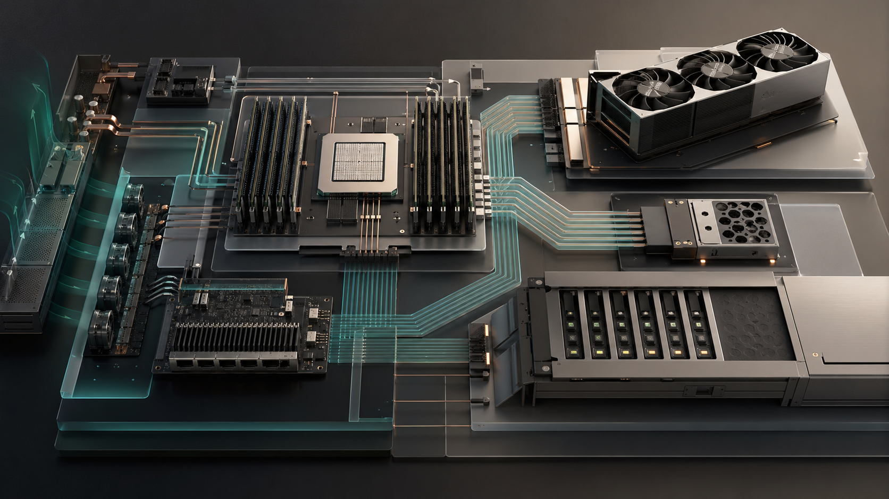

# Knowledge Ocean

这个仓库是我的长期学习知识库。我会把 AI、操作系统、硬件、推理系统、存储、工程实践等方向里值得反复查阅和持续更新的内容整理成教程化文档，尽量用通俗但不失深度的方式，把零散知识点连接成可学习、可实践、可迭代的知识网络。

我希望它不只是个人笔记，而是一个可以持续共建的知识海洋：如果这些内容能帮到同样在学习 AI systems、OS、硬件或工程基础的人，欢迎一起补充资料、修正错误、扩展案例、完善实验，让它逐渐成为更有参考价值的开放知识库。

## 当前内容

- `ai_knowledge_os/`：AI 学习系统，包括领域地图、官方资料索引、推理系统、Agent、Benchmark、多模态生产、上下文工程和后训练等主题。
- `hubs/os/`：操作系统学习材料，重点围绕 Linux 内核机制、系统调用、cgroup、namespace、systemd、可观测性、容器隔离和 AI/GPU 系统桥接。
- `hubs/hardware/`：硬件与基础设施学习材料，覆盖 CPU、内存、PCIe/CXL、GPU、服务器平台、网络、存储硬件、RAID、NVMe、Ceph、备份、容灾和数据保护。

## 组织原则

- 尽量写成教程，而不是只堆术语。
- 每个主题都尽量包含直觉、机制、实验、排障线索和延伸阅读。
- Mermaid 图用于表达精确结构；生成图片和真实硬件图片用于增强可读性，但不会为了装饰而强行插图。
- 涉及论文、网页和教程时，优先沉淀为可复用的资料索引和学习路径。

## 隐私与范围

这个公开仓库只保留适合分享的知识内容。个人对话记录、临时同步清单、任务更新档案、草稿轮次、私有知识库链接和可能包含个人信息的材料不会上传。

## 参与方式

如果你发现事实错误、链接失效、解释不清、实验步骤不完整，或者有更好的资料和案例，欢迎提交 issue 或 pull request。这个知识库会长期迭代，也希望它能成为更多学习者一起维护的参考地图。
