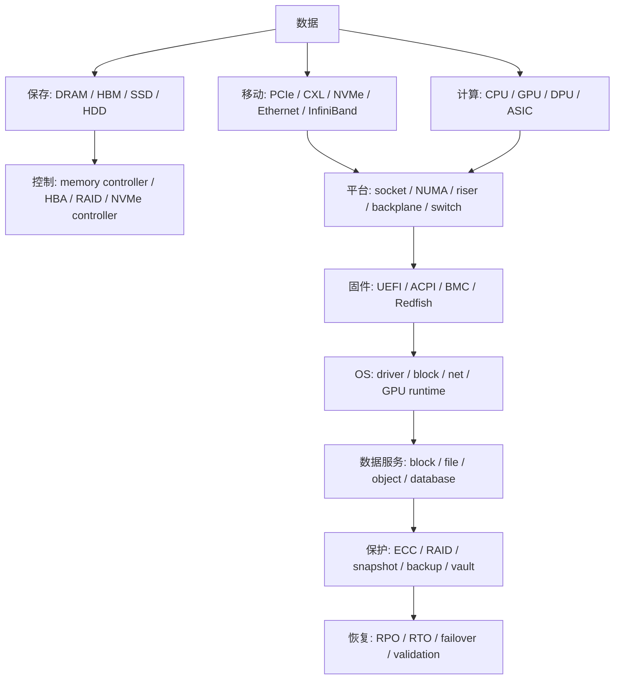

# 00 · Hardware Hub 总览

## 定位

Hardware Hub 是面向计算机硬件的系统化知识库。它不把硬件学习停留在参数表，而是把接口、协议、器件、平台、扩容、排障和采购判断，收敛成一套可推理的硬件地图。

核心问题只有一个：

> 数据如何在机器里被保存、移动、计算、管理、保护和恢复？

## 学习目标

- 建立从芯片到机架、从固件到操作系统、从单机到集群的硬件分层视角。
- 能把 CPU、内存、PCIe/CXL、GPU、NIC、存储、电源、散热和 RAS 放进同一张数据路径图。
- 遇到扩容、采购或故障时，先判断瓶颈属于容量、带宽、延迟、拓扑、固件、驱动、功耗还是运维边界。
- 能用系统命令、BMC/Redfish、厂商资料和开放规范交叉验证硬件状态。

## 核心直觉

硬件不是一堆孤立部件，而是一条数据生命周期链：



学习时不要只问“这个设备是什么型号”，更要问：

- 数据在哪里停留？
- 数据通过什么链路移动？
- 谁负责控制、枚举和上报？
- 性能瓶颈是算力、带宽、延迟、队列、拓扑还是功耗？
- 出错后能否被发现、隔离、恢复和复盘？

## 硬件/系统机制

Hardware Hub 基础章节按以下路径展开：

| 章节 | 关注点 | 关键判断 |
| --- | --- | --- |
| 09 CPU 与计算体系结构 | ISA、微架构、socket、NUMA、I/O root complex | CPU 是计算中心，还是 GPU/NIC/存储的数据调度器 |
| 10 内存与缓存体系 | cache、DDR5、MRDIMM、CXL memory、HBM | 容量、带宽、延迟和本地性必须一起看 |
| 11 固件、启动与带外管理 | UEFI、ACPI、BMC、Redfish、OpenBMC | OS 看见什么，常常由固件和管理面先决定 |
| 12 PCIe、CXL 与高速互连 | lane、slot、switch、retimer、fabric | 插槽数量不等于可用带宽和可用拓扑 |
| 13 GPU 与加速器平台 | HBM、NVLink、PCIe、NIC、DPU、存储 | AI 平台已经从单卡参数进入机架级系统 |
| 14 主板、芯片组与服务器平台 | socket、riser、backplane、风道、电源、BMC | 服务器平台是资源扇出和可维护性的组合 |
| 15 网络硬件、NIC 与 RDMA | Ethernet、InfiniBand、RoCE、DPU/SuperNIC | NIC 是远端内存、远端存储和远端 GPU 通信入口 |
| 16 电源、散热与物理部署 | PSU、rack power、airflow、liquid cooling、CDU | 电和热决定持续性能，不只是上架条件 |
| 17 RAS、监控与故障诊断 | ECC、MCA、EDAC、PCIe AER、BMC SEL、telemetry | 成熟平台要能发现、定位、降级、恢复和复盘 |

## 观察/实验方法

从任何一台服务器开始，先做四张图：

1. 拓扑图：`socket / NUMA / memory channel / PCIe root / slot / device`。
2. 数据路径图：CPU、内存、GPU、NIC、NVMe 之间数据如何移动。
3. 控制面图：UEFI/ACPI、BMC/Redfish、OS driver、监控系统各自负责什么。
4. 故障面图：错误从硬件、固件、内核、BMC 到工单系统如何流转。

常用入口：

```bash
lscpu -e=CPU,CORE,SOCKET,NODE,CACHE,ONLINE
numactl --hardware
lspci -tv
sudo lspci -vv | rg -n 'LnkCap|LnkSta|AER|NUMA'
lsblk
journalctl -k | rg -i 'mce|edac|aer|pcie|nvme|firmware|acpi'
```

带外侧优先检查：

- BMC/iDRAC/iLO/XClarity 的 inventory、sensor、SEL、firmware inventory。
- Redfish `/redfish/v1/` 下的 Systems、Chassis、Managers、UpdateService、TelemetryService。
- 厂商部件兼容矩阵、固件基线和平台配置指南。

## 采购/运维判断

采购硬件时，把问题拆成八类：

| 类别 | 必问问题 |
| --- | --- |
| 工作负载 | 更需要单线程、吞吐、内存带宽、GPU 通信、低延迟网络还是大容量存储 |
| 拓扑 | CPU、内存、GPU、NIC、NVMe 是否在合理 NUMA 和 PCIe 路径上 |
| 扩展 | lane、slot、riser、backplane、power、cooling 是否支持未来扩容 |
| 固件 | BIOS/BMC/设备固件是否有稳定基线和可自动化升级路径 |
| 观测 | OS、BMC、Redfish、厂商工具能否给出一致的健康状态 |
| 可靠性 | ECC、AER、EDAC、冗余电源、风扇、热插拔和 FRU 维护是否满足 SLA |
| 供应链 | 是否存在专有线缆、托架、背板、授权或维保锁定 |
| 生命周期 | 两到四年后还能否扩 GPU、扩内存、扩盘、升网络和更新固件 |

## 前沿趋势

- CPU 从“唯一计算中心”转向“平台资源编排器”，与 GPU、DPU、CXL memory 和高速 NIC 协同。
- 内存从本地 DDR 扩展到 MRDIMM、HBM、CXL attached memory 和更远端的内存池化。
- PCIe 7.0 已在 2025 年发布到 128 GT/s；CXL 4.0 则把 CXL 路线推进到 PCIe 7.0 速率、bundled ports 和更强 memory RAS，memory pooling、switching 和 fabric management 会继续进入平台层。
- AI 服务器从单机 GPU 参数转向 NVLink domain、液冷 rack、800G 网络、机架级供电和运维自动化。
- Redfish、OpenBMC、OCP 和 Linux kernel telemetry 让服务器管理更 API 化、标准化和可观测。

## 延伸阅读

- Intel Xeon 6 Product Brief: https://www.intel.com/content/www/us/en/products/docs/xeon-6-product-brief.html
- AMD EPYC 9005 Processor Architecture Overview: https://docs.amd.com/v/u/en-US/58462_amd-epyc-9005-tg-architecture-overview
- NVIDIA MGX: https://www.nvidia.com/en-gb/data-center/products/mgx/
- PCI-SIG PCIe 7.0 base specification: https://pcisig.com/PCIExpress/Spec/Base/_7.0
- CXL Consortium CXL 4.0 specification: https://computeexpresslink.org/cxl-specification
- DMTF Redfish standards: https://www.dmtf.org/standards/redfish
- Linux kernel CXL documentation: https://cxl.docs.kernel.org/
