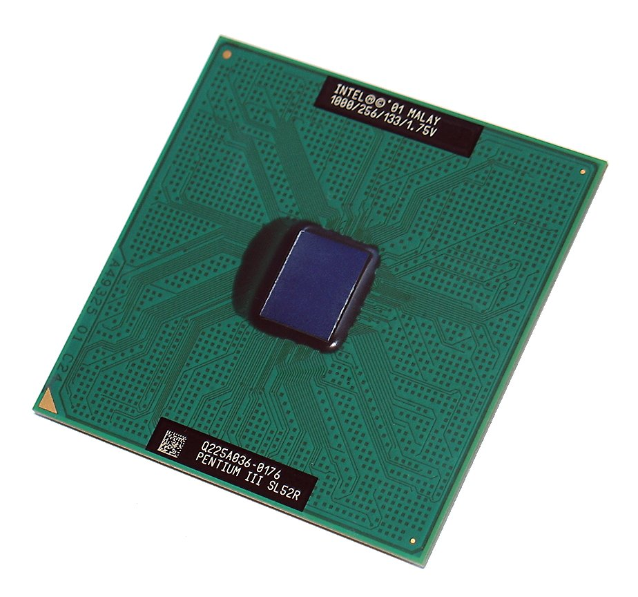
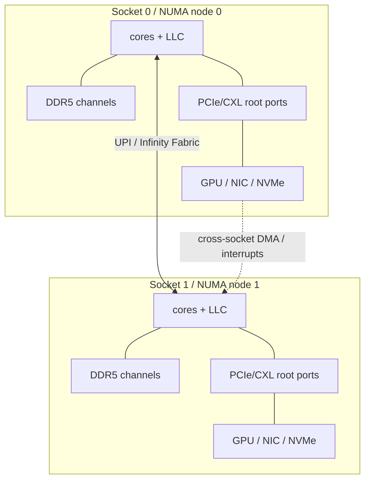

# 09 · CPU 与计算体系结构

## 定位

CPU 是通用服务器的控制中枢。它执行指令，也决定内存带宽、PCIe/CXL 根端口、NUMA 拓扑、虚拟化能力、功耗边界和对 GPU/NIC/存储的调度能力。学习服务器 CPU，不能只看“核数”和“GHz”，要看它如何把核心、缓存、内存、I/O 和封装组织成平台。

## 学习目标

- 区分 ISA、微架构和平台资源，不把品牌名当成性能解释。
- 能把工作负载映射到单线程、并行吞吐、内存带宽、I/O 拓扑和功耗约束。
- 能读懂 socket、core、thread、cache、NUMA node、root complex 的实际分布。
- 能用命令验证 CPU 拓扑，并把观察结果转化为采购和运维判断。

## 核心直觉

CPU 的价值不只在“自己算得快”，还在“把数据喂给该计算的地方”。数据库、虚拟化和控制平面更在意单核、缓存和延迟；微服务和云原生平台更在意密度与能效；AI 节点上的 CPU 越来越像 GPU、NIC、NVMe 和内存之间的调度与喂数控制器。



> 图：CPU die 可以帮助把“核心、缓存、互连、I/O”从抽象规格表拉回到真实硅片布局。图片来源与许可见 [image_attribution.md](../../assets/image_attribution.md)。

现代服务器 CPU 可以先分三条路线：

| 路线 | 代表 | 适合关注 |
| --- | --- | --- |
| 高单线程/通用核心 | Intel Xeon 6 P-core、AMD EPYC 9005 Zen 5 | 数据库、虚拟化、混合企业负载 |
| 高密度能效核心 | Intel Xeon 6 E-core、云原生高密度平台 | 横向扩展服务、前端、微服务 |
| CPU-GPU 协同 | NVIDIA Grace/Grace Blackwell、Arm Neoverse 平台 | AI 节点编排、内存带宽、GPU feeding |

从工程视角看 CPU，不要先问“这颗 CPU 强不强”，而要先问“这颗 CPU 让哪些资源彼此更近”：



这张图是读服务器规格书的最小模型：每个 socket 拥有自己的核心、缓存、内存通道和 I/O root port；跨 socket 能访问，但不是免费访问。

## 硬件/系统机制

### ISA 层

- `x86-64`、`Armv9`、`RISC-V` 回答的是软件面对哪套指令接口。
- ISA 决定编译器、操作系统、虚拟化和指令扩展生态，但不直接等于性能。
- 向量/矩阵扩展会影响 AI 推理、HPC、压缩、加密和数据库算子的可用能力。

### 微架构层

- 前端取指、译码、分支预测、乱序窗口、执行单元、cache、TLB 一起决定单线程效率。
- 很多“CPU 不够快”实际是 cache miss、TLB miss、分支预测失败或内存访问不本地。
- SMT/超线程能提高执行资源利用率，但不等于性能线性翻倍。

### 平台层

- CPU 通过 socket、内存通道、UPI/Infinity Fabric、PCIe/CXL lane 和 root complex 把整机资源组织起来。
- 多路服务器不是一个无代价的统一资源池，跨 socket 访问会引入延迟、带宽争用和调度复杂度。
- GPU、NIC、NVMe 挂在哪个 root complex 下，会影响 DMA、本地性、中断亲和性和跨 NUMA 数据移动。

### 负载映射层

| 负载特征 | 优先看 CPU 什么 | 容易漏掉什么 |
| --- | --- | --- |
| OLTP、Redis、控制平面 | 单线程、L3 延迟、频率稳定性 | NUMA 远端内存、SMT 争用、授权成本 |
| 虚拟化/容器密度 | 核数、每瓦吞吐、IOMMU/SR-IOV | 每核内存带宽、队列/中断亲和性 |
| 分析/HPC/压缩 | AVX/AMX/向量能力、内存带宽 | 降频、DIMM 填充、cache miss |
| AI host CPU | PCIe/CXL lane、GPU/NIC 本地性、内存带宽 | CPU 不是瓶颈时盲目堆核 |
| 存储/网络节点 | PCIe lane、NUMA、checksum/crypto/offload | NIC/NVMe 挂错 socket |

## 观察/实验方法

### 实验 1：识别 CPU 拓扑

```bash
lscpu
lscpu -e=CPU,CORE,SOCKET,NODE,CACHE,ONLINE
numactl --hardware
cat /sys/devices/system/cpu/cpu*/topology/thread_siblings_list | sort -u
```

目标：确认 socket、core、thread、NUMA node 和 SMT 关系。

进一步看 NUMA 距离：

```bash
for f in /sys/devices/system/node/node*/distance; do
  echo "$f: $(cat "$f")"
done
```

目标：确认本地节点和远端节点之间的相对距离，理解调度器为什么不应随意跨节点搬任务。

### 实验 2：观察本地与远端访问

```bash
numactl --cpunodebind=0 --membind=0 ./your_workload
numactl --cpunodebind=0 --membind=1 ./your_workload
```

目标：用同一负载对比本地内存和远端内存访问成本。

### 实验 3：判断是否在等内存

```bash
perf stat -d ./your_workload
perf stat -e cycles,instructions,cache-misses,context-switches -- sleep 10
```

目标：关注 IPC、cache miss、stall、上下文切换，而不是只看 CPU 使用率。

### 实验 4：把 PCIe 设备映射回 NUMA

```bash
for dev in /sys/bus/pci/devices/*; do
  [ -f "$dev/numa_node" ] || continue
  printf "%s numa_node=" "$(basename "$dev")"
  cat "$dev/numa_node"
done | sort -t= -k2,2n
```

目标：找出 GPU、NIC、NVMe 更靠近哪个 socket。`numa_node=-1` 通常表示固件/驱动没有给出明确归属，需要继续用 `lspci -tv`、主板手册或厂商拓扑图核对。

## 采购/运维判断

先把 CPU 选择写成约束，而不是写成愿望：

| 约束 | 需要落到规格书/实测的证据 |
| --- | --- |
| 单核响应时间 | SPEC/真实业务基准、频率策略、cache miss、tail latency |
| 并发密度 | 核数、SMT、每瓦吞吐、容器/VM 隔离模型 |
| 内存吞吐 | 每 socket 通道数、DIMM 填充、MRDIMM/RDIMM、NUMA 绑定 |
| I/O 扇出 | PCIe/CXL lane、root complex、switch/riser、设备本地性 |
| AI/加速器喂数 | CPU-GPU/NIC/NVMe 拓扑、GPUDirect/RDMA、数据加载路径 |
| 运维边界 | BIOS 项、微码、固件基线、RAS 事件、厂商支持矩阵 |

1. 目标负载主要需要高单核、任务并行、向量计算，还是 host CPU + accelerator orchestration？
2. 每颗 socket 的内存通道和带宽是否能喂饱核心数？
3. PCIe/CXL lane 是否够给 GPU、NIC、NVMe，且拓扑是否本地？
4. 单路是否已经足够，双路增加的资源是否值得承担 NUMA 和授权成本？
5. BIOS 是否提供 NPS、SMT、NUMA、功耗、频率和内存 interleaving 调整项？
6. 软件授权按 core、socket 还是整机计费，核数增长是否会放大成本？
7. 未来扩 GPU/NVMe/NIC 后，CPU 会不会从计算瓶颈变成 I/O 和调度瓶颈？

常见误区：

- 频率越高越强：高频不代表整体吞吐、内存带宽和 I/O 更好。
- 核数越多越值：核心数必须和每核带宽、缓存、授权、NUMA 复杂度一起看。
- 双路一定优于单路：双路增加资源，也增加跨 socket 路径、功耗和运维复杂度。

## 前沿趋势

- Intel Xeon 6 官方材料确认 P-core 与 E-core 两条路线，并强调 MRDIMM、CXL 增强和集成加速器；这说明 CPU 平台正在按负载类型分化。
- AMD EPYC 9005 延续 chiplet + central I/O die 路线，12 通道 DDR5、PCIe 5.0/CXL 2.0 和 NPS/NUMA 规划仍是平台判断重点。
- Arm Neoverse 与 NVIDIA Grace 把 performance-per-watt、高带宽内存和 CPU-GPU 协同推到数据中心核心位置。
- AI 节点中，CPU 的关键价值越来越体现在调度、数据搬运、网络栈、存储栈和故障管理，而不是单独峰值算力。

## 延伸阅读

- Intel Xeon 6 Product Brief: https://www.intel.com/content/www/us/en/products/docs/xeon-6-product-brief.html
- AMD EPYC 9005 Processor Architecture Overview: https://docs.amd.com/v/u/en-US/58462_amd-epyc-9005-tg-architecture-overview
- Arm Neoverse for cloud and AI data centers: https://www.arm.com/products/cloud-datacenter
- NVIDIA Grace CPU: https://www.nvidia.com/en-in/data-center/grace-cpu-superchip/
- Linux perf: https://perf.wiki.kernel.org/
