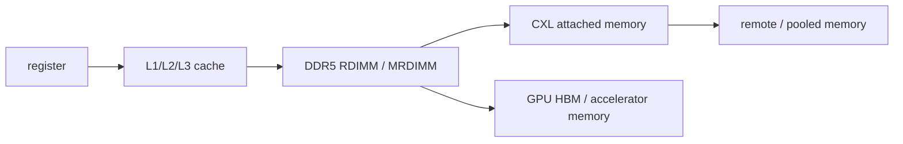
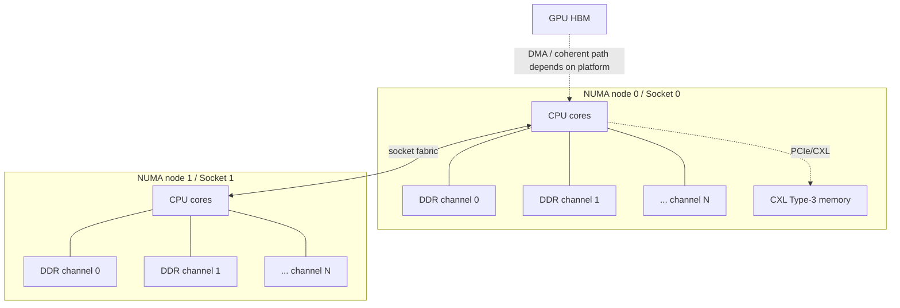

# 10 · 内存与缓存体系

## 定位

内存系统决定 CPU 和 GPU 能不能持续吃到数据。很多“算力不够”的问题，本质是缓存命中率低、内存带宽不足、NUMA 不本地、CXL 层级误用或 HBM 容量受限。服务器内存不是一个容量参数，而是从寄存器、cache、DDR、CXL 到 HBM/远端内存的层级系统。

## 学习目标

- 区分延迟、带宽、容量、通道数、rank、DPC 和 NUMA 本地性。
- 能解释 cache、DDR5 RDIMM/MRDIMM、CXL memory、HBM 在系统中的位置。
- 能用 Linux 命令观察内存拓扑、DIMM 填充和工作负载的内存敏感度。
- 能把内存配置转化为采购、扩容和性能调优判断。

## 核心直觉

延迟和带宽不是同一件事。延迟回答“第一次拿到数据要多久”，带宽回答“持续搬运多少数据”。OLTP、控制平面、元数据服务更怕延迟；训练、推理、分析、压缩、流式处理更容易被带宽卡住。

现代服务器至少有五层内存：



容量够不代表性能够。缓存 miss、NUMA 远端访问、CXL 内存访问、GPU HBM 不足，都可能让系统在“看似有资源”的情况下变慢。

一台双路服务器的内存图，应该至少画到“通道”和“归属”这一层：



内存排障时先问：数据在本地 DDR、远端 DDR、CXL-attached memory，还是 GPU HBM？这四个答案对应完全不同的延迟、带宽、故障域和调优方式。

## 硬件/系统机制

### Cache

- L1/L2/L3 越靠近核心越快、越小、越贵。
- 高性能代码首先争取局部性和缓存命中率，而不是只追求理论峰值。
- 共享 L3 的组织方式会影响多线程争用、跨核共享和 tail latency。

### DDR5 主存

- DDR5 RDIMM 是通用服务器的基础形态，强调可维护性、容量扩展和平台通用性。
- 内存通道数、DIMM 填充方式、1DPC/2DPC、rank、interleaving 会共同影响有效带宽和延迟。
- 高核数 CPU 如果没有足够每核带宽，多出来的核心会更快进入争用。

| 配置项 | 判断方法 | 风险信号 |
| --- | --- | --- |
| 通道填充 | 每个 socket 的通道是否均衡 | 只插大容量 DIMM 但少通道，容量够、带宽低 |
| 1DPC/2DPC | 查平台内存表，不只看 DIMM 标称速率 | 2DPC 后降速或时序变差 |
| rank/interleaving | 查 BIOS 和 `dmidecode` | 热点集中、NUMA 分布不均 |
| 每核带宽 | STREAM/真实负载实测 | 核数增加但吞吐不涨 |
| RAS 能力 | ECC、patrol scrub、spare、mirroring | 只有容量参数，没有错误策略 |

### MRDIMM

- MRDIMM 通过模块侧复用提高可用内存带宽路径，适合“核心数增长快于内存带宽增长”的平台。
- 它不是单纯替代 RDIMM，而是针对高核心密度和带宽不足的配置选项。
- 需要 CPU、主板、BIOS、DIMM 和固件组合支持，采购时必须看平台兼容矩阵。

### CXL memory

- CXL.mem 把内存扩展到 PCIe 物理层之上的一致性/内存协议路径。
- 它适合容量扩展、分层、池化和组合式基础设施探索，但不应默认等同本地 DDR。
- Linux CXL 文档强调 CXL 配置涉及硬件、BIOS/EFI、OS 和用户策略之间的交接，因此排障不能只看设备是否插上。
- Intel Xeon 6 的 Flat Memory Mode 文档把本地 DRAM 作为 Near Memory、CXL-attached DDR 作为 Far Memory 暴露为统一内存区域；这类模式能简化使用，但仍需要确认延迟层级、容量比例、BIOS 支持和 OS 策略。

### HBM

- HBM 是 GPU/AI/HPC 的高带宽近计算内存层。
- 它的容量、带宽、互连域和与 CPU 内存的一致性/可访问关系，会限制模型大小、batch、checkpoint 和数据并行策略。
- HBM 不是通用 DIMM 替代品，而是加速器平台的一部分。

## 观察/实验方法

### 实验 1：看物理内存布局

```bash
sudo dmidecode -t memory
```

目标：确认槽位、容量、速率、厂商、rank、当前配置和是否插满通道。

### 实验 2：看 NUMA 与内存分布

```bash
numactl --hardware
lscpu | rg -i 'numa|socket|core'
numastat -p $$
```

目标：确认每个 NUMA 节点拥有哪些 CPU 和内存。

### 实验 3：粗看内存敏感度

```bash
perf stat -d ./your_workload
```

目标：结合 cache miss、IPC 和 stalled cycles 判断负载像“算不动”还是“喂不饱”。

### 实验 4：查 CXL 设备入口

```bash
lspci | rg -i 'cxl|memory'
ls /sys/bus/cxl/devices 2>/dev/null
```

目标：确认 OS 是否暴露 CXL 设备和对应驱动对象。

### 实验 5：看节点内存和迁移压力

```bash
numastat
numastat -p <pid>
grep -H . /sys/devices/system/node/node*/meminfo | head -40
grep -H . /sys/devices/system/node/node*/numastat
```

目标：判断进程是否大量访问远端节点，或者系统是否因为内存压力发生 NUMA 迁移、回收和不均衡分配。

### 实验 6：建立带宽基线

```bash
perf stat -e cache-misses,cache-references,cycles,instructions ./your_workload
numactl --cpunodebind=0 --membind=0 ./stream_or_benchmark
numactl --cpunodebind=0 --membind=1 ./stream_or_benchmark
```

目标：不要只记录“内存多大”，要记录本地/远端带宽、cache miss 和 IPC 差异。没有基线时，后续 DIMM 更换、BIOS 升级、CXL 加入都很难评估影响。

## 采购/运维判断

1. 目标负载更需要容量、低延迟还是高带宽？
2. 每颗 CPU 有多少内存通道，DIMM 是否按通道均衡填充？
3. 1DPC/2DPC 会不会影响速率、时序或稳定性？
4. 每核带宽是否匹配核心数，是否需要 MRDIMM？
5. 应用是否具备 NUMA 亲和性配置能力？
6. GPU/HBM 与 CPU/DDR 是否形成两个并行内存世界，数据搬运路径在哪里？
7. 未来扩容是加 DIMM、加 CXL memory、增加 GPU HBM，还是换平台？

常见误区：

- 内存就是买大一点：容量、通道、速率、本地性和缓存命中率必须一起看。
- 频率越高一定越快：实际性能还受 DPC、rank、控制器、NUMA 和应用访问模式影响。
- CXL memory 等于本地 DDR：CXL 是新层级，不是无代价扩容。

## 前沿趋势

- DDR5 仍是通用服务器主存基线，但 MRDIMM 正在补高核数平台的带宽缺口。
- CXL 3.x 把内存池化、switching 和 fabric 管理推向更重要位置，但实际落地取决于 CPU、BIOS、OS、设备和管理软件共同成熟。
- CXL 内存会出现多种呈现方式：独立 NUMA node、DAX/系统内存热插拔、厂商 near/far memory 模式。教程学习时要把“OS 怎样看到它”作为第一问题。
- HBM3E/后续 HBM 继续把 AI 平台的竞争焦点放在近计算带宽、容量和能效上。
- 内存学习正在从“容量规划”转向“分层、拓扑、可观测和数据移动成本规划”。

## 延伸阅读

- Intel Xeon 6 Product Brief: https://www.intel.com/content/www/us/en/products/docs/xeon-6-product-brief.html
- AMD EPYC 9005 Processor Architecture Overview: https://docs.amd.com/v/u/en-US/58462_amd-epyc-9005-tg-architecture-overview
- Linux CXL documentation: https://cxl.docs.kernel.org/
- Linux CXL memory devices: https://www.kernel.org/doc/html/next/driver-api/cxl/memory-devices.html
- Intel Flat Memory Mode on Intel Xeon 6 Processors: https://www.intel.com/content/www/us/en/support/articles/000102525/processors/intel-xeon-processors.html
- NVIDIA Grace CPU: https://www.nvidia.com/en-in/data-center/grace-cpu-superchip/
- Micron HBM3E: https://sg.micron.com/products/memory/hbm/hbm3e
