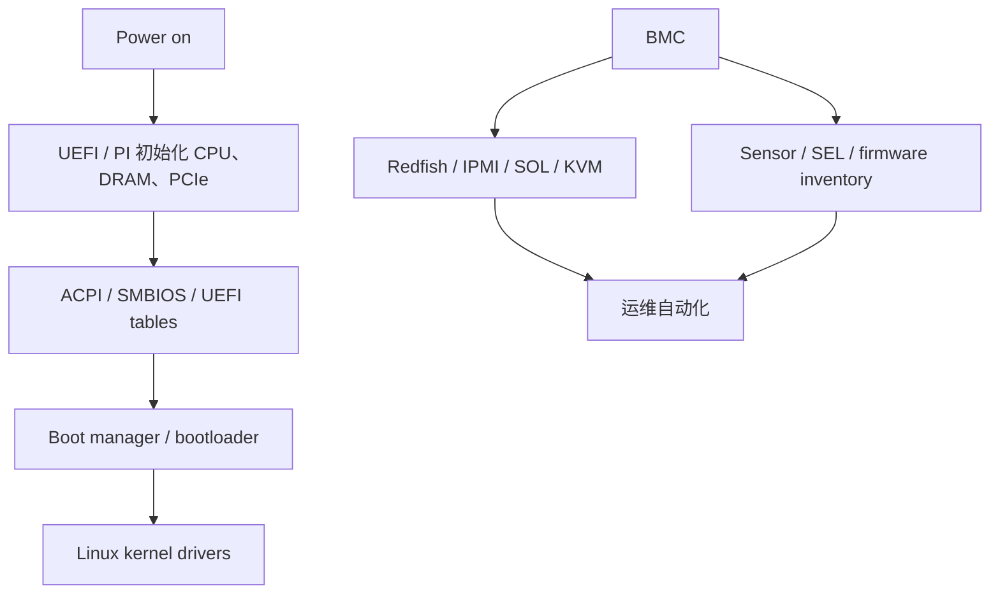

# 11 · 固件、启动与带外管理

## 定位

固件是硬件世界和操作系统世界之间的桥。很多服务器问题看起来像“Linux 没认出设备”，实际根因可能在 BIOS 设置、UEFI 枚举、ACPI 表、PCIe bifurcation、Option ROM、设备固件、BMC inventory 或带外管理链路。只要碰服务器，就不能把固件当成开机前黑箱。

## 学习目标

- 区分 UEFI、PI、ACPI、SMBIOS、BMC、Redfish 和 IPMI 的职责边界。
- 能理解启动链如何把平台初始化、硬件描述和 OS 驱动连接起来。
- 能用 OS 命令和 BMC/Redfish 交叉验证固件版本、启动项、硬件清单和传感器状态。
- 能把“设备不可见、启动失败、热插拔异常、固件不一致”拆成可排查路径。

## 核心直觉

现代服务器有两条控制面：



UEFI/ACPI 是主机启动和 OS 枚举的桥；BMC/Redfish 是带外管理、资产清单和遥测的桥。排障时要同时问：主机 OS 看到什么，BMC 看到什么，厂商固件清单认为这台机器应该是什么。

## 硬件/系统机制

### UEFI / PI

- UEFI 定义 OS 与平台固件之间的接口，包括启动服务、运行时服务、变量、设备路径和镜像加载。
- PI 规范描述平台初始化阶段，覆盖早期硬件初始化和固件模块组织。
- UEFI Forum 已发布 UEFI 2.11 和 PI 1.9，重点包括内存管理、架构支持、安全算法和错误处理增强。

### ACPI / SMBIOS

- ACPI 向 OS 描述 CPU、内存、NUMA、电源、热管理、中断、设备资源和部分热插拔语义。
- ACPI `_OSC` 等机制还会影响 OS 是否接管 PCIe AER 等错误处理路径。
- SMBIOS/DMI 更偏资产和平台信息，常用于识别厂商、主板、BIOS、内存槽位和系统序列信息。

### BMC / Redfish

- BMC 是独立管理控制器，不是主机 OS 上的后台进程。
- Redfish 使用 RESTful 接口和 schema-based data model，覆盖服务器、可组合基础设施和大规模云环境。
- DMTF Redfish 2025.3 发布中，Redfish Specification 为 DSP0266 1.23.0，Data Model 为 DSP0268 2025.3；这说明现代管理面持续扩展到固件更新、遥测、CXL、液冷和电力设备。

### OpenBMC 与厂商管理面

- OpenBMC 是开源 BMC firmware stack，面向 enterprise、HPC、telco 和 cloud-scale 数据中心。
- 厂商管理面如 iDRAC/iLO/XClarity 更强调完整产品化体验、远程控制、固件基线、授权功能和维保流程。
- 实战重点不是开源或闭源本身，而是数据模型是否稳定、API 是否可自动化、故障时能否跨 BIOS/BMC/OS 对齐。

## 观察/实验方法

### 实验 1：读取 BIOS、系统和主板信息

```bash
sudo dmidecode -t bios -t system -t baseboard
```

目标：确认 BIOS 版本、主板、厂商、系统型号和资产信息。

### 实验 2：检查 UEFI 启动项

```bash
efibootmgr -v
ls /sys/firmware/efi/efivars | head
```

目标：确认系统是否以 UEFI 方式启动，启动项是否符合预期。

### 实验 3：查看固件与 ACPI 日志

```bash
journalctl -k | rg -i 'efi|acpi|dmi|firmware|microcode'
```

目标：识别 ACPI 报错、固件表异常、微码加载和设备枚举问题。

### 实验 4：检查带外入口

```bash
curl -k https://<bmc-host>/redfish/v1/
```

目标：确认 Redfish 服务是否可达，并继续检查 Systems、Chassis、Managers、UpdateService 和 TelemetryService。

## 采购/运维判断

1. BIOS/BMC/设备固件是否有明确基线，是否支持批量升级和回滚？
2. Redfish 是否覆盖 inventory、health、sensor、SEL、power、thermal、firmware update？
3. BMC 与主机 OS 对同一设备的识别是否一致？
4. 平台是否支持所需的 PCIe bifurcation、SR-IOV、IOMMU、Secure Boot、TPM、PXE/HTTP Boot？
5. 固件升级是否需要维护窗口，是否会影响 RAID/HBA/NIC/GPU 兼容性？
6. 故障时是否能在主机挂死后通过带外拿到日志、截图、串口和电源控制？
7. 是否存在厂商授权限制，导致 Redfish、远程 KVM、虚拟介质或固件更新能力不可用？

常见误区：

- 设备不可见一定是驱动问题：也可能是 BIOS 禁用、bifurcation 不匹配、固件版本不兼容或 ACPI 描述错误。
- 能进 Web 管理页就等于可自动化：自动化需要稳定 API、权限模型、证书和可解析数据。
- 固件升级只是安全补丁：服务器固件还会改变设备枚举、链路训练、错误处理和电源热策略。

## 前沿趋势

- UEFI/ACPI 继续吸收更多跨架构、内存热插拔、错误记录和安全能力。
- Redfish 从传统服务器管理扩展到 CXL、SmartNIC、液冷、电源分配和遥测模型。
- OpenBMC 代表开放管理固件方向，适合理解 hyperscale 和开放硬件的管理面诉求。
- 固件供应链安全、可验证启动、签名固件和自动化合规检查会成为硬件运维基础能力。

## 延伸阅读

- UEFI 2.11 and PI 1.9 release: https://uefi.org/press-release/uefi-forum-releases-uefi-211-specification-and-pi-19-specification-streamline-user
- UEFI Specification 2.11: https://uefi.org/specs/UEFI/2.11/
- ACPI Specification 6.6: https://uefi.org/specs/ACPI/6.6/
- DMTF Redfish standards: https://www.dmtf.org/standards/redfish
- OpenBMC: https://openbmc.org/
- Linux PCIe AER HOWTO: https://www.kernel.org/doc/html/latest/PCI/pcieaer-howto.html
