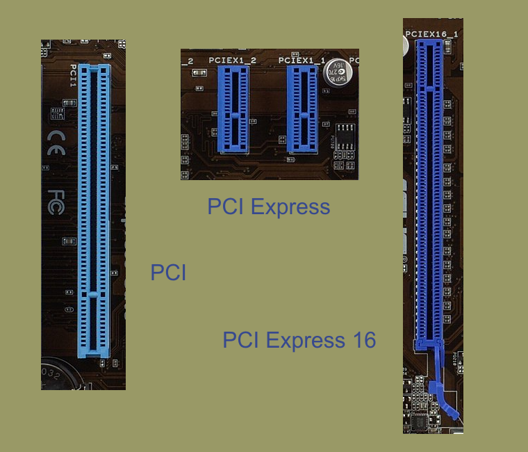
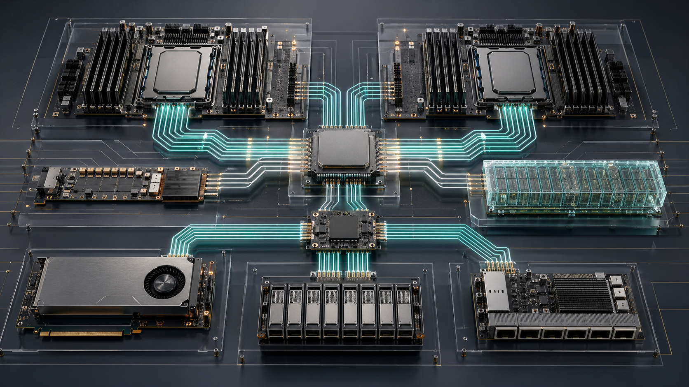

# 12 · PCIe、CXL 与高速互连

## 定位

PCIe 和 CXL 是现代服务器里 CPU、GPU、NIC、NVMe、DPU、FPGA 和内存扩展设备之间的高速数据通道。学习本章不要只看“有几个插槽”，而要把 lane、root complex、switch、retimer、riser、cable、NUMA 和协议能力看成一张 fabric。

## 学习目标

- 区分 PCIe 物理链路、插槽形态、root complex、switch、retimer 和 CXL 协议层。
- 能读懂 `LnkCap/LnkSta`，判断设备实际训练到的速率和 lane 宽度。
- 能把 PCIe/CXL 拓扑与 CPU socket、NUMA、GPU、NIC、NVMe 的本地性关联起来。
- 能理解 CXL memory/cache/io 的价值和当前落地边界。

## 核心直觉

插槽数量不是平台能力，真正决定能力的是：



> 图：PCIe x16、x1 与传统 PCI 插槽对比。图片来源与许可见 [image_attribution.md](../../assets/image_attribution.md)。



> 图：CPU root complex、PCIe switch、retimer、GPU/NIC/NVMe 与 CXL memory 的抽象拓扑。图片来源与生成说明见 [image_attribution.md](../../assets/image_attribution.md)。

- 上游来自哪个 CPU/root complex。
- 链路训练到哪一代、几条 lane。
- 是否经过 switch、retimer、riser、线缆或背板。
- 下游多个设备是否共享上游带宽。
- OS、BIOS、设备固件是否支持目标协议和热插拔/错误处理。

| 对象 | 解决什么 | 排障问题 |
| --- | --- | --- |
| lane | 点到点高速信号 | 实际训练到几代、几条 lane |
| root complex | CPU/平台侧根 | 属于哪个 socket/NUMA |
| switch | 扩展拓扑 | 下游设备是否共享上游带宽 |
| retimer | 高速信号恢复 | 高速代际下线缆、背板和 riser 是否合格 |
| CXL | PCIe 物理层上的一致性/内存协议 | 内存扩展、cache coherent device、fabric 管理 |

典型 AI/存储节点的 I/O 图应画出上游和共享关系：

```mermaid
flowchart TB
  subgraph CPU0[CPU socket 0 / Root complex 0]
    RP0[Root ports]
    SW0[PCIe switch]
    GPU0[GPU 0]
    NIC0[RDMA NIC]
    NVME0[NVMe backplane]
    CXL0[CXL Type-3 memory]
    RP0 --> SW0
    SW0 --> GPU0
    SW0 --> NIC0
    RP0 --> NVME0
    RP0 -. CXL.io + CXL.mem .-> CXL0
  end
  subgraph CPU1[CPU socket 1 / Root complex 1]
    RP1[Root ports]
    GPU1[GPU 1]
    NIC1[RDMA NIC]
    RP1 --> GPU1
    RP1 --> NIC1
  end
  CPU0 <-->|UPI / Infinity Fabric| CPU1
  GPU0 -. remote path if talking to NIC1 .-> NIC1
```

读这张图时，先找三件事：是否跨 socket、是否过 switch 共享上游、实际链路是否低于设备能力。

## 硬件/系统机制

### PCIe 基础路径

- PCIe 是分层协议，包含物理层、数据链路层和事务层。
- 每个 endpoint 通过 root port、switch 或 bridge 出现在 PCI 拓扑中。
- Gen 代际决定每 lane 速率，lane 数决定宽度；实际 `LnkSta` 低于 `LnkCap` 时，要查插槽、线缆、retimer、BIOS 和设备能力。

| 观察项 | 正常问题 | 异常线索 |
| --- | --- | --- |
| `LnkCap` | 设备/插槽最大能力是多少 | 规格书 x16，但 Cap 只有 x8 |
| `LnkSta` | 实际训练到多少 GT/s、几条 lane | 降代、降宽、反复 retrain |
| `NUMA node` | endpoint 靠近哪个 socket | GPU 与 NIC 分属不同 socket |
| `AER` | 是否有 corrected/uncorrected 计数 | correctable 持续增长、fatal 事件 |
| switch 上游 | 下游设备共享多少上行带宽 | 多块 NVMe/GPU 过度超卖 |

### 拓扑与本地性

- PCIe root complex 通常归属于特定 CPU socket。
- GPU、NIC、NVMe 如果跨 socket 通信，会引入远端 DMA、跨 NUMA 内存访问和中断亲和性问题。
- AI 和高性能存储平台必须同时看 GPU-NIC、GPU-NVMe、NIC-CPU 和 NVMe-CPU 的路径。

### CXL

- CXL 建立在 PCIe 物理层之上，面向 CPU、内存扩展和加速器的一致性互连。
- 常见语义包括 CXL.io、CXL.cache、CXL.mem；Type-3 memory device 是理解 CXL memory 的关键入口。
- CXL 3.x 把 switching、memory pooling、fabric 管理和组合式资源推到更重要位置，但实际部署需要 CPU、BIOS、OS、设备和管理软件一起支持。

### 错误处理

- PCIe AER 能收集错误、向用户报告并执行恢复动作。
- Linux 是否处理 AER 取决于固件是否通过 ACPI `_OSC` 把控制权交给 OS。
- 链路错误不一定立刻导致设备掉线，但持续 correctable error 会影响稳定性和运维判断。

## 观察/实验方法

### 实验 1：查看 PCIe 树

```bash
lspci -tv
```

目标：看清 root port、switch、bridge 和 endpoint 之间的层级关系。

### 实验 2：查看链路能力和实际状态

```bash
sudo lspci -D -vv | rg -n '^[0-9a-f:.]+|LnkCap|LnkSta|NUMA|AER|UESta|CESta'
```

目标：确认实际速率、lane 宽度、AER 状态和 NUMA 归属。

### 实验 3：对齐设备与 NUMA

```bash
find /sys/bus/pci/devices -maxdepth 2 -name numa_node -print -exec cat {} \;
```

目标：把 GPU、NIC、NVMe 与 CPU socket 对齐，识别跨 NUMA 路径。

### 实验 4：查看 CXL 入口

```bash
lspci | rg -i 'cxl|memory'
ls /sys/bus/cxl/devices 2>/dev/null
cxl list -vv 2>/dev/null || true
```

目标：确认平台是否暴露 CXL 设备和 Linux CXL bus 对象。

### 实验 5：把设备按 root port 分组

```bash
lspci -tv
for dev in /sys/bus/pci/devices/*; do
  [ -f "$dev/current_link_speed" ] || continue
  printf "%s %s %s numa=%s\n" \
    "$(basename "$dev")" \
    "$(cat "$dev/current_link_speed" 2>/dev/null)" \
    "$(cat "$dev/current_link_width" 2>/dev/null)" \
    "$(cat "$dev/numa_node" 2>/dev/null)"
done
```

目标：把“设备很多”变成“哪些设备共享哪条路径”。实际排障时，把这份输出和主板 riser/backplane 图贴在一起看。

## 采购/运维判断

1. 目标设备需要 PCIe Gen5、Gen6 还是未来 Gen7 路径？
2. slot 的物理宽度、lane 电气宽度和实际训练宽度是否一致？
3. GPU、NIC、NVMe 是否挂在正确 socket 下，是否需要同 NUMA 优先？
4. riser、背板、线缆和 retimer 是否支持目标速率？
5. switch 下游设备是否共享上游瓶颈，oversubscription 是否可接受？
6. BIOS 是否支持 bifurcation、SR-IOV、ARI、ACS、Resizable BAR、CXL memory 等所需选项？
7. AER、热插拔、固件日志和 BMC inventory 是否能定位链路问题？

常见误区：

- 插槽是 x16 外观就一定有 x16 lane：要看主板布线、riser 和 BIOS 配置。
- PCIe 代际越高应用一定越快：如果瓶颈在设备、CPU、内存或软件队列，链路升级收益有限。
- CXL memory 是普通内存：它是新的内存层级，延迟、带宽、热插拔和 OS 管理都有边界。

## 前沿趋势

- PCI-SIG 已在 2025 年发布 PCIe 7.0，目标速率 128 GT/s；进入 Gen6/Gen7 后，PAM4、FEC、retimer、线缆和背板质量会更直接地影响平台稳定性。
- CXL Consortium 已发布 CXL 4.0，速率路线跟进 PCIe 7.0，新增 bundled ports 等能力；从 CXL 3.x 开始形成的 memory pooling、switching、fabric 和管理模型会继续向平台级资源编排演进。
- 高速平台越来越依赖 retimer、线缆、背板和散热，信号完整性已经成为系统工程问题。
- Linux CXL 支持仍在活跃发展，生产落地要同时看内核、固件、ndctl/cxl 工具和厂商支持矩阵。

## 延伸阅读

- PCI-SIG PCIe 7.0 base specification: https://pcisig.com/PCIExpress/Spec/Base/_7.0
- CXL Consortium CXL 4.0 specification: https://computeexpresslink.org/cxl-specification
- CXL 4.0 release announcement PDF: https://computeexpresslink.org/wp-content/uploads/2025/11/CXL_4.0-Specification-Release_FINAL_Website-Copy.pdf
- Linux CXL documentation: https://cxl.docs.kernel.org/
- Linux CXL memory devices: https://www.kernel.org/doc/html/next/driver-api/cxl/memory-devices.html
- Linux PCIe AER HOWTO: https://www.kernel.org/doc/html/latest/PCI/pcieaer-howto.html
