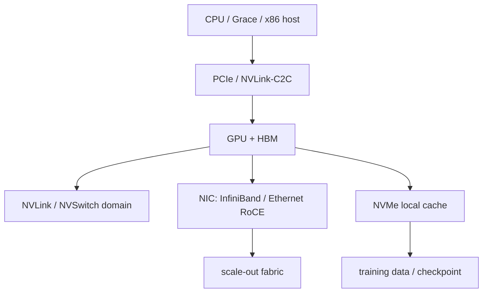

# 13 · GPU 与加速器平台

## 定位

GPU 与加速器平台已经从“单卡参数”进入“节点级、机架级和集群级系统”阶段。要理解 AI/HPC 硬件，必须同时看 GPU、HBM、NVLink/NVSwitch、PCIe、CPU、NIC/DPU、NVMe、供电、液冷和软件栈。

## 学习目标

- 区分 GPU 核心算力、HBM 容量/带宽、节点内互连和跨节点网络。
- 能把 CPU-GPU、GPU-GPU、GPU-NIC、GPU-storage 的路径画出来。
- 能用 `nvidia-smi`、`lspci` 和系统日志观察拓扑、电源、ECC、驱动和固件状态。
- 能从采购和运维角度判断一套 GPU 平台是否能持续跑目标工作负载。

## 核心直觉

AI 平台的瓶颈往往不在单张 GPU 的峰值 FLOPS，而在数据能否持续到达 GPU、GPU 之间能否低延迟同步、checkpoint 能否写出、机架供电和散热能否长期支撑。



## 硬件/系统机制

### GPU 与 HBM

- GPU 核心负责矩阵、向量、图形或通用并行计算，HBM 负责提供近计算高带宽。
- HBM 容量限制模型、batch、KV cache 和多租户切分；HBM 带宽限制训练/推理数据供给。
- ECC、温度、功耗、BAR1、MIG/partitioning、驱动版本都会影响可用性。

### 节点内互连

- PCIe 是通用 GPU 接入路径，兼容性强，但 CPU/root complex 和 NUMA 本地性很重要。
- NVLink/NVSwitch 提供更强 GPU-GPU 通信域，适合大模型训练、张量并行和高带宽 collective。
- NVIDIA GB200 NVL72 官方材料把 72 个 Blackwell GPU 放进同一 rack-scale NVLink domain，并使用液冷，这代表关注点已从服务器内多卡扩展到机架级 GPU 域。

### 跨节点网络

- InfiniBand、RoCE、Spectrum-X 等决定 scale-out 训练和推理集群的效率。
- NIC 与 GPU 的 PCIe 本地性、GPUDirect、队列配置、拥塞控制和交换网络同样关键。
- 网络不是 GPU 外围设备，而是大规模 GPU 平台的组成部分。

### 存储与 checkpoint

- 本地 NVMe、并行文件系统、对象存储和数据加载管线决定训练数据与 checkpoint 是否能跟上。
- 只堆 GPU 而不规划存储与网络，容易出现 GPU 利用率低、checkpoint 变慢、恢复窗口过长。

## 观察/实验方法

### 实验 1：查看 GPU 拓扑

```bash
nvidia-smi topo -m
lspci -tv
```

目标：确认 GPU、CPU、NIC、NVMe 的相对路径和跨 NUMA 情况。

### 实验 2：查看 GPU 健康和能力

```bash
nvidia-smi -q | rg -i 'vbios|driver|power|temperature|bar1|fabric|ecc|retired|mig'
```

目标：确认驱动、VBIOS、功耗、温度、ECC、fabric 和分区能力。

### 实验 3：观察运行期瓶颈

```bash
nvidia-smi dmon
nvidia-smi pmon
```

目标：粗看 GPU 利用率、显存、功耗、温度和进程占用。

### 实验 4：对齐 GPU 与网络

```bash
rdma link 2>/dev/null || true
ibv_devinfo 2>/dev/null || true
```

目标：确认 RDMA/NIC 能力是否与 GPU 拓扑和训练框架需求匹配。

## 采购/运维判断

1. 工作负载需要训练、推理、图形、HPC，还是混合使用？
2. HBM 容量是否够模型、batch、KV cache 和多租户隔离？
3. 节点内通信需要 PCIe 还是 NVLink/NVSwitch 域？
4. 跨节点网络是 InfiniBand、RoCE 还是普通 Ethernet，是否支持目标规模？
5. CPU、GPU、NIC、NVMe 的 NUMA 和 PCIe 本地性是否合理？
6. 存储和 checkpoint 带宽是否匹配 GPU 吞吐？
7. 供电、散热、液冷、机架承重和维护窗口是否满足持续运行？
8. 驱动、CUDA、固件、BMC 和调度平台是否有统一基线？

常见误区：

- 只看 GPU 型号：HBM、互连、网络、存储、电源和散热同样决定结果。
- 单机跑得快就能集群扩展：collective、拥塞控制、拓扑和 checkpoint 会改变扩展效率。
- GPU 利用率低一定是 GPU 问题：数据加载、CPU 调度、网络和存储更常见。

## 前沿趋势

- Blackwell/Blackwell Ultra 把平台重点推向 rack-scale NVLink domain、液冷、机架级供电和 AI factory 参考架构。
- NVIDIA GB300 NVL72 官方新闻稿显示 Blackwell Ultra 继续沿用 72 GPU + 36 Grace CPU 的 rack-scale 方向，并强调 test-time scaling 和 reasoning workloads。
- SuperNIC/DPU、GPUDirect、RDMA 和并行存储会越来越接近 GPU 平台核心，而不是附加选项。
- GPU 运维将更依赖统一 telemetry：ECC、温度、功耗、fabric、链路、驱动、固件和调度事件必须关联分析。

## 延伸阅读

- NVIDIA GB200 NVL72: https://www.nvidia.com/en-us/data-center/gb200-nvl72/
- NVIDIA Blackwell Ultra announcement: https://nvidianews.nvidia.com/news/nvidia-blackwell-ultra-ai-factory-platform-paves-way-for-age-of-ai-reasoning
- NVIDIA DGX GB Rack Scale Systems User Guide: https://docs.nvidia.com/dgx/dgxgb200-user-guide/
- NVIDIA MGX: https://www.nvidia.com/en-gb/data-center/products/mgx/
- NVIDIA ConnectX-8 SuperNIC: https://docs.nvidia.com/networking/display/connectx8SuperNIC/Introduction
