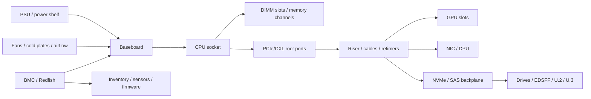

# 14 · 主板、芯片组与服务器平台

## 定位

现代服务器不是“主板 + CPU”，而是 socket、内存通道、PCIe/CXL lane、riser、backplane、风道、电源、BMC、固件策略和可维护性组合出来的平台。平台决定部件能不能插，也决定插上后能否稳定、可观测、可扩展、可维护。

## 学习目标

- 能把服务器拆成 CPU/socket、内存、I/O、存储背板、GPU、供电散热、管理面和机箱维护路径。
- 能解释为什么 slot、盘位和电源额定值不等于可用资源。
- 能用命令和实物检查把逻辑设备映射到物理槽位、riser、backplane 和 NUMA。
- 能从采购角度判断平台是否适合通用计算、存储节点、网络节点或 GPU 节点。

## 核心直觉

平台设计的本质是资源扇出：CPU 提供核心、内存控制器和 I/O lane；主板、riser、背板、线缆和机箱把这些资源变成可插拔、可散热、可供电、可维护的形态。

| 维度 | 必问问题 |
| --- | --- |
| CPU | 单路/双路、NUMA、UPI/Infinity Fabric 成本 |
| 内存 | 通道数、1DPC/2DPC、MRDIMM/RDIMM、最大容量 |
| I/O | PCIe 代际、lane 分配、riser、bifurcation |
| 存储 | SAS/SATA/NVMe 背板、HBA/RAID、热插拔 |
| GPU | 插槽宽度、供电线、风道、散热、拓扑 |
| 管理 | BMC、Redfish、固件升级、资产清单 |

可以把平台看成“资源从 CPU 出发，经过机械/电气结构落到可维护部件”的路径：



所以“同一型号服务器”也不一定等价。不同 riser、背板、电源、风扇、液冷套件和固件许可，会让同一个机箱变成完全不同的平台。

## 硬件/系统机制

### Socket 与 NUMA

- 单路平台更简单，跨 socket 成本低，软件授权也可能更低。
- 双路平台增加核心、内存通道和 I/O 资源，但引入 NUMA、互连、功耗和调度复杂度。
- 判断单路或双路，不看“档次”，看目标工作负载是否真的需要双路资源。

### Riser 与 PCIe 扇出

- Riser 把主板 lane 转换成不同方向、宽度和形态的 slot。
- 同一机型可能因 riser 组合不同，导致 GPU/NIC/NVMe 支持完全不同。
- PCIe bifurcation、retimer、线缆和背板会影响高代际设备稳定性。

### Backplane 与存储形态

- 盘位外观不等于协议能力，必须区分 SAS、SATA、NVMe、tri-mode、EDSFF、U.2/U.3。
- 背板可能接 HBA/RAID，也可能直接接 CPU PCIe root complex。
- 存储背板会消耗 lane、线缆、散热和前维护空间。

### 机箱、电源、风道与 BMC

- 机箱不是外壳，它决定前后维护、风道、riser 方向、GPU 支撑、电缆路径和盘位密度。
- PSU、风扇墙、导风罩、液冷接口和 BMC 传感器共同决定持续性能。
- BMC/Redfish 是平台生命周期管理入口：固件、资产、传感器、事件和远程控制都依赖它。

### 平台 SKU 的真实差异

| 看似相同 | 实际要核对 |
| --- | --- |
| 同一 CPU | BIOS 支持、功耗档、内存速率、UPI/IF 配置 |
| 同一机箱 | riser 组合、背板协议、GPU 支架、电源线束 |
| 同样 x16 slot | lane 来源、是否共享、是否支持目标 Gen、散热空间 |
| 同样盘位数量 | SATA/SAS/NVMe/tri-mode、直连或 HBA/RAID、热插拔能力 |
| 同样 BMC | Redfish 覆盖范围、授权、固件升级和日志导出能力 |
| 同样满配功耗 | 输入电压、PSU 冗余、风扇策略、机架供电和散热 |

## 观察/实验方法

### 实验 1：做一张平台资源地图

记录以下对象：

- CPU socket 和 NUMA node。
- DIMM 槽位和通道分布。
- PCIe slot、riser、背板、线缆和 retimer。
- 前后盘位、HBA/RAID/NVMe 连接方式。
- PSU、风扇、进出风方向和 BMC 管理口。

目标：形成一张“这台机器到底怎样切分资源”的平台图。

### 实验 2：对齐逻辑设备和平台结构

```bash
lspci -tv
lsblk
sudo dmidecode -t system -t baseboard -t chassis
```

目标：把操作系统看到的设备映射到主板、机箱和物理槽位。

### 实验 3：查平台固件和传感器

```bash
journalctl -k | rg -i 'dmi|acpi|firmware|pcie|thermal'
```

目标：识别平台初始化、PCIe 链路、热管理和固件相关线索。

### 实验 4：收货/上架前检查清单

| 项目 | 证据 |
| --- | --- |
| 部件与订单一致 | BMC inventory、物理标签、FRU/part number |
| 固件基线一致 | BIOS、BMC、NIC、HBA/RAID、NVMe、GPU、retimer |
| I/O 拓扑正确 | `lspci -tv`、slot/riser 图、NUMA node |
| 内存通道均衡 | `dmidecode -t memory`、平台内存填充表 |
| 电热可持续 | PSU 冗余、风扇/液冷、BMC power/thermal |
| 可维护性 | 前后维护路径、线缆标识、备件、远程 KVM/SOL |

目标：把采购参数变成可验收证据。平台问题越早在收货阶段发现，后续集群问题越少。

## 采购/运维判断

1. 平台是为通用算力、存储节点、网络节点还是 GPU/AI 节点设计？
2. CPU lane 和内存通道是否被主板真实扇出到目标部件？
3. riser、背板和盘位是否会抢 GPU/NIC/NVMe 的资源？
4. 维护时哪些部件前维护，哪些后维护，是否需要整机下架？
5. 供电和散热是否支持未来更高 TDP CPU/GPU/NIC？
6. BIOS/BMC 是否成熟，Redfish 和固件升级是否完整？
7. 是否存在专有背板、托架、线缆、电源或授权锁定？
8. 平台更适合灵活配置，还是标准化复制和批量运维？
9. 未来两到四年要扩的到底是算力、存储、网络还是内存，平台是否留了余量？

常见误区：

- 插槽总数等于可扩展性：真正上限是 lane、riser、背板、供电、散热和固件支持。
- 机箱只是外壳：机箱决定热路径、维护路径和可部署密度。
- 参考架构不重要：参考架构往往定义了兼容边界、散热边界和生态验证边界。

## 前沿趋势

- NVIDIA MGX 把模块化参考架构推向单节点到 rack-scale AI factory，并强调 PCIe、OCP、EIA 等开放标准兼容。
- OCP 让 rack、power、cooling、hardware management 和模块化设计成为平台工程的一部分。
- 服务器平台生命周期越来越长于单个 CPU/GPU 代际，采购时必须考虑后续固件、部件和机架级升级路径。
- 平台从“服务器 SKU”转向“可组合基础设施单元”，BMC/Redfish 和自动化资产模型会更重要。

## 延伸阅读

- Intel Xeon 6 Product Brief: https://www.intel.com/content/www/us/en/products/docs/xeon-6-product-brief.html
- AMD EPYC 9005 Processor Architecture Overview: https://docs.amd.com/v/u/en-US/58462_amd-epyc-9005-tg-architecture-overview
- NVIDIA MGX: https://www.nvidia.com/en-gb/data-center/products/mgx/
- OCP Rack and Power: https://www.opencompute.org/projects/rack-and-power
- OCP Hardware Management specs and designs: https://www.opencompute.org/wiki/Hardware_Management/SpecsAndDesigns
- OCP Open Systems for AI whitepaper: https://www.opencompute.org/documents/ocp-open-systems-for-ai-whitepaper-v1-0-0-final-pdf
- DMTF Redfish standards: https://www.dmtf.org/standards/redfish
