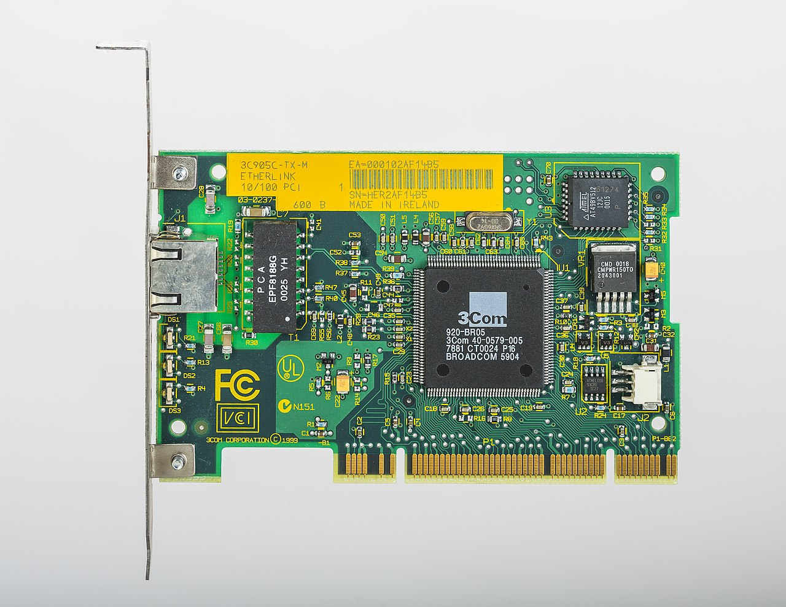
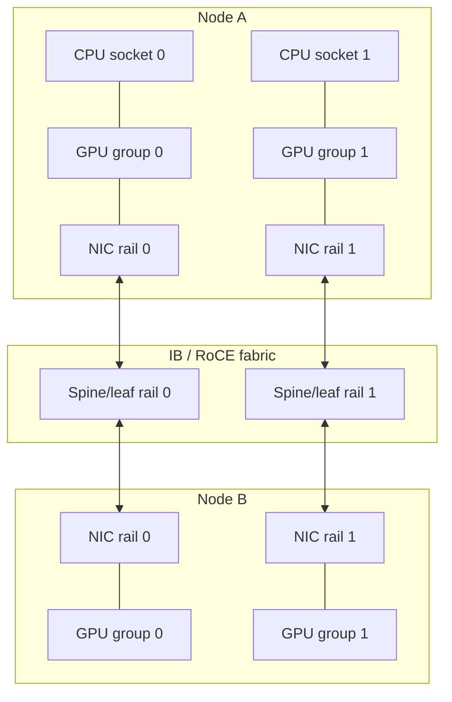

# 15 · 网络硬件、NIC 与 RDMA

## 定位

网络硬件在现代服务器里不再只是“把机器联网”。高速 NIC、InfiniBand、RoCE、DPU/SuperNIC 和 GPU 直连路径，已经把网络变成远端内存、远端存储和远端 GPU 通信的入口。理解 AI、HPC、分布式存储和数据库集群，必须把 NIC、PCIe、CPU/GPU、交换网络和协议栈作为整体。

## 学习目标

- 区分 Ethernet、InfiniBand、RoCEv2、RDMA、DPU、SmartNIC、SuperNIC 的边界。
- 能判断瓶颈在链路带宽、交换网络、主机栈、PCIe 本地性、拥塞控制还是 CPU 参与过多。
- 能用 OS 工具查看 NIC、驱动、固件、链路速率、RDMA 设备和队列状态。
- 能从采购和运维角度判断普通以太网、RoCE 和 InfiniBand 的适用场景。

## 核心直觉

NIC 不是“网口速度”，而是服务器与外部数据平面之间的硬件入口。



> 图：从早期以太网卡到现代 SmartNIC/DPU，核心结构仍围绕主机接口、控制器、板载资源和网络端口展开。图片来源与许可见 [image_attribution.md](../../assets/image_attribution.md)。

| 路线 | 关键词 | 适合 |
| --- | --- | --- |
| TCP Ethernet | 普适、便宜、易运维 | 通用服务、NVMe/TCP、常规东西向流量 |
| RoCEv2 | RDMA over UDP/IP | AI/HPC 以太网低延迟、高吞吐 |
| InfiniBand | 原生 RDMA fabric | 大规模训练、HPC、低延迟集群 |
| DPU/SmartNIC/SuperNIC | offload、隔离、安全、遥测 | 多租户云、存储/网络卸载、AI scale-out |

RDMA 的核心价值是让远端数据移动尽量减少主机 CPU 的重复介入；但它不是单个网卡开关，而是主机、PCIe、驱动、固件、交换机、队列和拥塞控制共同工作的结果。

AI/HPC 网络常用 rail 思路：每组 GPU 尽量有本地 NIC，跨节点通信走对应 rail，减少跨 socket 和交换网络拥塞。



这类图的目的不是追求漂亮，而是提前发现“GPU 在 socket 0，NIC 在 socket 1，训练时所有流量绕远路”的问题。

## 硬件/系统机制

### NIC / HCA

- NIC 是主机网络接口卡；HCA 常见于 InfiniBand/RDMA 语境。
- 现代高端 NIC 支持多队列、RSS、SR-IOV、checksum/TSO/LRO、RDMA、GPUDirect、telemetry 和固件可编程能力。
- NIC 插在哪个 root complex 下，会影响 CPU/GPU/NVMe 本地性。

### RDMA / RoCE / InfiniBand

- InfiniBand 是为低延迟和高吞吐设计的 fabric，长期用于 HPC 和大规模 AI。
- RoCE 把 RDMA 语义带到 Ethernet；RoCEv2 运行在 IP/UDP 之上，更适合 L3 网络。
- RoCE 稳定性依赖 lossless 或近似 lossless 设计，PFC、ECN、队列、优先级和拥塞控制都必须匹配。

| 能力 | InfiniBand | RoCEv2 |
| --- | --- | --- |
| 网络语义 | 原生 RDMA fabric | RDMA over UDP/IP |
| 运维重点 | SM/路由、LID/GID、分区、IB counters | PFC/ECN/DCQCN、DSCP/priority、交换机缓冲 |
| 常见风险 | fabric 管理面和线缆/模块质量 | lossless 配错、PFC 风暴、拥塞不可见 |
| 适合判断 | 规模化训练/HPC 的可预测低延迟 | 以太网生态下的 AI/存储 RDMA |

### DPU / SmartNIC / SuperNIC

- DPU/SmartNIC 把网络、安全、存储、隔离和遥测卸载到网卡侧。
- SuperNIC 更强调 AI 平台中的高带宽、低延迟和 GPU 通信协同。
- NVIDIA ConnectX-8 SuperNIC 官方文档显示其支持 InfiniBand/Ethernet 最高 800Gb/s，并面向 AI factories 和云数据中心。

### 交换网络

- 高速网卡必须配合交换机、布线、光模块、拥塞控制和遥测。
- AI 集群中，网络 topology、rail 设计、NCCL collective、拥塞控制和故障域会直接决定扩展效率。

## 观察/实验方法

### 实验 1：识别网卡、驱动和链路

```bash
lspci | rg -i 'ethernet|infiniband|network'
ip -br link
ethtool -i <iface>
ethtool <iface>
devlink dev info 2>/dev/null || true
```

目标：确认网卡型号、驱动、固件、链路速率和协商状态。

### 实验 2：查看 RDMA 设备

```bash
rdma link 2>/dev/null || true
ibv_devinfo 2>/dev/null || true
rdma statistic show 2>/dev/null || true
```

目标：确认 RDMA 设备、端口状态、link layer 和能力。

### 实验 3：对齐 NIC 与平台本地性

```bash
lspci -tv
cat /sys/class/net/<iface>/device/numa_node
```

目标：确认 NIC 靠近哪个 CPU socket，是否与目标 GPU/NVMe 同侧。

### 实验 4：观察错误和丢包线索

```bash
ethtool -S <iface> | rg -i 'err|drop|timeout|pause|ecn|pfc|rx|tx'
journalctl -k | rg -i 'mlx|ice|irdma|bnxt|rdma|infiniband|link'
```

目标：把链路、驱动、RDMA、PFC/ECN 和错误计数关联起来。

### 实验 5：做 RoCE/IB 配置核对

| 项目 | RoCEv2 重点 | InfiniBand 重点 |
| --- | --- | --- |
| 端口状态 | `ethtool`、MTU、pause/PFC | `ibstat`、port state、rate |
| RDMA 能力 | `rdma link`、GID、driver/firmware | `ibv_devinfo`、LID/GID、SM |
| 拥塞 | ECN/PFC counters、switch queue drops | VL/port counters、symbol errors |
| 本地性 | NIC NUMA node、GPU topo | HCA NUMA node、GPU topo |
| 证据留存 | host counters + switch counters + topology | host counters + fabric manager logs |

目标：把网络问题从“吞吐不稳”拆成端口、队列、拥塞、拓扑和驱动固件几个可验证部分。

## 采购/运维判断

1. 业务真正需要 RDMA 吗，还是普通高带宽 TCP Ethernet 已够用？
2. 更适合 InfiniBand fabric，还是 Ethernet + RoCEv2？
3. NIC 是否与 GPU/NVMe/CPU 放在合理 PCIe 和 NUMA 路径上？
4. 交换机、光模块、线缆、PFC、ECN、队列和遥测是否配套？
5. 目标负载更敏感的是带宽、尾延迟、jitter 还是丢包恢复？
6. 是否需要 DPU/SuperNIC 承担安全、隔离、存储或网络卸载？
7. 驱动、固件、交换机 OS、NCCL/MPI/存储协议是否有统一兼容矩阵？
8. 是否能拿到 per-port、per-queue、RDMA counters 和拥塞指标？

常见误区：

- 更高网速一定更快：CPU、PCIe、队列、交换网络和应用协议都可能成为瓶颈。
- RoCE 只是打开网卡功能：RoCE 是端到端 fabric 工程。
- 网络与 GPU 是独立话题：AI 平台里 GPU、NIC 和 PCIe 本地性经常一起决定训练效率。

## 前沿趋势

- 800Gb/s InfiniBand 和 Ethernet 已成为新一代 AI 网络平台重点，NVIDIA Quantum-X800 与 ConnectX-8/Spectrum-X 代表了这一方向。
- Ethernet AI fabric 正在强化 RoCE、拥塞控制、性能隔离和端到端遥测，目标是提高大规模 GPU 集群可预测性。
- DPU/SuperNIC 会继续把网络、存储、安全和遥测从 CPU 卸载出去。
- 光互连、co-packaged optics 和更高密度布线会成为机架级和跨机架网络的重要约束。

## 延伸阅读

- NVIDIA ConnectX-8 SuperNIC: https://docs.nvidia.com/networking/display/connectx8SuperNIC/Introduction
- NVIDIA Quantum-X800 InfiniBand: https://www.nvidia.com/en-eu/networking/products/infiniband/quantum-x800/
- NVIDIA Spectrum Ethernet Platform: https://www.nvidia.com/en-us/networking/products/ethernet/
- NVIDIA RoCE documentation: https://docs.nvidia.com/networking/display/Onyxv3103100/RDMA%2BOver%2BConverged%2BEthernet%2B%28RoCE%29
- Linux RDMA documentation: https://docs.kernel.org/infiniband/index.html
- Linux devlink documentation: https://docs.kernel.org/networking/devlink/index.html
