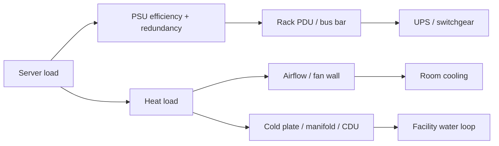

# 16 · 电源、散热与物理部署

## 定位

功耗和散热不是部署完成后的机房问题，而是服务器设计的第一约束之一。进入高密度 AI 和液冷时代后，power budget、airflow、rack power distribution、coolant distribution、telemetry 和 serviceability 直接决定平台能否持续运行。

## 学习目标

- 区分单机、机架和设施三层电力/散热约束。
- 能解释 PSU 冗余、PDU、rack kW、airflow、cold plate、CDU、液冷管路和传感器之间的关系。
- 能通过 BMC/Redfish、OS hwmon 和厂商工具观察功耗、温度、风扇和降频线索。
- 能从采购和部署角度判断平台是否能满配、满载和长期维护。

## 核心直觉

电力最终都会变成热。功耗越高，热负载越高；散热越弱，降频、寿命缩短、故障率和维护风险越高。AI 服务器进入液冷和机架级供电后，单机参数已经不够，必须把整架和设施一起算。

| 层级 | 指标 | 风险 |
| --- | --- | --- |
| 单机 | PSU 冗余、CPU/GPU TDP、风扇策略、传感器 | 降频、过热、冗余失效 |
| 机架 | kW/rack、PDU、供电相位、液冷接口、承重 | 机架无法满配或无法持续满载 |
| 设施 | UPS、配电、CDU、冷却水、消防、维护通道 | 部署不可持续，扩容被设施卡住 |

电热规划至少要从单机算到机架：



粗算时可以先用保守模型：`机架 IT 功耗 = 单机峰值功耗 x 节点数 x 同时满载系数`。再把 PSU 效率、冗余掉电场景、PDU 额定值、液冷/风冷容量和设施余量逐项扣掉。

## 硬件/系统机制

### 单机供电

- PSU 额定功率不等于可持续可用功率，还要看冗余模式、效率曲线、输入电压和瞬态峰值。
- GPU、CPU、NIC、SSD、风扇和 BMC 都参与功耗预算。
- 掉一个 PSU 后能否满载，是生产平台必须验证的问题。

| 场景 | 必须验证 |
| --- | --- |
| N+N 冗余 | 掉一路输入或一组 PSU 后是否仍能承载目标负载 |
| N+1 冗余 | 单 PSU 故障时是否降频、限功耗或触发保护 |
| 高压输入 | 目标机房电压下 PSU 是否能输出标称功率 |
| GPU 瞬态 | 训练/推理峰值是否触发 OCP/OPP 或节点重启 |
| 固件功耗策略 | BIOS/BMC power cap 是否影响性能和温度 |

### 风冷

- 风冷结构简单、维护成熟，但受机箱密度、风扇噪声、风道阻力和进风温度限制。
- 高密度 GPU、满插 DIMM、高速 NIC 和背板会形成局部热点。
- 风道被线缆、非标卡或缺失导风罩破坏时，平台可能在未达标称功耗前降频。

### 液冷

- 液冷包含 cold plate、CDU、manifold、管路、快接头、冷却液、泄漏检测和维护流程。
- OCP Cooling Environments 明确把 warm water cooling 作为高功率密度下的有效热提取方案。
- 液冷难点不只是带走热，还包括责任边界、运维培训、备件、泄漏风险和设施接口。

### 机架与设施

- OCP Rack and Power 强调从 grid to gates 看机架与数据中心基础设施。
- NVIDIA GB200 NVL72 这类 rack-scale、liquid-cooled 平台说明 AI 基础设施正在把机架作为计算单元。
- 电、热、网络和维护空间必须同步规划，否则服务器采购完成后也可能无法上架满配。

## 观察/实验方法

### 实验 1：做单机电热清单

记录以下对象：

- PSU 数量、额定功率、输入电压和冗余方式。
- CPU/GPU/NIC/SSD 的最大功耗或 TDP。
- 风扇数量、风道、导风罩和进出风方向。
- BMC 可见的温度、功耗、风扇转速和 throttle 事件。

目标：理解这台机器的热设计语言。

### 实验 2：读取 OS 传感器入口

```bash
ls /sys/class/hwmon
sensors 2>/dev/null || true
journalctl -k | rg -i 'thermal|throttle|power|fan|hwmon'
```

目标：查看 OS 是否能看到温度、电源或风扇相关数据。

### 实验 3：读取带外遥测

通过 BMC/Redfish 检查：

- Chassis thermal。
- Chassis power。
- Sensor collection。
- Event log。
- Firmware inventory。

示例入口：

```bash
curl -k https://<bmc-host>/redfish/v1/Chassis/
curl -k https://<bmc-host>/redfish/v1/TelemetryService/
curl -k https://<bmc-host>/redfish/v1/Systems/
```

目标：确认故障时是否能独立于主机 OS 观察电热状态。

### 实验 4：做机架部署检查表

记录单机功耗、机架总功耗预算、PDU、供电相位、网络走线、冷却方式、维护空间和设施容量。

目标：把“能上架”变成可核查条件。

### 实验 5：液冷上线检查表

| 项目 | 需要记录 |
| --- | --- |
| 冷却环路 | CDU、manifold、供回水温度、流量、压差 |
| 节点侧 | cold plate 覆盖部件、快接头、泄漏检测、维护空间 |
| 责任边界 | 服务器厂商、液冷厂商、设施团队的接口和保修 |
| 遥测 | BMC/Redfish 是否暴露流量、温度、泄漏、泵/阀状态 |
| 维护 | 排液、隔离、替换、复测、应急处置流程 |
| 验证 | 上架前压力/泄漏测试，满载热测试，掉泵/掉风扇场景 |

目标：液冷不是“接上水管”。它需要可观测、可隔离、可维护、可回滚的工程流程。

## 采购/运维判断

1. 单机峰值功耗和典型功耗是多少，是否有厂商实测功耗资料？
2. PSU 冗余方式是什么，掉一个 PSU 后是否仍能满载？
3. 机架支持多少 kW，是否支持液冷和目标 CDU/管路接口？
4. 风冷还能支撑未来 GPU/NIC/SSD 升级吗？
5. 是否具备电力、温度、风扇、液冷和泄漏遥测？
6. 液冷方案中冷板、CDU、管路、快接头和维护窗口由谁负责？
7. 是否存在局部热点，例如 GPU 后段、DIMM 区、riser、背板或网卡？
8. 设施侧 UPS、配电、冷却水和消防是否支持下一批扩容？

常见误区：

- 额定电源功率够就行：还要看冗余、效率、瞬态峰值和机架总容量。
- 散热只是机房团队问题：服务器平台本身决定热路径和维护难度。
- 液冷只适合极端超算：高密度 AI 正在把液冷推向更广泛的数据中心场景。

## 前沿趋势

- OCP 把 cooling、rack power、hardware management 和 telemetry 放进开放基础设施协作范围。
- NVIDIA GB200/GB300 NVL72 这类 rack-scale 平台让液冷、bus bar、power shelf 和 rack telemetry 成为计算平台的一部分。
- Redfish 已经覆盖 power distribution、liquid cooling 和 telemetry 相关资料，电热管理将更 API 化。
- 未来采购会越来越关注每瓦性能、热回收、设施水温边界、维护窗口和可持续扩容。

## 延伸阅读

- OCP Cooling Environments: https://www.opencompute.org/projects/cooling-environments
- OCP Hardware Management for Liquid Cooling: https://www.opencompute.org/wiki/Cooling_Environments/Hardware_Management_for_Liquid_Cooling
- OCP Open Data Center for AI Strategic Initiative: https://www.opencompute.org/index.php/blog/realizing-the-open-data-center-ecosystem-vision
- OCP Rack and Power: https://www.opencompute.org/projects/rack-and-power
- NVIDIA GB200 NVL72: https://www.nvidia.com/en-us/data-center/gb200-nvl72/
- NVIDIA MGX: https://www.nvidia.com/en-gb/data-center/products/mgx/
- Linux hwmon documentation: https://docs.kernel.org/hwmon/index.html
- DMTF Redfish standards: https://www.dmtf.org/standards/redfish
