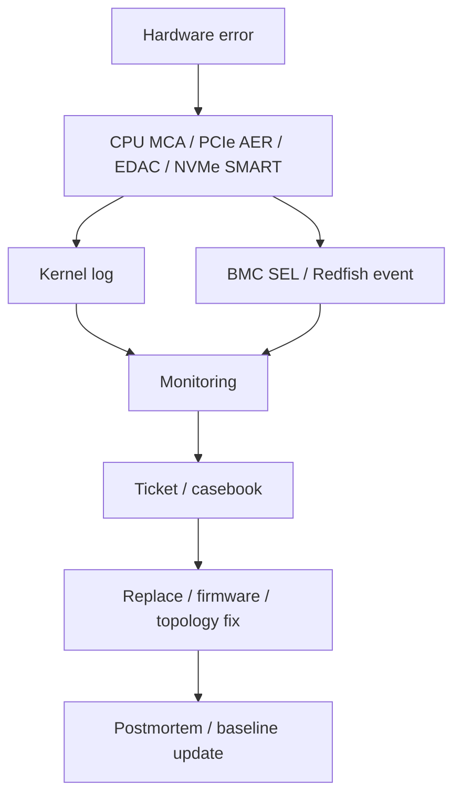

# 17 · RAS、监控与故障诊断

## 定位

RAS 指 Reliability, Availability, Serviceability。它不是单个部件，而是一台服务器从“能跑”变成“能稳定跑、能发现问题、能恢复问题、能维护问题”的能力总和。成熟的硬件知识不止会看配置，还要看错误如何被发现、上报、隔离、恢复和复盘。

## 学习目标

- 理解 CPU MCA、ECC/EDAC、PCIe AER、NVMe health、BMC SEL、Redfish telemetry 的职责。
- 能区分 correctable、uncorrectable、fatal、degraded、predictive failure 等故障语义。
- 能用 OS 日志、sysfs、BMC/Redfish 和厂商工具交叉定位硬件异常。
- 能把告警转化为替换部件、升级固件、调整拓扑或建立观察窗口的决策。

## 核心直觉

RAS 的核心不是“有没有坏”，而是“坏之前能不能发现，坏的时候能不能隔离，坏之后能不能恢复和复盘”。



## 硬件/系统机制

### 硬件检测层

- ECC、链路校验、控制器 health、温度/电源传感器和设备错误计数器是故障最早出现的位置。
- Correctable error 不等于可以忽略，趋势增长可能意味着 DIMM、PCIe 链路、温度或固件问题。
- Uncorrectable/fatal error 通常需要更强的隔离、下线或硬件替换流程。

### 固件与平台层

- BIOS/UEFI/ACPI/BMC 负责错误资源的枚举、记录和部分上报。
- Linux PCIe AER 文档指出，OS 是否处理 AER 取决于固件是否通过 ACPI `_OSC` 授权。
- BMC SEL 和 Redfish event 能在主机 OS 异常时继续保留电源、温度、风扇和硬件事件。

### 操作系统层

- Linux AER 提供 PCIe Advanced Error Reporting 基础设施，可收集错误、报告用户并执行恢复动作。
- Linux EDAC 负责向 userspace 报告内存和相关 error detection/correction 事件。
- hwmon、NVMe log、GPU telemetry、网卡 counters 和 journal 共同构成 OS 侧观察面。

### 管理与复盘层

- Redfish 把 inventory、health、sensor、log、firmware 和 telemetry API 化。
- 监控系统需要关联 OS 日志、BMC 事件、固件版本、部件位置和变更记录。
- 没有关联模型的日志只会制造噪声，无法指导维护动作。

## 观察/实验方法

### 实验 1：查看 PCIe 错误

```bash
journalctl -k | rg -i 'pcie|aer|corrected|uncorrected|fatal|error'
sudo lspci -vv | rg -n 'AER|UESta|CESta|LnkSta'
```

目标：确认是否存在链路错误、AER 统计和降速/降宽问题。

### 实验 2：查看内存错误

```bash
journalctl -k | rg -i 'mce|edac|ecc|memory error'
ras-mc-ctl --summary 2>/dev/null || true
```

目标：确认平台是否有 EDAC/MCA 上报链路，错误是否持续增长。

### 实验 3：查看设备健康

```bash
nvme list 2>/dev/null || true
nvme smart-log /dev/nvme0 2>/dev/null || true
ethtool -S <iface> 2>/dev/null | rg -i 'err|drop|timeout|crc|reset' || true
```

目标：把存储、网络和链路 counters 纳入同一故障判断。

### 实验 4：检查带外健康

通过 BMC/Redfish 检查：

- System health。
- Chassis sensors。
- Event log / SEL。
- Firmware inventory。
- Power and thermal telemetry。

目标：确认主机 OS 与带外管理面是否给出一致结论。

## 采购/运维判断

1. 平台是否启用 ECC、AER、EDAC、MCA、NVMe health 和必要 telemetry？
2. OS 是否真正接管了需要的错误处理路径？
3. BMC/Redfish 能提供哪些 health、log、sensor 和 firmware inventory？
4. 监控能否区分 correctable、uncorrectable、fatal 和 predictive failure？
5. 是否能把 PCIe、内存、NVMe、NIC、GPU、电源、温度和风扇事件统一到同一视图？
6. 故障发生后，第一时间看 OS 日志、BMC SEL 还是厂商诊断包？
7. 告警能否指导 FRU 替换位置，而不是只给出笼统错误？
8. 日志保留、变更记录和固件基线是否足够支持复盘？

常见误区：

- 有 ECC 就等于没问题：ECC 是检测和纠正机制，不代表没有老化、热问题或控制器异常。
- 日志很多就等于可诊断：没有时间线、拓扑和部件位置，日志难以指导动作。
- 监控只看 CPU/内存/磁盘利用率：RAS 更关心错误事件、纠错计数、链路状态、温度、功耗和恢复动作。

## 前沿趋势

- Redfish 2025.3 继续强化资源模型、schema、事件、固件和遥测生态，适合作为跨厂商管理面基线。
- CXL、GPU、DPU、液冷和电源分配设备会把 RAS 范围从传统服务器扩展到 composable/rack-scale 基础设施。
- Linux AER、EDAC、CXL、hwmon 与厂商 telemetry 的关联会成为自动化诊断重点。
- 故障诊断会从“人工看日志”转向“事件关联 + 拓扑归因 + 固件基线 + 变更审计”。

## 延伸阅读

- Linux PCIe AER HOWTO: https://www.kernel.org/doc/html/latest/PCI/pcieaer-howto.html
- Linux EDAC documentation: https://www.kernel.org/doc/html/latest/driver-api/edac.html
- Linux hwmon documentation: https://docs.kernel.org/hwmon/index.html
- DMTF Redfish standards: https://www.dmtf.org/standards/redfish
- OpenBMC: https://openbmc.org/
- Dell iDRAC RESTful APIs / Redfish: https://www.dell.com/support/manuals/en-us/idrac9-lifecycle-controller-v6.x-series/smog_26.0/idrac-restful-apis-redfish-standards-based
