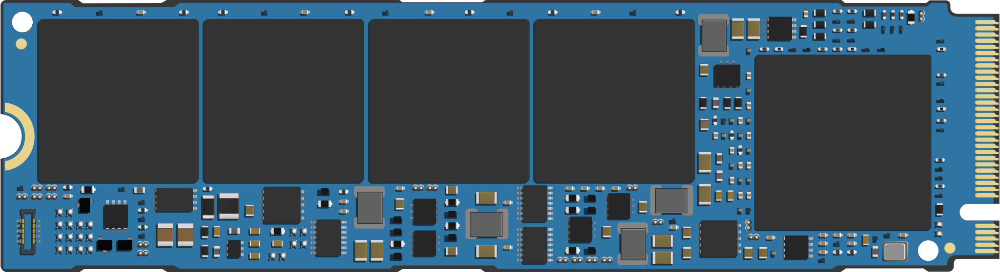

# 18 · 存储硬件、HDD / SSD / RAID / 背板

## 定位

存储硬件不是“买一块盘插进去”这么简单。真实服务器里的存储路径至少包含 `盘位 / 托架 / 背板 / 控制器 / 协议 / 介质 / 固件 / OS 抽象` 八个对象。只看容量和接口，最后最容易在背板、RAID 卡、盘型兼容、重建时间和遥测能力上踩坑。

## 学习目标

- 能把 `form factor`、链路、协议和控制器分成不同层，而不是把 U.2、PCIe、NVMe 混成一个词。
- 能从服务器实物、BMC、控制器和 Linux 四个视角还原一条真实存储路径。
- 能解释 HDD、SATA/SAS SSD、NVMe SSD 在容量、延迟、管理和重建风险上的取舍。
- 能在采购前提出背板、线缆、PERC/HBA、固件、遥测和保修边界问题。

## 核心直觉

存储硬件的第一原则是“能插上”不等于“能稳定生产”。盘位只是入口，背板决定电气和协议路径，控制器决定 OS 能看到什么对象，介质和固件决定长期负载下的行为。RAID 也不是备份，它只是某一层的在线冗余策略。



> 图：M.2 SSD 形态示意。图片来源与许可见 [image_attribution.md](../../assets/image_attribution.md)。

## 先抓住六个判断问题

1. 这次面对的是 `HDD`、`SATA/SAS SSD` 还是 `NVMe SSD`？
2. 盘位背后连接的是 `SATA/SAS backplane`、`tri-mode backplane`，还是直连 NVMe？
3. 服务器是让 OS 直面物理盘，还是先经过 `HBA / RAID / PERC`？
4. 这块盘的关键约束在 `性能`、`容量`、`耐久`、`重建风险`，还是 `兼容性`？
5. 这是企业级产品线，还是消费级产品线被硬塞进服务器？
6. 这台机器真实支持的到底是 `什么盘`，而不是“看起来能插什么盘”？

## 机制拆解

| 层 | 先问什么 | 常见例子 | 最容易误判的点 |
| --- | --- | --- | --- |
| 形态 | 能不能装进托架和风道 | 3.5、2.5、M.2、U.2/U.3、E1.S、E3.S | 空盘位不等于已配背板和线缆 |
| 链路 | 电气怎么连 | SATA、SAS、PCIe | U.2/U.3 是形态和连接生态，不等于协议 |
| 协议 | 命令怎么说 | ATA、SCSI、NVMe | NVMe 通常跑在 PCIe 上，但不是 PCIe 本身 |
| 控制 | 谁管理设备 | HBA、RAID/PERC、NVMe controller、expander | OS 看到的可能只是 virtual disk |

## 先把存储路径拆开

### 物理层

- `Bay / Tray / Caddy` 决定盘能否被固定、抽拉和维护。
- `Backplane` 决定盘位后面到底走什么信号，以及是否支持混插和热插拔。

### 控制层

- `HBA` 倾向把真实盘直接交给 OS。
- `RAID Controller / PERC` 倾向把多块盘收编成逻辑对象再交给 OS。

### 协议层

- `SATA` 主要是成本敏感与兼容性广的路径。
- `SAS` 主要是企业阵列、双端口、扩展器和更强管理能力。
- `NVMe` 是为低延迟、高并发闪存设计的路径，通常直接跑在 PCIe 上。

### 介质层

- `HDD` 依赖机械结构，容量优势明显，但随机访问和重建窗口都更脆弱。
- `SSD` 则取决于 NAND 类型、控制器、固件和耐久模型，而不只是“是不是固态”。

## HDD 与 SSD 的真正边界

### HDD：容量、成本和重建窗口

- 企业 HDD 的价值常常在于每 TB 成本和单盘容量，而不是延迟。
- Seagate Exos 企业盘当前公开页已经把 24TB 到 32TB 作为数据中心容量主线，这说明 HDD 在归档、对象存储和大规模冷温数据里仍然重要。
- Toshiba MG 系列官方页明确给出 `24/7` 与 `550 TB/year workload` 这类企业级约束，提醒你 HDD 采购要看 workload rating，不只是看容量。

### SSD：不是只分快和慢

- 企业 SSD 的差异至少包括：
- `TLC / QLC`
- `读密集 / 混合 / 写密集`
- `DWPD`
- `PLP`
- `遥测与管理接口`
- Solidigm D5-P5336 把 `高密度 QLC` 推到 61.44TB，这种盘的意义不是替代所有 TLC，而是把大规模读密集数据集压到更高密度、更低 TCO。
- Micron 9550 这类高性能 Gen5 数据中心 SSD 则强调的是吞吐、延迟、功耗和 AI 路径下的效率。

## CMR / SMR、TLC / QLC 这四个词必须看穿

### CMR 与 SMR

- `CMR` 更适合一般企业阵列与可预期写入模式。
- `SMR` 能把容量做得更高，但重写与阵列行为更敏感。
- Dell PERC 11 官方文档明确说明 `PERC controller supports only conventional magnetic recording (CMR) drives, and does not support shingled magnetic recording (SMR) drives`。
- 这意味着“物理上能插进去”不代表控制器愿意支持。

### TLC 与 QLC

- `TLC` 往往用于更平衡的企业级性能与耐久方案。
- `QLC` 更适合高密度、读密集和成本敏感场景。
- 真正要比较的不是“QLC 一定差”，而是：
- 数据写入比例
- 缓存命中情况
- 重写频率
- DWPD
- 容量密度收益

## SATA / SAS / NVMe 不要再混成一个概念

### SATA

- 适合广泛兼容和成本敏感部署。
- 但在并发、双端口、扩展器生态和企业路径上通常弱于 SAS / NVMe。

### SAS

- 常见于企业阵列、RAID 卡和共享存储语境。
- 强项往往不只是速度，而是管理、拓扑和企业特性。

### NVMe

- NVM Express 官方页面当前显示 `NVMe Base Specification Revision 2.3` 于 `2025-08-05` 发布。
- 这类接口的意义不只是更高带宽，而是更低延迟、更深队列和更适合现代闪存并发。
- 但 NVMe 真正值不值，要看平台 lane、本地性、热设计和软件栈是否跟上。

## HBA、RAID、PERC 的边界

### HBA

- 目标是把物理盘暴露给 OS，让上层自己做 md/LVM/ZFS/对象层。

### RAID Controller / PERC

- 目标是先在控制器层完成编组、缓存策略和虚拟盘暴露。
- OS 看到的可能只是一个 `Virtual Disk`，而不是后面的 `Physical Disk`。

### 所以最关键的问题不是“有没有 RAID”

- 而是：
- 你想把复杂度放在控制器，还是放在 OS / 文件系统
- 你真正需要的是统一管理、缓存与兼容，还是端到端可见性

## 企业级与消费级盘的真正差异

- 企业级判断通常要看：
- 是否有 `PLP`
- 是否有更稳定固件与错误恢复策略
- 是否有可用遥测
- 是否在 OEM / 控制器兼容矩阵内
- 是否有清晰保修和批量运维路径
- 消费级盘即便参数亮眼，也可能在：
- 电源异常保护
- 长时间高负载稳定性
- 固件一致性
- 控制器兼容
- 带外遥测
上明显吃亏。

## 服务器落地时最该问的十个问题

1. 盘位后面真实接的是哪种背板？
2. 控制器是 HBA、RAID 还是 Tri-Mode？
3. 这台服务器的当前配置到底支持几块 SAS / SATA / NVMe？
4. 是否存在对 `CMR / SMR` 或特定盘型的明确限制？
5. 目标负载是容量优先、吞吐优先，还是低延迟优先？
6. 这块 SSD 的 `DWPD`、`PLP`、form factor 和热设计是否匹配？
7. RAID 重建窗口是否会把风险放大？
8. Linux 看到的是物理盘、命名空间，还是控制器给出的虚拟盘？
9. 能否从 iDRAC / Redfish / smartctl / nvme-cli 稳定取到健康数据？
10. 未来 2-3 年扩容时，背板、线缆、riser 和控制器是否仍有余量？

## 设计 / 采购判断

| 选择 | 更适合 | 主要代价 |
| --- | --- | --- |
| 原厂认证盘 | 需要明确支持边界、固件配套和告警集成的生产环境 | 单价更高，SKU 灵活性较低 |
| 第三方企业盘 | 有能力自测兼容、自己维护固件和批次基线的团队 | 故障归责和带外可见性需要提前验证 |
| 消费级盘 | 实验、临时缓存、非关键数据 | PLP、耐久、长时间稳定性和遥测常不足 |
| HDD 容量池 | 归档、对象、冷温数据、大容量备份 | 随机访问弱，重建窗口长 |
| NVMe SSD | 低延迟、高并发、数据库、虚拟化、AI 本地缓存 | PCIe lane、散热、价格和软件栈要求更高 |

## 常见误区

### 误区 1：空盘位一定能插任何盘

- 错。盘位只是物理入口，背板和控制器才决定真实支持矩阵。

### 误区 2：NVMe 一定比 SAS 更适合所有场景

- 错。很多场景更受平台拓扑、成本、热设计、容量密度和运维路径约束。

### 误区 3：QLC 一定不能进企业

- 错。读密集、高密度数据集和对象型场景里，QLC 反而可能是更优解。

### 误区 4：买到企业盘就一定无脑安全

- 错。还要看控制器兼容、固件版本、保修责任和重建策略。

## 故障模式

- 协议不匹配：托架能装入，但背板或控制器只支持 SAS/SATA，不支持 NVMe。
- 控制器遮蔽：Linux 只看到 virtual disk，物理盘 predictive failure 只能从 PERC/iDRAC 看到。
- 热设计不足：高功耗 NVMe 在密集盘位中降速或频繁报温度告警。
- 介质选择错误：把 SMR 或消费级 SSD 放进重写密集阵列，导致重建、延迟和寿命风险。
- 批次和固件风险：同批次盘或相同固件缺陷在重建窗口里集中暴露。

## Linux / 硬件观察命令

### 观察 1：先画一张真实存储路径图

- 记录盘位数量
- 记录背板类型
- 记录控制器型号
- 记录 OS 看到的设备对象

目标：把 “盘位 -> 背板 -> 控制器 -> 设备节点” 串起来。

### 观察 2：识别控制器和物理盘类型

```bash
lsblk -o NAME,SIZE,TYPE,ROTA,MODEL,SERIAL,FSTYPE,MOUNTPOINT
lspci | grep -Ei 'raid|sas|sata|storage|nvme'
sudo lspci -vv | grep -Ei 'LnkCap|LnkSta|NUMA|Non-Volatile|RAID|SAS|SATA'
sudo smartctl -a /dev/sdX
sudo nvme list
sudo nvme id-ctrl /dev/nvme0
```

目标：知道当前系统到底是 HDD、SATA/SAS SSD，还是 NVMe SSD。

### 观察 3：把逻辑盘和物理盘分开看

- 在 iDRAC / PERC 里看 Physical Disk / Virtual Disk
- 在 Linux 里看 `/dev/sdX` 或 `/dev/nvmeXnY`

目标：建立“控制器视角”和“OS 视角”两张清单。

## 前沿趋势

- EDSFF（如 E1.S、E3.S）和 U.3 让数据中心 NVMe SSD 更关注密度、散热、热插拔和统一背板。
- OCP Datacenter NVMe SSD 这类规范把企业盘能力推进到 telemetry、LED、管理、安全和形态一致性，而不只是 NVMe 基础命令。
- NVMe-MI 把管理路径从主机 I/O 路径里分离出来，适合 BMC、JBOF 和大规模资产管理。
- 高密度 QLC 与大容量 HDD 会长期共存，关键分界是写入比例、重建窗口、机架密度、功耗和 TCO。

## 本页要配套记住的概念卡

- CMR / SMR
- TLC / QLC
- HBA / RAID Controller
- Virtual Disk / Physical Disk
- DWPD
- AFR / URE

## 延伸阅读

- NVM Express Base Specification: https://nvmexpress.org/specification/nvm-express-base-specification/
- SATA-IO Purchase Specification: https://sata-io.org/developers/purchase-specification
- Dell PERC 11 User’s Guide: https://www.dell.com/support/manuals/en-us/perc-h355-sas/perc11_ug/technical-specifications?guid=guid-aaaf8b59-903f-49c1-8832-f3997d125edf
- Seagate Exos Enterprise Hard Drives: https://www.seagate.com/products/enterprise-drives/exos-x/x24/
- Solidigm D5-P5336 Product Brief: https://www.solidigm.com/products/data-center/product-briefs/d5-p5336-product-brief.html
- Micron 9550 NVMe SSD: https://www.micron.com/products/storage/ssd/data-center-ssd/9550-ssd
- Toshiba Enterprise Capacity Hard Drive MG Series: https://www.toshiba-storage.com/products/enterprise-capacity-hard-drive-mg-series/
