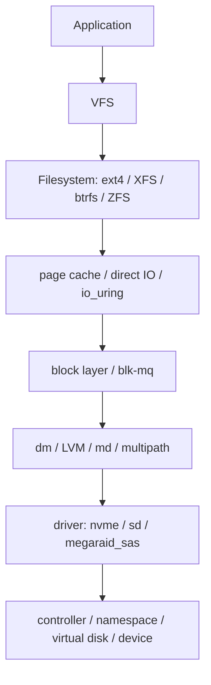

# 19 · Linux 块层、文件系统与存储软件

## 定位

Linux 存储软件栈的关键，不在于背几个命令，而在于看清 `物理设备 -> 请求队列 -> 块层 -> md / dm / LVM -> 文件系统 -> 挂载点` 的对象关系。很多“磁盘问题”其实是块层问题，很多“文件系统问题”其实是控制器或队列问题。

## 学习目标

- 能从 `/dev/sdX`、`/dev/nvme0n1`、`/dev/md0`、`/dev/dm-*` 反推出底层对象关系。
- 能解释 `blk-mq`、I/O scheduler、queue depth、md、dm/LVM 和文件系统分别处在哪一层。
- 能在扩容、性能测试和故障排查时先确认测试对象，而不是直接跑命令。
- 能判断控制器 RAID、Linux md、LVM、ZFS 等方案各自把复杂度放在哪里。

## 核心直觉

Linux 里的块设备名不是物理现实的直接镜像，而是当前内核栈暴露出来的对象。现代 NVMe 和高速 SSD 的性能瓶颈经常出现在队列映射、NUMA、本地性、调度器、缓存路径和上层文件系统语义里，而不只是“盘够不够快”。

## 先抓住六个问题

1. OS 看到的对象到底是什么：物理盘、命名空间、虚拟盘，还是逻辑卷？
2. 当前 I/O 排队和派发主要发生在 `blk-mq`、控制器，还是文件系统上层？
3. 冗余是控制器 RAID、`md`、`dm-raid`，还是文件系统自身提供？
4. 容量管理发生在 GPT、LVM、thin provisioning，还是 ZFS pool？
5. 出现性能抖动时，先看文件系统、队列、还是底层设备？
6. 扩容时到底应该改哪一层，而不会误操作到错误对象？

## 机制拆解



| 层 | 负责什么 | 常见观察点 |
| --- | --- | --- |
| VFS / 文件系统 | 文件、目录、inode、日志和恢复语义 | `findmnt`、`xfs_info`、`tune2fs` |
| page cache / direct I/O | 缓存与绕过缓存策略 | `fio --direct=1`、`iostat` |
| blk-mq | 请求排队、tag、软硬件队列映射 | `/sys/block/*/queue/*` |
| md / dm / LVM | 冗余、映射、thin、crypt、卷管理 | `mdadm`、`dmsetup`、`lvs` |
| driver / controller | 把请求交给 NVMe/SCSI/RAID 设备 | `lspci`、`nvme`、`smartctl` |

## Linux 存储栈要从下往上看

### 1. Block Device

- OS 最先看到的是块设备对象，例如 `/dev/sdX`、`/dev/nvme0n1`、`/dev/md0`、`/dev/dm-0`。
- 这些名字不是“真实物理盘”的同义词，而是 Linux 当前暴露出的块设备对象。

### 2. blk-mq

- Linux 官方文档把 `blk-mq` 定义为让现代高速存储通过并行队列同时提交请求、发挥更高 IOPS 的机制。
- 这意味着今天很多性能问题，都要先看 `队列` 而不是只看“磁盘快不快”。

### 3. md

- `md` 是 Linux 里直接做 RAID 的经典路径。
- 它适合那些想把冗余逻辑放在 OS、而不是 RAID 卡里的场景。

### 4. device-mapper / LVM

- `device-mapper` 是 Linux 存储栈里一个非常核心的中间层。
- 它下面可以挂 `linear / thin / cache / raid / crypt / verity` 等多种目标。
- LVM 则是最常见的 device-mapper 友好入口之一。

### 5. File System

- `ext4`、`XFS`、`ZFS` 不是同一层的替代词，而是不同设计哲学下的数据组织方式。
- 选哪一个，要回到恢复路径、容量增长、管理成本和 workload 模式。

## blk-mq 为什么是现代 Linux 存储的关键

- 旧式单队列模型更容易在多核和高速 SSD 时代成为瓶颈。
- blk-mq 的意义，是把请求队列更贴近 CPU 与硬件队列，减少单锁和串行瓶颈。
- 这也是为什么今天你看 NVMe、PCIe SSD 或高并发块设备，不能再用老式机械盘时代的直觉去想性能。

## md、dm、LVM、文件系统不要混

### md

- 更像 “在块设备层做阵列”。
- 核心价值是直接、透明、OS 侧可见。

### dm / LVM

- 更像 “在块设备层再做一层映射和容量组织”。
- 适合做卷管理、thin、快照、缓存和多层拼接。

### 文件系统

- 负责把块空间组织成目录、inode、元数据、日志和恢复语义。

### 所以一个典型路径可能是

```text
NVMe / SAS 盘
  -> md RAID
  -> LVM
  -> XFS
  -> /data
```

或者：

```text
RAID Controller Virtual Disk
  -> GPT
  -> ext4
  -> /srv
```

## ext4、XFS、ZFS 的边界

### ext4

- 仍然是广泛部署、非常稳健的通用文件系统。
- Linux ext4 文档还提供了 `/proc/fs/ext4` 和 `/sys/fs/ext4` 的观测入口，适合做运行期检查。

### XFS

- 在大文件、大容量和持续吞吐型场景里很常见。
- XFS 文档现在明确提醒旧 `V4` 格式已进入弃用路径，这说明文件系统选择不只是“能用”，还涉及长期格式生命周期。

### ZFS / OpenZFS

- 更强调整体数据完整性、pool / dataset / snapshot 的统一模型。
- 但它也意味着学习曲线、内存占用、生态和运维习惯要一起改变。

## 控制器 RAID 与 Linux 软件栈的边界

### 控制器 RAID

- 优点是统一管理、对上层暴露更简单、很多 OEM 路径更成熟。
- 缺点是 OS 可见性降低，很多真实物理盘状态要回到带外或控制器工具看。

### Linux 软件 RAID / 卷管理

- 优点是对象透明、脚本友好、与 Linux 观测工具更一致。
- 缺点是你自己要对阵列、恢复、告警和升级路径负责得更多。

## 服务器落地时最该问的十个问题

1. 当前 `/dev` 里看到的是物理盘、逻辑盘还是卷管理对象？
2. 现有阵列能力是在控制器还是 Linux 软件栈里实现？
3. 有没有用到 `md`、`dm`、`LVM` 或 `ZFS`，各自承担什么职责？
4. 文件系统到底选的是 `ext4`、`XFS` 还是 `ZFS`，为什么？
5. 队列调度和队列深度是否与设备类型匹配？
6. 性能测试时，测试的是裸设备、卷、还是挂载后的文件？
7. 扩容时需要改 GPT、LVM、文件系统中的哪几层？
8. 监控是否能看见 `/sys/block`、`/proc/fs/ext4`、`xfs_info`、`zpool status` 这类真实入口？
9. 发生异常时，第一现场该看 `dmesg`、`mdadm`、`lvs`、还是文件系统工具？
10. 这套软件栈是否适合当前团队长期维护？

## 设计 / 采购判断

- 如果要最大化硬件售后和统一告警，控制器 RAID 往往更符合 OEM 支持路径，但 OS 对物理盘可见性会下降。
- 如果要端到端透明和脚本化控制，Linux md/dm/LVM 更直接，但团队必须自己负责巡检、告警、恢复演练和升级。
- 如果工作负载依赖高并发 NVMe，先确认 blk-mq、NUMA、本地 PCIe 拓扑、I/O scheduler 和队列深度，再谈更换更贵的盘。
- 如果准备用 ZFS、btrfs 或带校验的数据系统，采购时要把内存、HBA 直通、错误上报和恢复策略一起纳入设计。

## 常见误区

### 误区 1：`/dev/sdX` 就是一块物理盘

- 错。它可能是 RAID 控制器给出的虚拟盘，也可能是多层映射后的结果。

### 误区 2：LVM 就等于 RAID

- 错。LVM 主要解决卷管理，不等于冗余。

### 误区 3：文件系统变大，底层一定已经安全扩好

- 错。可能只是上层增长了，而底层冗余、对齐或备份策略仍没处理好。

### 误区 4：性能问题只需要跑一次 fio

- 错。你要先明确测试对象、IO 模式、队列深度、缓存影响和文件系统层级。

## 故障模式

- 对象认错：把 RAID virtual disk 当作物理盘，导致扩容或换盘步骤完全错层。
- 队列拥塞：设备还能跑满带宽，但高队列延迟让数据库或虚拟化应用抖动。
- 缓存误导：fio 测到了 page cache 或文件系统预分配效果，而不是底层盘性能。
- 扩容断层：底层 LUN 扩了，但 GPT、PV、LV、文件系统某一层没有正确增长。
- 多路径缺失：NVMe multipath 或 dm-multipath 没有按设计启用，链路故障变成业务中断。

## Linux / 硬件观察命令

### 观察 1：把当前块设备关系画出来

```bash
lsblk -o NAME,KNAME,SIZE,TYPE,FSTYPE,MOUNTPOINT,PKNAME
blkid
findmnt -o TARGET,SOURCE,FSTYPE,OPTIONS
dmsetup ls --tree 2>/dev/null || true
```

目标：看清 block device、分区、文件系统和挂载点之间的对应关系。

### 观察 2：观察 blk-mq 与调度器

```bash
cat /sys/block/nvme0n1/queue/scheduler
cat /sys/block/nvme0n1/queue/nr_requests
cat /sys/block/nvme0n1/queue/rotational
cat /sys/block/nvme0n1/queue/nomerges
ls /sys/block/nvme0n1/mq
```

目标：知道当前设备队列的可见参数和调度器状态。

### 观察 3：检查 md / LVM / 文件系统

```bash
sudo mdadm --detail /dev/md0
sudo pvs
sudo vgs
sudo lvs
sudo xfs_info /mountpoint 2>/dev/null || true
sudo tune2fs -l /dev/mapper/vg-lv 2>/dev/null | head
```

目标：如果系统启用了软件栈，知道冗余和卷管理分别发生在哪一层。

### 观察 4：用 fio 明确测试对象

```bash
fio --name=randread --filename=/tmp/fio.test --size=1G --rw=randread --bs=4k --iodepth=16 --runtime=30 --time_based=1
```

目标：学会把测试对象、访问模式和队列深度说清楚，而不是只报一个带宽数字。

## 前沿趋势

- `io_uring` 改变的是高性能异步 I/O 提交和完成路径，不会自动把慢设备变快。
- NVMe multipath、zoned block device、blk-mq 和 SPDK/用户态路径会让 Linux 存储排障越来越依赖对象模型。
- 高性能测试正在从“单线程顺序带宽”转向“队列深度、尾延迟、NUMA、本地性和长期稳定性”的综合判断。

## 本页要配套记住的概念卡

- blk-mq
- md RAID
- Device Mapper
- LVM
- ext4 / XFS / ZFS
- queue depth

## 延伸阅读

- blk-mq: https://docs.kernel.org/block/blk-mq.html
- Device Mapper: https://docs.kernel.org/admin-guide/device-mapper/index.html
- RAID arrays (md): https://docs.kernel.org/6.5/admin-guide/md.html
- ext4 General Information: https://docs.kernel.org/admin-guide/ext4.html
- XFS Filesystem: https://docs.kernel.org/admin-guide/xfs.html
- OpenZFS Documentation: https://openzfs.github.io/openzfs-docs/index.html
- fio Documentation: https://fio.readthedocs.io/
