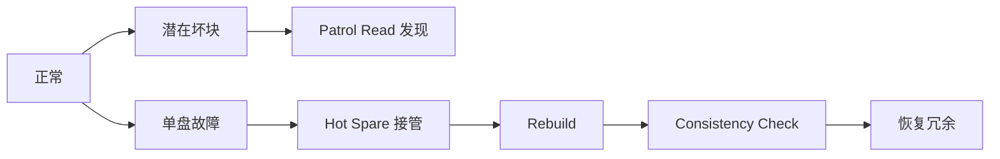

# 23 · RAID 运维、Hot Spare、Patrol Read 与重建策略

## 定位

`RAID` 真正难的地方，不是记住几个级别，而是把 `冗余方式`、`热备策略`、`后台扫描`、`重建窗口` 和 `可恢复性` 当成一个完整运维策略。很多阵列不是在“盘坏的那一刻”失败，而是在“重建过程中又出第二个问题”时失败。

## 学习目标

- 能把 RAID 从级别表升级成故障时间线和恢复策略。
- 能解释 hot spare、patrol read、consistency check、background initialization 和 rebuild window 的差异。
- 能判断控制器 RAID、Linux md、上层分布式冗余分别适合什么责任边界。
- 能在采购和设计时用重建窗口、URE、盘容量、批次和温度风险评估阵列。

## 核心直觉

RAID 的关键不是“平时可用容量是多少”，而是“坏盘后系统如何度过风险窗口”。Hot spare 只会让恢复更快开始，不能消除重建期间的第二故障、隐藏坏块、链路抖动、高温或人为误操作风险。

## 先抓住六个判断问题

1. 冗余到底是做在 `控制器`、`Linux md`，还是更上层存储系统里？
2. 这套阵列优化的是 `容量利用率`、`随机性能`，还是 `重建时间`？
3. 是否已经配置 `global / dedicated hot spare`，它们的范围和行为是否符合预期？
4. Patrol Read、Consistency Check、Background Initialization 是不是打开了，频率与窗口是否合理？
5. 当前盘型和单盘容量会不会把 `重建窗口` 拉得过长？
6. 当第二块盘、URE、掉线或高温出现在重建期时，回滚和恢复路径是什么？

## 机制拆解



| 动作 | 目的 | 典型风险 |
| --- | --- | --- |
| Hot Spare | 故障后自动加入替代盘 | 容量不匹配、作用域不对、回迁策略不清 |
| Patrol Read | 主动读物理盘，提前发现介质错误 | 频率过低或业务高峰运行影响性能 |
| Consistency Check | 校验阵列数据和冗余信息一致性 | 只在线不代表校验信息一定可靠 |
| Rebuild | 把冗余重新构建到替代盘 | 长时间暴露在第二故障和 URE 风险下 |

## RAID 先别从级别开始，要先从风险模型开始

### RAID 的核心是故障时怎么活下去

- 平时看到的容量和性能，只是表面收益。
- 真正决定阵列价值的，是盘坏之后的行为：`能不能自动接管`、`多久重建完`、`重建时业务影响多大`、`第二个异常出现时还有没有余量`。

### 所以 RAID 级别只是策略的一部分

- `RAID 1 / 10` 常常用空间换更简单的恢复路径和更好的随机写。
- `RAID 5 / 6` 更强调容量利用，但单盘变大后，重建时间和第二故障风险都会上升。
- 选择时必须同时看盘型、容量、负载、控制器能力和维护窗口。

## Hot Spare 不是“有就行”

### Global Hot Spare 与 Dedicated Hot Spare

- `Global Hot Spare` 面向更广的受保护范围。
- `Dedicated Hot Spare` 绑定更具体的虚拟磁盘或磁盘组。
- 它们的差异，不只在定义，而在故障发生时谁能优先接管。

### Persistent / Revertible 行为也很关键

- Dell OMSA 文档明确给出 `Persistent Hot Spare` 与 `Allow Revertible Hot Spare and Replace Member` 这类控制器属性。
- 这意味着热备盘策略不只是“选一块闲置盘”，还涉及：
- 插槽是否持续保留热备语义
- 故障盘更换后，数据是否自动回迁
- 批量维护时是否会因为插槽更换而改变保护行为

## Patrol Read 和 Consistency Check 在解决什么问题

### Patrol Read

- Dell OpenManage 文档明确指出，`Patrol Read` 用来识别磁盘错误，以避免磁盘故障和数据损坏。
- 它通常在控制器空闲时后台运行，I/O 繁忙时会降速或暂停。

### 为什么这很重要

- 很多介质问题在平时是潜伏的。
- 如果你只在真正重建时才第一次碰到坏块、链路问题或介质错误，恢复窗口会被瞬间放大。
- Patrol Read 的价值，就是把“隐藏错误”尽量提前暴露。

### Consistency Check

- 它更像校验冗余信息与数据是否一致。
- 对奇偶校验类阵列尤其重要，因为“阵列在线”并不等于“冗余信息一定可恢复”。

## 重建风险为什么会随着单盘容量变大而放大

### 大盘的代价不是只在采购时更省槽位

- 单盘越大，重建所需时间通常越长。
- 重建时间越长，系统暴露在第二故障、链路抖动、温度问题和 URE 风险下的窗口越大。

### 这就是为什么同样是 RAID 5

- 在小容量时代可能还能接受。
- 到了高容量近线盘时代，是否继续用单重校验，就要回到实际恢复窗口来判断，而不能只看“历史上一直这么配”。

## 控制器 RAID 与 Linux 软件 RAID 的运维差异

### 控制器 RAID

- 更适合要统一 GUI、统一告警、统一热备和 OEM 支持路径的环境。
- 但很多关键操作和状态也因此被收敛到控制器语义中。

### Linux md RAID

- 更透明、更脚本化，和 Linux 原生工具链一致。
- 但热备、巡检、告警、恢复流程要靠你自己体系化设计。

### 所以不要问“哪个好”

- 要问谁对当前团队、设备形态和维护习惯更合适。

## 服务器落地时最该问的十个问题

1. 当前冗余发生在哪一层，控制器还是 OS？
2. 选这个 RAID 级别，是为了容量、性能还是恢复窗口？
3. 是否已经配置 global / dedicated hot spare？
4. hot spare 是不是 persistent，故障盘替换后会不会自动回迁？
5. Patrol Read 是否开启，周期和速率是否合理？
6. Consistency Check 是否有固定窗口？
7. 重建时对业务有多大影响，有没有限速策略？
8. 当前阵列用的盘型、容量和 firmware 是否一致？
9. 如果重建期间再掉一块盘或出现 URE，恢复预案是什么？
10. 现在的监控能不能区分 “degraded / rebuilding / predictive failure / foreign config / hot spare used”？

## 设计 / 采购判断

- 高容量近线 HDD 上慎用单重校验策略，重建窗口和 URE 风险可能比容量收益更关键。
- Hot spare 要明确 `global`、`dedicated`、`persistent`、`revertible`、容量匹配和槽位策略。
- RAID 组内尽量避免同批次、同老化程度、同温度压力的盘同时进入高风险期。
- 对业务高峰敏感的系统，要明确 rebuild rate、patrol read 窗口和 consistency check 窗口。
- RAID 不能替代备份，阵列误删、勒索、固件缺陷、控制器故障和站点故障仍需要独立保护。

## 常见误区

### 误区 1：RAID 级别一旦选好，后面就只是换盘

- 错。Hot Spare、Patrol Read、Consistency Check、Rebuild Rate 都会改变真实风险。

### 误区 2：有 Hot Spare 就不需要关注重建窗口

- 错。热备只是更快开始恢复，不会自动缩短全部重建时间。

### 误区 3：RAID 6 一定绝对安全

- 错。它只是容错余量更大，不代表可以忽略 firmware、温度、批次相关性和恢复策略。

### 误区 4：控制器显示健康就不用做后台巡检

- 错。隐藏介质错误往往要靠 Patrol Read / Consistency Check 提前挖出来。

## 故障模式

- Hot spare 范围错误：故障阵列无法使用预期热备盘，或错误阵列抢占热备盘。
- 重建期二次故障：另一块盘出现 URE、掉线或温度异常，导致恢复失败。
- Foreign config 误处理：换盘或迁移后误导入/清除配置，造成数据风险。
- 巡检窗口缺失：潜在坏块直到 rebuild 才被读到，恢复窗口被放大。
- 告警语义丢失：监控只看到虚拟盘在线，没区分 degraded、rebuild、predictive failure。

## Linux / 硬件观察命令

### 观察 1：给当前阵列做一张策略清单

- RAID 级别
- Hot Spare 类型
- Rebuild 策略
- Patrol Read 状态
- Consistency Check 计划

目标：把“阵列配置”从容量视角升级为运维策略视角。

### 观察 2：在控制器和 OS 各抓一份 degraded / rebuild 语义

- 控制器：Physical / Virtual Disk 状态
- OS：块设备、文件系统、挂载状态

目标：理解业务视角和控制器视角并不完全等价。

### 观察 3：估算一次最坏重建窗口

- 记录单盘容量
- 记录阵列类型
- 记录业务写入强度
- 记录重建速率和维护窗口

目标：学会用“恢复时间”而不是只用“可用容量”说 RAID。

### 观察 4：Linux md 与内核日志入口

```bash
cat /proc/mdstat
sudo mdadm --detail /dev/md0
journalctl -k --since "24 hours ago" | grep -Ei 'md|raid|rebuild|resync|scsi|sas|timeout|error'
```

目标：如果冗余在 Linux md 层，能看到阵列状态、重同步进度和内核错误。

## 前沿趋势

- 单机 RAID 在大容量 HDD 和高密度 SSD 场景下会更依赖后台巡检、遥测、快速换盘和重建限速策略。
- 越来越多系统把冗余上移到 Ceph、对象存储、分布式文件系统或应用副本层，控制器 RAID 不再是唯一答案。
- 控制器、本地 OS、BMC/Redfish 的状态语义需要对齐，否则自动化换盘和事件闭环会出错。

## 本页要配套记住的概念卡

- Hot Spare
- Patrol Read
- Consistency Check
- Rebuild Window
- URE / rebuild risk

## 延伸阅读

- Dell PowerEdge RAID Controller 11 User’s Guide: https://www.dell.com/support/manuals/en-us/perc-h355-sas/perc11_ug/technical-specifications?guid=guid-aaaf8b59-903f-49c1-8832-f3997d125edf
- Dell OMSA Controllers Properties and Tasks: https://www.dell.com/support/manuals/en-us/openmanage-server-administrator-v11.0.1.0/omss_11.0.1.0_ug_olh_pub/controllers-properties-and-tasks?guid=guid-bea6ba57-5ec3-46d3-9f06-8df222e02dc3&lang=en-us
- Dell Setting the Patrol Read Mode: https://www.dell.com/support/manuals/en-lk/openmanage-server-administrator-v9.1.2/omss_9.1.2_users_guide/setting-the-patrol-read-mode?guid=guid-16573c2b-c9c7-4c48-b376-be4cee388595&lang=en-us
- Linux RAID arrays (md): https://docs.kernel.org/6.5/admin-guide/md.html
- Backblaze Drive Stats Dataset: https://www.backblaze.com/cloud-storage/resources/hard-drive-test-data
