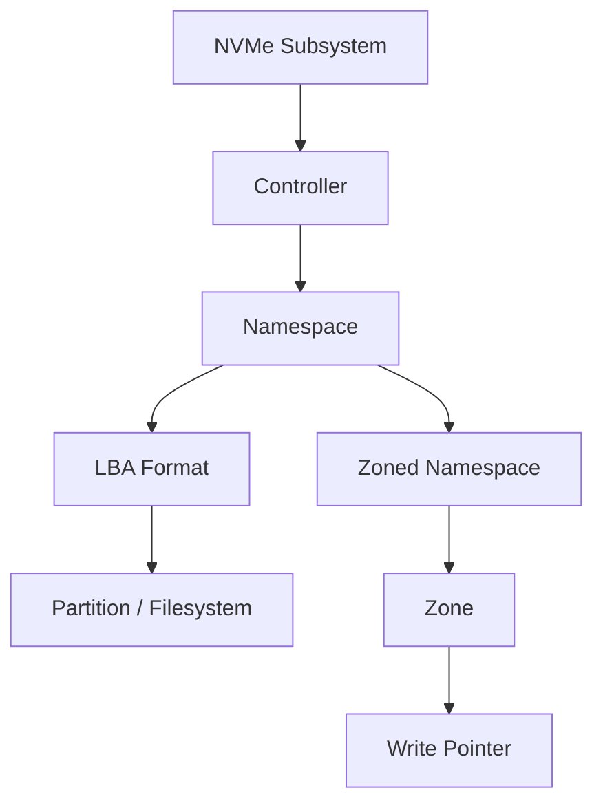

# 24 · SSD 耐久、PLP、Namespace 与 Zoned Storage

## 定位

SSD 最容易被简化成“比 HDD 快的盘”，但企业环境里真正决定它价值的，往往是 `耐久模型`、`掉电保护`、`命名空间抽象` 和 `数据写入模式`。如果只看带宽和容量，你会错过 SSD 最本质的约束。

## 学习目标

- 能用 TBW、DWPD、`percentage used` 和实际写入量估算 SSD 耐久预算。
- 能解释 PLP 对数据库、虚拟化、日志和缓存盘的一致性意义。
- 能区分 NVMe controller、subsystem、namespace、LBA format、partition 和 filesystem。
- 能理解 ZNS/zoned storage 的顺序写约束，以及它为什么能降低写放大和 over-provisioning 压力。

## 核心直觉

企业 SSD 的核心问题不是“是不是固态”，而是写入预算和写入形态是否匹配。namespace 不是分区，ZNS 也不是普通块设备的透明加速；它们都要求你理解 NVMe 控制器、逻辑地址和软件栈之间的责任边界。

## 先抓住六个判断问题

1. 目标负载是 `读密集`、`混合`，还是 `写密集`？
2. 这块 SSD 的耐久指标应该看 `TBW`、`DWPD`、`percentage used`，还是实际写入模式？
3. 有没有 `PLP`，以及它对应用一致性意味着什么？
4. OS 面对的是整块盘、一个 namespace，还是多个 namespace？
5. 当前软件栈是否需要理解 `zoned storage` 的顺序写约束？
6. 这次选盘是在优化 `低延迟`、`高密度`、`更低写放大`，还是 `更简单的运维路径`？

## 机制拆解



| 概念 | 解决什么 | 观察重点 |
| --- | --- | --- |
| TBW/DWPD | 保修期内写入预算 | 与实际每日写入和写放大一起看 |
| PLP | 掉电边界的一致性风险 | 不等于备份，但影响 flush/commit 可信度 |
| Namespace | NVMe 控制器暴露的逻辑空间 | 不是传统分区，可能有多个 namespace |
| ZNS | host-managed 顺序写 zone | 软件必须尊重 zone write pointer |

## SSD 耐久不是“寿命玄学”，而是写入预算

### DWPD / TBW 的真正意义

- SNIA 对 SSD 的介绍明确指出，厂商通常用 `TBW` 或 `DWPD` 表示设备在保修期内允许的写入量。
- 所以 DWPD 不是营销参数，而是“你每天大致能写多少而不越过设计边界”的预算语言。

### 真正要和负载匹配

- 同样是 30TB 级 SSD，读密集 QLC 和高写入 TLC 的目标场景可能完全不同。
- 如果应用是 checkpoint、日志密集或持续随机写，单纯用“大容量更便宜”的直觉选盘，往往会选错。

## PLP：企业盘和消费盘最容易被忽略的分界线之一

### 什么是 PLP

- `PLP` 即 Power Loss Protection。
- 它的意义不是“断电后数据永远不丢”，而是让设备在掉电边界上更可靠地处理写入完成与元数据一致性。

### 为什么它重要

- 对数据库、日志、虚拟化、RAID cache flush 协同场景，PLP 直接影响一致性风险模型。
- 这也是为什么很多消费级 SSD 即便顺序带宽看起来不错，也不适合直接塞进关键服务器。

## Namespace：NVMe 世界里不要再把“盘”和“设备节点”混成一个词

### Namespace 在解决什么

- NVMe 把 controller、namespace、NQN、命名空间格式和 log page 这些对象明确区分开。
- Linux 里的 `/dev/nvme0n1` 往往对应一个 namespace，而不是“整个 NVMe 子系统”的全部语义。

### 为什么要理解 namespace

- 多 namespace、格式、容量切分、隔离、控制器共享与管理操作，都会依赖这一层抽象。
- 只把它当成“另一个块设备名字”，后面做管理和故障定位会越来越乱。

## Zoned Storage：为什么顺序写约束重新回来了

### Zoned 的核心思想

- Zoned storage 把地址空间按 zone 划分。
- 对 `sequential zones` 来说，随机读可以，写入必须按顺序推进 write pointer。

### 这不是只有 SMR HDD 才有

- Linux `zonefs` 文档明确指出，最常见的 zoned storage 形式包括基于 `ZBC / ZAC` 的 SMR HDD。
- 同时它也指出，SSD 也可以实现 zoned interface，例如 NVMe `ZNS`，以减少设备侧写放大和过度预留。

### ZNS 在 NVMe 里意味着什么

- NVM Express 官方页当前把 `Zoned Namespaces Command Set` 列为独立命令集，`2025-08-05` 时的当前版本为 `1.4`。
- 这说明 Zoned 不是实验室概念，而是 NVMe 规范体系中的正式扩展方向。

## Linux 如何面对 Zoned 设备

### zonefs

- `zonefs` 把每个 zone 暴露成一个文件。
- 它并不试图完全隐藏顺序写约束，而是让应用更直接面对 “one file is one zone” 的模型。

### dm-zoned

- `dm-zoned` 则尝试把 zoned block device 暴露成更接近传统 regular block device 的形态。
- 它本质上是在设备映射层替应用吸收一部分顺序写约束的复杂度。

### 这两条路代表两种哲学

- `zonefs` 更接近“应用理解 Zoned 世界”。
- `dm-zoned` 更接近“系统替应用屏蔽一部分 Zoned 复杂性”。

## QLC、耐久和 Zoned 之间的关系

### 这些词经常一起出现，但不是同义词

- `QLC` 讲的是存储单元比特密度和耐久 / 成本取舍。
- `PLP` 讲的是掉电边界一致性保护。
- `Namespace` 讲的是 NVMe 对资源对象的抽象。
- `ZNS` 讲的是 host 和 device 如何围绕 zone write pointer 协同写入。

### 真正共通的主题

- 都是在回答一个问题：`怎样让闪存设备在密度、性能、寿命和可管理性之间取得更合理平衡`。

## 服务器落地时最该问的十个问题

1. 当前负载真实写入比例是多少？
2. 选盘时看的是 TBW / DWPD，还是只看容量和带宽？
3. 这块盘有没有 PLP？
4. percentage used 的增长速度是否和业务写入量匹配？
5. 当前 OS 看到的是单 namespace 还是多 namespace？
6. 有没有需要做 namespace 管理、格式或隔离的场景？
7. 这类负载是否可能从 Zoned Storage 中获益？
8. 当前文件系统或应用是否能理解顺序写约束？
9. 如果用了高密度 QLC，业务是否足够读密集？
10. 采购时有没有把 endurance、PLP、管理能力和热设计一起写进约束？

## 设计 / 采购判断

- 数据库、虚拟化、日志盘和写缓存盘优先确认 PLP、稳定尾延迟、DWPD 和厂商企业线定位。
- 读密集、高密度、对象/数据湖/AI 数据集可以评估 QLC，但必须以真实写入比例和重写频率为前提。
- 多 namespace 适合隔离、管理或多租户场景，但会增加监控、格式化、容量规划和故障定位复杂度。
- ZNS 适合能控制写入布局的软件栈；如果应用和文件系统不知道 zone 约束，就不要假设它能透明收益。

## 常见误区

### 误区 1：SSD 寿命只要看保修年限

- 错。DWPD / TBW 与真实写入模式更接近工程判断。

### 误区 2：QLC 只适合消费级

- 错。高密度、读密集、成本敏感的数据集里，QLC 可能非常合理。

### 误区 3：Namespace 就是分区

- 错。它更靠近 NVMe 控制器语义，不等于传统分区概念。

### 误区 4：Zoned Storage 只是 HDD 时代遗留问题

- 错。NVMe ZNS 正是在把 zoned host model 带到 SSD 世界。

## 故障模式

- 耐久预算错配：高写入业务使用读密集/QLC 盘，`percentage used` 增长明显快于预期。
- PLP 缺失：断电或控制器 reset 后出现已确认写入与实际落盘边界不一致风险。
- namespace 误操作：把格式化 namespace 当成格式化分区，影响错误对象。
- Zoned 写入违规：随机写到 sequential zone，触发 I/O 错误或写指针异常。
- 热节流：高密度 NVMe SSD 在密集背板里温度过高，性能和寿命同时受影响。

## Linux / 硬件观察命令

### 观察 1：读一次 NVMe controller 和 namespace 信息

```bash
sudo nvme id-ctrl /dev/nvme0
sudo nvme id-ns /dev/nvme0n1
sudo nvme smart-log /dev/nvme0
sudo nvme list-ns /dev/nvme0
sudo nvme ns-descs /dev/nvme0n1
```

目标：把 controller、namespace 和健康信息分开看。

### 观察 2：为一块 SSD 建耐久预算表

- 记录容量
- 记录 DWPD / TBW
- 记录保修期
- 估算业务每日写入量

目标：把“能不能用”改写成可计算的写入预算。

### 观察 3：阅读 zoned Linux 软件栈

- 阅读 `zonefs`
- 阅读 `dm-zoned`
- 如果环境允许，再用 zoned loop 或模拟环境观察 zone 行为

目标：先建立 Zoned Storage 的软件心智模型。

### 观察 4：查看块设备是否暴露 zone 模型

```bash
cat /sys/block/nvme0n1/queue/zoned 2>/dev/null || true
cat /sys/block/nvme0n1/queue/chunk_sectors 2>/dev/null || true
lsblk -o NAME,SIZE,MODEL,ROTA,ZONED
```

目标：确认 Linux 当前是否把设备识别为 conventional、host-aware 或 host-managed zoned 设备。

## 前沿趋势

- NVMe 2.x 把 base、command set、transport、management interface 组织成统一规范体系，namespace、ZNS、Fabrics 和 NVMe-MI 要放在同一架构里理解。
- ZNS 的核心收益来自 host 与 device 协同减少写放大和过度预留，但它把一部分复杂度交给文件系统或应用。
- 高密度 QLC、PLC 探索和 ZNS 都在围绕同一个目标演进：在成本、密度、耐久和可预测性之间重新分配责任。

## 本页要配套记住的概念卡

- PLP
- NVMe Namespace
- Zoned Storage / ZNS
- TBW / DWPD
- Write Amplification

## 延伸阅读

- SNIA What is an SSD?: https://www.snia.org/education/what-is-ssd
- Micron 9550 NVMe SSD: https://www.micron.com/products/storage/ssd/data-center-ssd/9550-ssd
- Solidigm D5-P5336 Product Brief: https://www.solidigm.com/products/data-center/product-briefs/d5-p5336-product-brief.html
- NVMe Zoned Namespaces (ZNS) Command Set Specification: https://nvmexpress.org/specification/nvme-zoned-namespaces-zns-command-set-specification/
- ZoneFS: https://docs.kernel.org/filesystems/zonefs.html
- dm-zoned: https://docs.kernel.org/6.2/admin-guide/device-mapper/dm-zoned.html
- F2FS: https://docs.kernel.org/filesystems/f2fs.html
