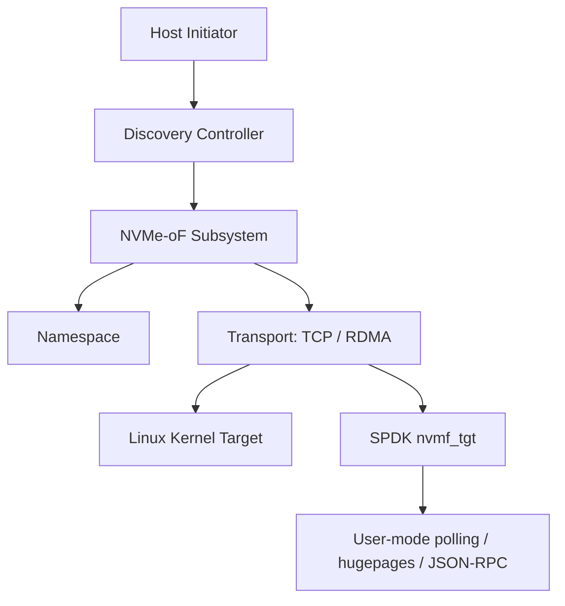
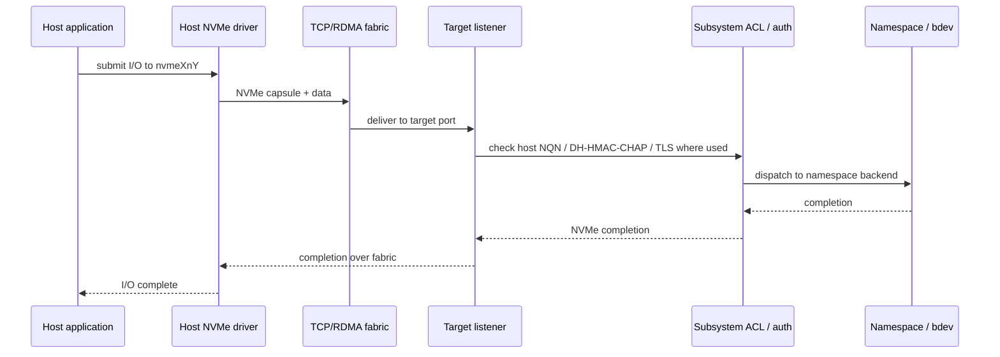

# 26 · NVMe-oF、SPDK 与用户态存储

## 定位

当本地 NVMe 已经很快，下一步问题就会变成：`能不能把这种低延迟能力通过网络提供出去`，以及 `能不能绕开传统内核 I/O 栈的开销`。`NVMe-oF` 和 `SPDK` 正是在回答这两个问题。

## 学习目标

- 能解释 NVMe-oF 如何把 NVMe queue/subsystem/namespace 语义扩展到网络。
- 能区分 NVMe/TCP、NVMe/RDMA、Linux kernel target 和 SPDK target 的取舍。
- 能理解 NQN、discovery controller、subsystem、namespace、transport 和 listener 的对象模型。
- 能评估 SPDK 的性能收益与 hugepage、CPU pinning、polling、NUMA、隔离和可观测性成本。

## 核心直觉

NVMe-oF 是规范和协议体系，SPDK 是高性能用户态实现路线。前者回答“远端 NVMe 怎么被发现和访问”，后者回答“如何用轮询、用户态驱动和异步模型把数据路径开销降到更低”；两者经常一起出现，但不是同一个层级。

## 先抓住六个判断问题

1. 当前面对的是 `本地 PCIe NVMe`，还是 `通过网络暴露的 NVMe service`？
2. 你想优化的是 `延迟`、`CPU 开销`、`吞吐`，还是 `存储资源解耦`？
3. 传输走的是 `TCP` 还是 `RDMA`？
4. 应用是否能接受 `polling`、用户态驱动和更强的 CPU 绑核约束？
5. 你需要的是通用内核路径，还是极致性能路径？
6. 当前瓶颈在设备本身，还是在协议栈、上下文切换和数据搬运？

## 机制拆解



| 路线 | 优点 | 成本 |
| --- | --- | --- |
| NVMe/TCP | 普通以太网可部署，路径清晰 | 延迟和 CPU 开销通常高于 RDMA |
| NVMe/RDMA | 低延迟、高吞吐、直接数据放置 | 网络、拥塞控制、驱动和运维复杂 |
| Linux kernel target | 集成稳定，易进入现有 Linux 运维体系 | 极致性能和定制能力有限 |
| SPDK target | 用户态轮询、高并发、可定制 | 占核、hugepage、NUMA、隔离和调试成本 |

一条 NVMe-oF I/O 可以按下面的路径理解：



这里最容易遗漏的是：网络不只是“线通了”。多路径、ACL、认证、TLS、拥塞控制、MTU、队列深度、target 后端和 host timeout 都会进入同一条恢复路径。

## NVMe-oF：把 NVMe 队列语义从本地搬到网络上

### 它在做什么

- NVMe 2.0 之后，NVMe-oF 的理论操作被并入 Base 规范，不同传输被拆成独立 transport 规范。
- NVM Express 官方对 `NVMe over TCP` 的定义是：把 NVMe queues、capsules 和数据传输映射到标准 TCP 网络之上。
- 同理，`NVMe over RDMA` 把 NVMe 数据面映射到 RDMA 可靠传输之上。

### 为什么它重要

- 这意味着远端闪存不必再通过传统 SCSI 语义暴露。
- 主机看到的仍然更接近 NVMe 的队列和命令模型，而不是被转换成另一套旧协议心智。

## TCP 和 RDMA 是两条很不一样的路

### NVMe/TCP

- NVM Express 官方页面当前列出的 `NVMe over TCP Transport Specification` 最新版本是 `1.2`，`2025-08-01` ratified。
- 它的最大现实价值，是能直接跑在现有标准 IP / Ethernet 网络之上。
- 所以它很适合“先用现有网络把 NVMe-oF 部署起来”的路径。

### NVMe/RDMA

- `NVMe over RDMA Transport Specification` 当前版本同样是 `1.2`。
- 它更强调直接数据放置和更低协议开销。
- 但代价是网络、驱动、运维和排障门槛通常更高。

### 结论不是谁绝对更好

- TCP 更容易落地、网络复用性更强。
- RDMA 更追求低延迟和更少 CPU 消耗。
- 你真正该问的是：团队能维护哪条路径，业务值不值得为更低延迟承担更高复杂度。

## NQN、Discovery、Subsystem：NVMe-oF 的对象模型

### NQN

- `NQN` 是 NVMe Qualified Name。
- 它是主机和 subsystem 在 fabric 里识别彼此的重要命名对象。

### Discovery Controller

- NVMe-oF 里不是“扫盘符”这么简单。
- 主机通常先做 discovery，再连接具体 subsystem / namespace。

### 所以 NVMe-oF 不是“远程盘符”

- 它有自己的命名、发现和连接语义。
- 这也是为什么把它简单等同于 “iSCSI 换了个名字” 会越用越乱。

## SPDK：为什么有人要绕开传统内核块层

### SPDK 的核心路线

- SPDK 官方文档把自己定位为 `high performance, scalable, user-mode storage applications` 的工具和库集合。
- 它强调用户态、异步和高性能路径，而不是默认依赖传统内核 block I/O 栈。

### 它为什么快

- 关键不只是“用户态”三个字，而是：
- 更少上下文切换
- 更接近设备队列
- 更倾向 polling 而不是传统中断驱动直觉
- 对高并发 NVMe I/O 更友好

### 代价也很真实

- CPU 核绑定位、内存管理、设备绑定和运维方式会变。
- 它更像“为极致性能重构路径”，而不是普通 Linux 服务器默认就该这么跑。

## SPDK 和 NVMe-oF 经常一起出现

### 原因很简单

- SPDK 不只可以做本地 NVMe 高性能访问，也有成熟的 NVMe-oF target / initiator 相关组件。
- 它很适合做“用户态、高性能、可定制”的远程 NVMe 数据路径实验和产品化。

### 但不要误解

- `NVMe-oF` 是规范和协议体系。
- `SPDK` 是一套实现高性能存储路径的开源工具与库。
- 两者经常配合，但不是同一个层级。

## 用户态存储不是“跳过内核所以一定赢”

### 真正适合它的场景

- 极低延迟要求
- 高 IOPS / 高并发 NVMe
- 存储服务本身就是产品核心
- 你愿意为了性能重构线程模型和运维路径

### 不一定适合它的场景

- 通用服务器
- 以维护稳定性为优先的环境
- 团队对内核、驱动、绑核和用户态 DMA 路径不熟

## 服务器落地时最该问的十个问题

1. 当前真正需要的是本地 NVMe 还是 disaggregated NVMe？
2. 是想要复用现有 Ethernet，还是已经具备 RDMA 能力？
3. 业务延迟目标是否真的值得引入 NVMe-oF / SPDK？
4. 团队是否能维护 discovery、NQN、multipath 和 fabric 故障排查？
5. CPU 开销和网络开销分别占了多少？
6. 当前瓶颈到底在协议栈还是在设备本身？
7. 是否需要 NVMe/TCP 的 TLS / 安全能力？
8. 应用是更适合内核默认路径，还是可以重构成 polling / async 模型？
9. 你在追求的是“最快”，还是“够快且更稳”？
10. 如果远端 NVMe 路径中断，应用和监控怎么反应？

## 设计 / 采购判断

- 如果目标是快速落地和复用现有以太网，优先评估 NVMe/TCP，再通过多路径、网络隔离和监控补齐可靠性。
- 如果目标是低延迟和高吞吐，并且团队能维护 RDMA/RoCE/InfiniBand，才把 NVMe/RDMA 放进主路径。
- 如果存储服务是产品核心、能接受占用专用 CPU 核和用户态运维模型，SPDK target 才有足够收益。
- 如果业务只是通用服务器块存储，Linux kernel target 或传统 SAN/NAS 可能更稳、更容易交接。
- 远端 NVMe 的采购不能只看 SSD，还要看 NIC、交换机、拥塞控制、MTU、CPU NUMA 和多路径策略。

网络韧性检查清单：

- 至少为关键路径设计双网卡、双交换机或独立故障域；不要让所有 target listener 共用一个交换故障点。
- NVMe/TCP 要明确 VLAN/VRF、ACL、防火墙、TLS、host NQN 白名单和端口暴露边界。
- NVMe/RDMA 要把 PFC/ECN、MTU、RoCE 版本、GID、NIC firmware、交换机缓冲和拥塞告警写进运维手册。
- 主机侧要验证 multipath、ANA/路径状态、timeout、重连和应用重试策略，而不是只验证 `nvme connect` 成功。
- SPDK target 要记录 hugepage、CPU pinning、NUMA、设备绑定和 JSON-RPC 管理面的恢复步骤。

## 常见误区

### 误区 1：NVMe-oF 就是更快版 iSCSI

- 过于简化。它的队列模型、命名和协议语义都更接近 NVMe 本身。

### 误区 2：RDMA 一定比 TCP 更值得上

- 不一定。业务收益、团队能力和现网条件都要算。

### 误区 3：SPDK 等于 NVMe-oF

- 错。SPDK 是实现路线，NVMe-oF 是规范与传输体系。

### 误区 4：用户态存储天然适合所有高性能场景

- 错。它会带来新的复杂度边界。

## 故障模式

- Discovery 成功但连接失败：NQN、subsystem ACL、listener、端口或 transport 参数不一致。
- 多路径缺失：单链路抖动直接变成 I/O timeout，没有 NVMe multipath 或业务降级策略。
- RDMA 网络问题：PFC/ECN、MTU、GID、RoCE 版本、NIC firmware 或交换机配置导致尾延迟异常。
- SPDK 资源错配：hugepage 不足、CPU pinning 跨 NUMA、设备未正确绑定或 polling 核被抢占。
- 可观测性不足：绕开传统内核块层后，原有 `iostat`/文件系统监控不能解释全部数据路径。

## Linux / 硬件观察命令

### 观察 1：画一张 NVMe-oF 对象图

- Host NQN
- Discovery
- Subsystem
- Namespace
- Transport

目标：把 NVMe-oF 从“远程 NVMe”还原成明确对象模型。

### 观察 2：做一张 TCP vs RDMA 选择表

- 网络要求
- 运维复杂度
- CPU 开销
- 时延目标
- 落地门槛

目标：让传输选择从“听说 RDMA 更快”变成可比较决策。

### 观察 3：阅读一遍 SPDK nvmf target 文档

- transport 创建
- subsystem 创建
- namespace 添加
- listener 配置

目标：理解用户态高性能 target 的组成对象。

### 观察 4：Linux NVMe-oF initiator 基础命令

```bash
nvme list
nvme list-subsys
nvme discover -t tcp -a <target-ip> -s 4420
nvme connect -t tcp -n <nqn> -a <target-ip> -s 4420
cat /etc/nvme/hostnqn 2>/dev/null || true
```

目标：理解 host NQN、discovery、connect 和 namespace 出现在 Linux 中的路径。

## 前沿趋势

- NVMe/TCP 正在成为更容易规模化部署的 disaggregated storage 入口，安全、多路径和可观测性会成为生产关键。
- SPDK 继续适合作为高性能 target、gateway 和存储产品数据路径，但它要求团队接受用户态轮询模型的运维成本。
- Ceph、阵列和存储网关正在把 NVMe-oF 作为块服务出口之一，未来要同时理解协议、网关、后端对象/块层和故障域。

## 本页要配套记住的概念卡

- NVMe-oF
- NQN / Discovery Controller
- SPDK
- Polling vs Interrupt I/O
- Transport Binding

## 延伸阅读

- NVMe over TCP Transport Specification: https://nvmexpress.org/specification/tcp-transport-specification/
- NVMe over RDMA Transport Specification: https://nvmexpress.org/wp-content/uploads/NVM-Express-NVMe-over-RDMA-Transport-Specification-Revision-1.2-2025.08.01-Ratified.pdf
- NVMe 2.0 Fabrics and Multi-Domain Overview: https://nvmexpress.org/nvme-2-0-specifications-support-for-fabrics-and-multi-domain-subsystems/
- SPDK Documentation: https://spdk.io/doc/
- SPDK NVMe-oF Target: https://spdk.io/doc/nvmf.html
- SPDK NVMe-oF Target Programming Guide: https://spdk.io/doc/nvmf_tgt_pg.html
- Linux NVMe Documentation: https://docs.kernel.org/nvme/index.html
