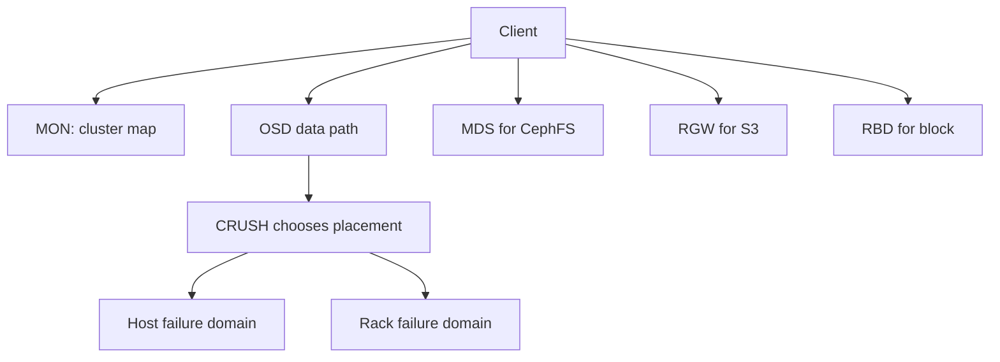
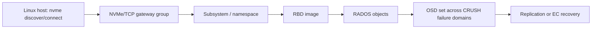

# 27 · Ceph、故障域与分布式存储节点设计

## 定位

到了分布式存储阶段，问题不再是“单台机器有几块盘”，而是 `数据怎么跨节点放置`、`故障域怎么定义`、`恢复流量怎么控制`、`一个统一底层怎么同时提供 block / file / object 服务`。Ceph 是理解这条链路最好的主线之一。

## 学习目标

- 能解释 Ceph 如何用 RADOS、MON、OSD、MGR、MDS、RGW、RBD 提供统一存储系统。
- 能把 CRUSH、pool、placement group、replication、erasure coding 和 failure domain 串起来。
- 能从节点设计角度评估磁盘、网络、CPU、内存、WAL/DB、故障域和恢复流量。
- 能把 Ceph 的 block/file/object 服务映射回第 25 章的数据服务语义。

## 核心直觉

Ceph 的核心不是“很多硬盘拼起来”，而是用 CRUSH 和 cluster map 把数据放置变成可计算规则。副本数只是开始，真正决定风险的是副本跨越了哪些独立故障域，以及恢复和 rebalancing 时集群能否承受额外流量。

## 先抓住六个判断问题

1. 这套系统要提供 `block`、`file`、`object` 中的哪几类服务？
2. 底层数据放置是否依赖中央元数据查表，还是由算法直接计算？
3. 当前故障域定义在 `disk`、`host`、`rack` 还是更高层？
4. 保护方式用 `replication` 还是 `erasure coding`？
5. 恢复和 rebalancing 发生时，网络和节点会承受多大流量？
6. 你设计的是“单机扩容”，还是“长期横向扩展的存储节点体系”？

## 机制拆解



| 对象 | 负责什么 | 设计时重点 |
| --- | --- | --- |
| MON | quorum、cluster map | 奇数数量、独立故障域、稳定网络 |
| OSD | 数据读写、复制、恢复、scrub | 盘型、WAL/DB、CPU、内存、网络 |
| MGR | 管理模块、dashboard、编排 | 可观测性和自动化 |
| MDS | CephFS 元数据 | 文件工作负载、HA、目录热点 |
| RGW | S3/Swift 对象入口 | 多站点、bucket、认证、生命周期 |
| RBD | 块设备服务 | VM/数据库、快照、镜像和网关 |

## Ceph 为什么特别适合做这条主线

### 一个统一系统，三类服务接口

- Ceph 官方架构文档明确说明，它在统一系统里同时提供 `Ceph Block Device`、`Ceph File System` 和 `Ceph Object Storage`。
- 这意味着它非常适合帮助建立“块 / 文件 / 对象最终都可能落到底层对象集群”的心智。

### 底层核心是 RADOS

- Ceph 把底层可靠分布式对象层称为 `RADOS`。
- 不管上层是 RBD、CephFS 还是 RGW，最终都要把数据转换成对象存进集群。

## Ceph 节点上到底有什么

### Monitor

- 负责维护 cluster map 的主副本。
- 没有健康的 monitor quorum，客户端和集群都无法可靠知道当前拓扑。

### OSD

- 负责真正的数据读写、复制、恢复和一致性相关操作。
- 在 Ceph 里，很多传统集中式系统由“控制器”完成的工作，被分散给 OSD 和算法体系承担。

### Manager

- 提供监控、编排和模块化管理入口。

### MDS

- 当你要提供 CephFS 时，MDS 负责文件系统元数据路径。
- 这也是为什么 file service 不只是“对象上面多一层目录”。

## CRUSH：为什么 Ceph 不靠中央查表

### CRUSH 在解决什么

- Ceph 文档明确指出，客户端和 OSD 使用 `CRUSH` 算法计算数据位置，而不是依赖中央查表。
- 这样做的核心好处，是避免中心瓶颈并提高可扩展性。

### 为什么它重要

- 当节点数很多时，如果每次定位对象都依赖中央元数据服务，扩展性会很快受限。
- CRUSH 把“数据放哪”变成由集群拓扑和规则共同决定的可计算问题。

## Failure Domain：真正决定恢复风险的不是副本数本身

### 什么是故障域

- Ceph cluster map / CRUSH map 会显式描述 `device`、`host`、`rack`、`row`、`room` 等层级。
- 所以“有三副本”并不自动等于“能抗三类独立故障”。

### 真正该问的是

- 这些副本到底落在了不同磁盘、不同主机，还是不同机架？
- 如果副本都在同一 host，host 掉了就一起没了。
- 这就是故障域设计比口头说“做了冗余”更重要的原因。

## Replication 与 Erasure Coding：不是二选一教条

### Replication

- 更直观、恢复路径更简单、写放大和空间开销通常更高。

### Erasure Coding

- Ceph 文档说明，EC pool 把对象拆成 `K + M` chunks。
- 它能显著降低空间开销，但恢复、写路径和对象能力边界会更复杂。

### 关键不是背公式

- 而是理解：你是在用更复杂的编码路径换更高的容量效率。
- 选择时要同时看对象大小、故障域、恢复流量、工作负载类型和运维能力。

## Rebalancing、Scrubbing 与恢复流量

### 扩容不会只是“多一台机器”

- Ceph 文档明确指出，新增 OSD 会改变 object placement，并触发 rebalancing。
- 这意味着扩容会带来真实的数据搬迁，而不是零成本增加容量。

### Scrubbing 也不能忽略

- Ceph 会执行 scrub 和 deep scrub 来发现元数据不一致与底层介质问题。
- 这和单机 RAID 的 Patrol Read 在精神上有点像，但发生层级已经提升到分布式对象层。

## 一个很关键的统一视角

### 上层看起来不一样，底层依然是对象

- Ceph 文档明确说，block device image、文件目录树和 RESTful objects，最终都会被转换成 objects 存进集群。
- 这正是理解现代分布式存储最重要的跨层心智之一。

### 所以你以后看到

- RBD：是 block service
- CephFS：是 file service
- RGW：是 object service

不要只把它们当产品名，而要看到它们共用的底层对象与放置逻辑。

### 从 Ceph 到 NVMe/TCP gateway 的跨章连接

Ceph 的 NVMe-oF gateway 把 RBD image 通过 NVMe/TCP 暴露给没有原生 Ceph 客户端的主机。它不是把 OSD 变成普通 NVMe 盘，而是在 `host NVMe driver -> gateway -> RBD -> RADOS -> OSD` 之间加了一层协议出口。



Ceph 官方 NVMe-oF gateway 要求高可用部署时至少两个 gateway，且放在不同 Ceph 节点上。设计时要把 gateway 当成协议出口和故障域对象，而不是把它当成无状态“转发端口”。

## 服务器落地时最该问的十个问题

1. 你要提供 block、file、object 中的哪几类服务？
2. 故障域定义在 disk、host、rack 还是更高层？
3. cluster map 和 CRUSH 规则是否能真实反映机房拓扑？
4. 该工作负载更适合 replication 还是 erasure coding？
5. 扩容时预计会搬多少数据、多久收敛？
6. 恢复、rebalancing、scrub 会不会把生产流量打爆？
7. 管理平面有没有 monitor quorum 单点风险？
8. file service 是否需要 MDS 扩展和高可用设计？
9. block / file / object 三类服务是否共享同一底层容量池，彼此会不会抢资源？
10. 节点设计是在追求“单节点强”，还是“规模化下的整体稳”？

## 设计 / 采购判断

- Ceph 节点采购要按故障域采购，而不是只按单机容量采购；同一机架、同一电源域、同一批次盘会形成相关风险。
- OSD 盘型、BlueStore DB/WAL 位置、网络带宽和恢复限速会直接影响 scrub、recovery 和 rebalancing 对业务的冲击。
- Replicated pool 更简单、恢复直观，EC pool 容量效率高但恢复和小对象/小写路径更复杂。
- 如果提供 RBD、CephFS 和 RGW 多服务，要为不同 pool、QoS、CRUSH rule、元数据服务和网关容量做隔离设计。
- 采购网卡、交换机和机架时必须把恢复流量算进去，不能只按正常业务读写吞吐设计。

## 常见误区

### 误区 1：分布式存储就是把很多硬盘拼起来

- 错。关键难点在数据放置、故障域、一致性和恢复流量。

### 误区 2：三副本就说明风险很低

- 错。要看副本是否跨了真正独立的 failure domains。

### 误区 3：EC 一定比 replication 更先进

- 错。它是不同的容量效率 / 复杂度权衡，不是天然升级版。

### 误区 4：扩容只会增加容量，不会影响线上

- 错。rebalancing 和 recovery 都会引入真实网络与磁盘压力。

## 故障模式

- 故障域假跨越：三副本落在不同磁盘但同一 host 或同一 rack，实际抗故障能力不足。
- MON quorum 风险：管理面节点集中在同一故障域，网络抖动时失去 quorum。
- 恢复流量压垮业务：OSD recovery、backfill 或 rebalance 与生产 I/O 抢同一网络和磁盘。
- PG/CRUSH 设计不匹配：扩容后数据分布不均，某些 OSD 或 host 长期热点。
- 多服务争抢：RGW、RBD、CephFS 共用底层资源但没有容量、QoS 和故障域隔离。

## Linux / 硬件观察命令

### 观察 1：画一张 Ceph 服务栈图

- RBD
- CephFS
- RGW
- RADOS
- OSD / MON / MGR / MDS

目标：建立统一对象底层和多服务接口的映射关系。

### 观察 2：设计一张 failure domain 表

- device
- host
- rack
- room

目标：把“冗余”变成具体拓扑规则，而不是口头描述。

### 观察 3：做一次 replicated vs EC 选择题

- 负载类型
- 容量效率
- 恢复成本
- 元数据能力
- 运维复杂度

目标：理解为什么不同 pool 策略会影响长期运营成本。

### 观察 4：Ceph 集群基础健康入口

```bash
ceph -s
ceph health detail
ceph osd tree
ceph osd df tree
ceph osd pool ls detail
ceph pg stat
```

目标：从健康、OSD 树、容量分布、pool 和 PG 状态开始建立分布式存储观察路径。

## 前沿趋势

- Ceph v20.2.1 Tentacle 已在 2026-04-06 发布；Tentacle 继续增强 dashboard、RGW、RBD、SMB 管理、NVMe/TCP gateway 和多命名空间等能力，Ceph 正在从“存储集群”扩展为多协议数据服务平台。
- NVMe/TCP gateway 让 Ceph 的块服务可以更接近 NVMe-oF 语义，但要额外理解 gateway group、namespace、网络故障和后端 RADOS 的关系。
- FastEC、BlueStore/WAL/DB 调优、对象网关多站点和自动化编排会让 Ceph 设计更像平台工程，而不是单纯装包部署。

## 本页要配套记住的概念卡

- Failure Domain
- CRUSH
- Replication vs Erasure Coding
- RBD / CephFS / RGW
- Rebalancing / Scrubbing

## 延伸阅读

- Ceph Architecture: https://docs.ceph.com/en/tentacle/architecture/
- Ceph CRUSH Map: https://docs.ceph.com/en/latest/rados/operations/crush-map/
- Ceph Erasure Code: https://docs.ceph.com/docs/master/rados/operations/erasure-code/
- Ceph Pools: https://docs.ceph.com/en/latest/rados/operations/pools/
- Ceph File System Creation: https://docs.ceph.com/en/latest/cephfs/createfs/
- Ceph NVMe-oF Gateway: https://docs.ceph.com/en/tentacle/rbd/nvmeof-overview/
- Ceph NVMe-oF Gateway Requirements: https://docs.ceph.com/en/tentacle/rbd/nvmeof-requirements/
- Ceph v20.2.1 Tentacle release: https://ceph.io/en/news/blog/2026/v20-2-1-tentacle-released/
