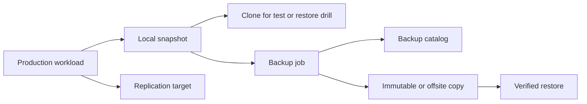

# 28 · 备份、快照、克隆与复制的边界

## 定位

很多团队在讨论“数据保护”时，会把 `snapshot`、`backup`、`clone`、`replication` 混成一个词，结果采购、运维和恢复方案都做偏。真正要先分清的是：这些能力解决的是不是同一个问题。

本章把四个词绑定到四种意图：`snapshot` 用于快速回看，`clone` 用于派生副本，`replication` 用于跨位置传播变化，`backup` 用于独立、可验证、可按保留策略恢复。

## 学习目标

- 能用“是否独立、是否可写、是否跨故障域、是否有历史点、是否可验证恢复”区分快照、克隆、复制和备份。
- 能识别“快照很多但没有备份”“异地复制等于备份”等常见误判。
- 能为一个服务器或存储工作负载组合本地快照、远端复制、对象备份和不可变保留。
- 能把供应商能力表翻译成恢复语义，而不是只看功能名。

## 核心直觉

先问六个问题：

1. 你要的是 `回看某一时刻`，还是 `拿到一份独立可恢复副本`？
2. 这份副本还依赖原系统元数据、底层对象或同一权限域吗？
3. 它是在 `同一存储域` 内保留历史，还是跨系统、跨站点复制？
4. 它的目标是 `快速回滚`、`快速派生`、`异地接管`，还是 `长期恢复与保留`？
5. 错删、勒索、误操作发生后，它会不会一起被传播或删除？
6. 你真正想买的是一个“快照功能”，还是一整套恢复能力？

| 动作 | 核心意图 | 典型依赖 | 不能替代 |
| --- | --- | --- | --- |
| Snapshot | 快速回到某个时间点 | 原存储系统、原元数据域 | 异地备份 |
| Clone | 从快照派生可写副本 | 父快照或底层块共享 | 长期保护 |
| Replication | 把变化复制到另一处 | 链路、目标站点、角色控制 | 防误删/勒索 |
| Backup | 形成独立恢复副本 | 备份目录、介质、密钥、校验 | 在线高可用 |

## 机制边界

### Snapshot

- 快照首先是一个时间点视图，不是自动等于完整备份。
- OpenZFS 文档把 snapshot 定义为 dataset 在特定时间点的一致镜像；CephFS 文档把 snapshot 描述成文件系统在该时刻的 immutable view。
- 快照通常仍然依赖原存储系统、原元数据域或同一套权限边界。如果同一阵列、对象池、账号或密钥域被破坏，快照也可能一起失效。

### Clone

- clone 的核心用途不是长期保护，而是从某个快照快速派生可写副本。
- Ceph RBD layering 的语义是基于只读快照形成 copy-on-write 子对象关系。
- clone 适合测试、模板派生、补丁验证和恢复演练，不适合替代正式备份。

### Replication

- 复制的重点是让另一个站点或系统拥有可用副本，通常服务于 DR、HA 或读扩展。
- Ceph `rbd-mirror` 是集群间异步 mirroring；CephFS snapshot mirroring 是把 snapshots 异步推送到远端 CephFS。
- 复制会忠实传播变化，也可能传播错删、坏数据、加密后的文件或应用层破坏。

### Backup

- 备份的目标是生成可恢复副本，并进入 retention、校验、离线/异地保存和恢复流程。
- NIST SP 800-34 把 backup 归入 contingency planning 的基础能力：备份要被例行执行、异地保存并定期验证。
- 真正的 backup 不只是“有个副本”，而是这份副本可以独立、可验证、按目标时点恢复。

## 架构/流程

常见组合：

- `Snapshot + Backup`：先做本地或近端快照保证快速回退，再导出、转储或合成为独立备份副本。
- `Snapshot + Clone`：从指定时间点快速派生可写环境，用于测试、演练或取证。
- `Snapshot + Replication`：跨站点同步关键工作集，解决站点级可用性，但仍需保留历史恢复点。
- `Backup + Immutability`：面向勒索和合规，目标不是复制得更快，而是让恢复点不会被随手删除或缩短保留期。

服务器落地时最该问的十个问题：

1. 当前需求是短期回滚、测试派生、异地接管，还是长期恢复？
2. 这个“副本”是否独立于原存储域和原权限域？
3. 恢复时是否需要原系统仍然活着？
4. 错删和逻辑损坏会不会传播到副本？
5. 这套方案能否提供历史恢复点，而不只是最新副本？
6. retention 是谁在控制，存储系统、备份软件还是对象锁？
7. 应用是否需要一致性冻结或组快照？
8. 复制目标侧能否直接接管生产流量？
9. 恢复验证是否定期执行过？
10. 当前采购文档里写的是“snapshot feature”，还是“backup and restore capability”？

## 常见故障

### 阵列快照很多，但备份仍然失败

- 故障表现：主阵列损坏、对象池误删、管理员账号被接管后，快照和生产数据一起不可用。
- 判断方法：检查快照是否能在没有原阵列、原集群或原账号的情况下恢复。
- 修正方向：至少保留一层跨故障域的备份副本，并验证恢复目录、密钥和恢复环境。

### 异地复制把坏状态复制过去

- 故障表现：误删、批量加密、错误脚本执行后，远端副本也变成坏状态。
- 判断方法：检查复制目标是否只有最新状态，是否有独立历史点和保留锁。
- 修正方向：复制链之外保留独立备份链，并把关键恢复点做不可变或隔离保存。

### Clone 被当成长期副本

- 故障表现：父快照被删除、底层块被回收或元数据关系损坏后，clone 不再可用。
- 判断方法：确认 clone 是否仍依赖父快照或共享块。
- 修正方向：长期保护使用备份副本；clone 只作为派生工作副本。

### 备份任务成功，但恢复不可用

- 故障表现：任务显示成功，恢复时发现目录缺失、密钥不可用、版本不兼容或应用不一致。
- 判断方法：用隔离环境做端到端恢复，而不是只看作业状态。
- 修正方向：把恢复验证、校验和业务验收写进备份策略。

## 演练方法

### 演练 1：做一张 Snapshot / Clone / Replication / Backup 对照表

- 字段：是否独立、是否可写、是否跨站点、是否适合长期保留、是否适合勒索恢复。
- 证据：每一项都要能指向具体产品配置、命令输出、策略截图或恢复记录。
- 目标：把四个词从口头概念变成明确决策表。

### 演练 2：拿一个虚拟机工作负载做保护路径拆解

- 路径：本地快照、远端复制、对象备份、不可变副本、恢复演练。
- 验证：分别记录回滚时间、接管时间、备份恢复时间和业务校验结果。
- 目标：看到“一个工作负载往往同时需要多层保护”。

### 演练 3：比较 Ceph snapshot、mirror 和 ZFS send 的恢复语义

- 对比：回滚速度、独立性、恢复时点、故障域、是否能抵抗误删传播。
- 目标：理解同样叫“副本”，语义完全不同。

演练证据模板：

| 项目 | 记录 |
| --- | --- |
| 工作负载 | 名称、owner、依赖 |
| 保护机制 | snapshot / clone / replication / backup |
| 恢复点 | 时间、版本、保留策略 |
| 恢复环境 | 原地、异地、隔离环境 |
| 验证结果 | 服务启动、数据校验、业务验收 |
| 缺口 | 权限、密钥、目录、带宽、流程 |

## 治理/合规判断

- 采购文档不要只写“支持 snapshot”，要写清楚恢复对象、恢复时点、故障域、保留期和验证责任。
- 复制链路需要和备份链路分别建账：复制负责可用性，备份负责历史恢复和独立保留。
- 快照、clone、备份和复制的管理权限应分离；生产管理员不应天然拥有删除所有恢复点的权限。
- 审计记录至少覆盖策略变更、保留期变更、快照删除、备份删除、恢复执行和恢复验证结果。

## 前沿趋势

- 备份平台正在把 `restore testing`、恶意文件扫描、恢复点索引和恢复编排做成默认能力，备份不再只是写入作业。
- 云厂商开始把对象锁、备份仓库锁、跨账号恢复和多方审批组合到备份平面中。
- 分布式存储继续增强异步 mirroring、snapshot diff 和跨集群复制，但这些能力仍需要独立恢复点和治理策略配合。
- 恢复设计正在从“有没有副本”转向“副本是否可信、是否独立、是否被验证过”。

## 本页要配套记住的概念卡

- Snapshot vs Backup
- Clone
- Replication
- Backup Chain
- Restore Artifact

## 延伸阅读

- NIST SP 800-34 Rev. 1: https://nvlpubs.nist.gov/nistpubs/legacy/sp/nistspecialpublication800-34r1.pdf
- CephFS Snapshots: https://docs.ceph.com/en/latest/cephfs/snapshots/
- CephFS Snapshot Mirroring: https://docs.ceph.com/en/latest/cephfs/cephfs-mirroring/
- Ceph RBD Mirroring: https://docs.ceph.com/en/latest/rbd/rbd-mirroring/
- Ceph RBD Layering: https://docs.ceph.com/en/latest/dev/rbd-layering/
- Ceph RBD Snapshots: https://docs.ceph.com/en/latest/rbd/rbd-snapshot/
- OpenZFS `zfs-snapshot`: https://openzfs.github.io/openzfs-docs/man/v2.3/8/zfs-snapshot.8.html
- OpenZFS `zfs-send`: https://openzfs.github.io/openzfs-docs/man/master/8/zfs-send.8.html
