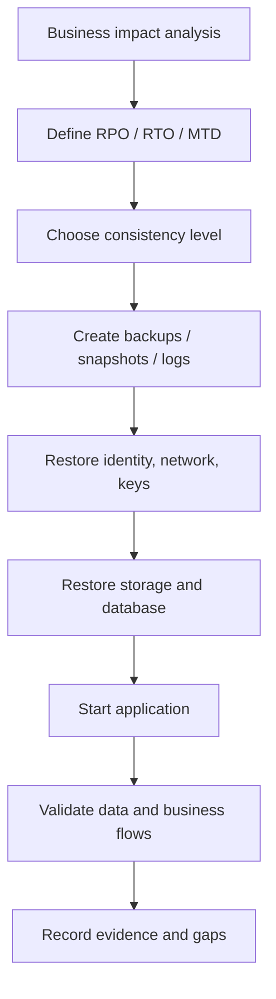

# 29 · 一致性、RPO / RTO 与恢复策略

## 定位

真正决定恢复成败的，往往不是“有没有副本”，而是 `恢复到什么时点`、`多久能恢复`、`副本内部是否一致`。这就是 `consistency`、`RPO`、`RTO` 和恢复策略存在的意义。

本章把恢复视为一份“业务合同”：副本必须能被应用理解，恢复时间必须能被执行步骤支撑，恢复点必须和业务可接受的数据损失窗口一致。

## 学习目标

- 能区分 crash-consistent、application-consistent 和 group-consistent 副本。
- 能解释 RPO、RTO、MTD 分别回答什么问题，避免把它们混成一个 SLA 数字。
- 能把恢复对象拆成文件、卷、数据库、应用和站点级恢复。
- 能写出包含依赖顺序、验证动作和证据记录的最小恢复 runbook。

## 核心直觉

先抓住六个判断问题：

1. 当前副本是 `crash-consistent`、`application-consistent`，还是只保证单卷内部一致？
2. 你要恢复的是一个文件、一个卷，还是一个跨数据库与应用的业务系统？
3. 业务能接受丢掉多久的数据？
4. 业务能接受停多久？
5. 恢复时是否有明确的依赖顺序、脚本和验证动作？
6. 你优化的是“多快能切换”，还是“恢复后数据能不能用”？

| 指标 | 回答的问题 | 典型例子 | 错误理解 |
| --- | --- | --- | --- |
| Consistency | 副本是否能被应用理解 | crash-consistent vs application-consistent | 快照成功就一定一致 |
| RPO | 最多丢多少数据 | 最多丢 15 分钟日志 | RPO 小就一定安全 |
| RTO | 多久恢复服务 | 2 小时切换到可用状态 | 脚本跑完就算 RTO |
| MTD | 业务最多能停多久 | 8 小时内必须恢复核心流程 | 和 RTO 完全相同 |

## 机制边界

### Crash-Consistent

- 存储层很多快照天然只能保证 crash-consistent。
- Ceph RBD snapshot 文档提醒：RBD 不知道卷里的文件系统，未协调时快照通常只是 crash-consistent，建议在取快照前暂停或停止 I/O。
- 这类副本适合依赖文件系统日志或数据库恢复机制自行修复的场景，但不能保证应用事务边界完整。

### Application-Consistent

- 应用一致性意味着应用在快照或备份前已经完成 flush、freeze、checkpoint 或 log 边界处理。
- 对数据库、消息队列和事务系统来说，这往往比“快照快不快”更重要。
- 应用一致性通常需要 agent、数据库原生命令、脚本钩子或备份软件与应用协调。

### Group Consistency

- 复杂系统不是一个卷，而是多个卷、多个实例和多个依赖。
- 如果数据库数据卷、日志卷、配置卷不是同一时间点，恢复出来可能每个卷都“没坏”，但业务整体不可用。
- 多卷 consistency group 或应用级检查点可以降低这种跨卷错位风险，但会增加协调成本。

### RPO、RTO、MTD

- NIST SP 800-34 把 RPO 定义为 outage 后数据必须恢复到的时间点，回答“最多能丢多久的数据”。
- RTO 回答系统组件进入 recovery phase 后，多久内恢复到可接受状态。
- MTD 是业务流程在造成重大伤害前能承受的最大中断时间，通常是 RTO 的上限而不是同义词。

## 架构/流程

恢复不是“把文件拷回来”，而是按依赖顺序恢复身份、网络、密钥、数据库、应用、监控和验证。

恢复顺序建议：

1. 确认事件边界、目标恢复点和业务优先级。
2. 恢复身份、网络、DNS、证书、密钥和访问控制。
3. 恢复存储卷、数据库基线、日志链和配置。
4. 启动应用、队列、缓存和前端入口。
5. 做数据完整性、依赖连通性、业务流程和监控验证。
6. 记录实际 RPO、实际 RTO、问题和后续改进。

## 常见故障

### 快照可挂载，但数据库无法正确启动

- 故障表现：文件系统可读，数据库启动后长时间恢复、报事务日志错误或数据不一致。
- 判断方法：确认取快照前是否执行 freeze、checkpoint、flush logs 或数据库原生备份流程。
- 修正方向：为数据库使用应用一致性备份或把日志回放纳入恢复流程。

### RPO 数字与副本频率不匹配

- 故障表现：业务要求 15 分钟 RPO，但实际每天一次备份、每小时一次快照且没有日志归档。
- 判断方法：用最近一次可恢复点到故障时间的差值计算实际 RPO。
- 修正方向：增加日志归档、增量备份或更高频恢复点，并验证恢复窗口。

### RTO 只覆盖技术恢复，不覆盖业务可用

- 故障表现：服务器启动很快，但身份系统、DNS、外部依赖或数据校验拖长恢复。
- 判断方法：从故障声明到业务 owner 验收为止记录实际时间。
- 修正方向：把依赖恢复、验证和审批纳入 RTO 演练。

### Group consistency 被忽略

- 故障表现：数据库数据卷、日志卷、对象存储元数据、应用配置来自不同时间点。
- 判断方法：检查恢复点时间戳和应用事务边界是否一致。
- 修正方向：使用 consistency group、应用级备份或统一恢复编排。

## 演练方法

### 演练 1：做一张 RPO / RTO / MTD 工作表

- 字段：业务名称、最大可停时间、最大可丢数据窗口、当前保护机制、当前缺口。
- 目标：把恢复目标从口头需求变成结构化表格。

### 演练 2：给一个数据库系统设计一致性策略

- 覆盖：crash-consistent snapshot、application-consistent backup、日志回放、恢复校验。
- 目标：理解为什么一致性是恢复设计的核心。

### 演练 3：写一个最小恢复顺序 runbook

- 顺序：网络、身份、密钥、存储、数据库、应用、验证。
- 证据：记录开始时间、结束时间、恢复点、操作人、验证项和异常。
- 目标：让 RTO 从 PPT 数字变成可执行步骤。

演练复盘模板：

| 项目 | 计划 | 实际 | 缺口 |
| --- | --- | --- | --- |
| RPO | 目标恢复点 | 实际恢复点 | 丢失窗口 |
| RTO | 目标时长 | 实际耗时 | 阻塞项 |
| 一致性 | 目标级别 | 实际级别 | 协调缺口 |
| 验证 | 通过标准 | 验证结果 | 后续动作 |

## 治理/合规判断

- RPO、RTO 和 MTD 应来自业务影响分析，而不是存储团队单独填写。
- 恢复成功的定义必须包含数据正确性、依赖连通性和业务验收，不应只看机器启动。
- 对关键系统，恢复 runbook、测试记录和偏差修复应纳入审计证据。
- 如果合规要求特定保留期或恢复能力，必须同时证明副本存在、不可提前删除、可读取、可恢复。

## 前沿趋势

- 备份产品正在增加自动 restore testing、恢复点索引、恶意文件扫描和应用级验证。
- 云 DR 服务越来越强调按应用依赖编排恢复，而不是只复制虚拟机或卷。
- 数据库原生备份、WAL/binlog 归档和对象存储不可变能力正在被组合成细粒度恢复链。
- “恢复合同”会从单个 RTO/RPO 数字扩展为按业务流程分级的恢复目标。

## 本页要配套记住的概念卡

- Crash-Consistent vs Application-Consistent
- Consistency Group
- RPO
- RTO
- MTD

## 延伸阅读

- NIST SP 800-34 Rev. 1: https://nvlpubs.nist.gov/nistpubs/legacy/sp/nistspecialpublication800-34r1.pdf
- Ceph RBD Snapshots: https://docs.ceph.com/en/latest/rbd/rbd-snapshot/
- CephFS Snapshots: https://docs.ceph.com/en/latest/cephfs/snapshots/
- OpenZFS `zfs-snapshot`: https://openzfs.github.io/openzfs-docs/man/v2.3/8/zfs-snapshot.8.html
