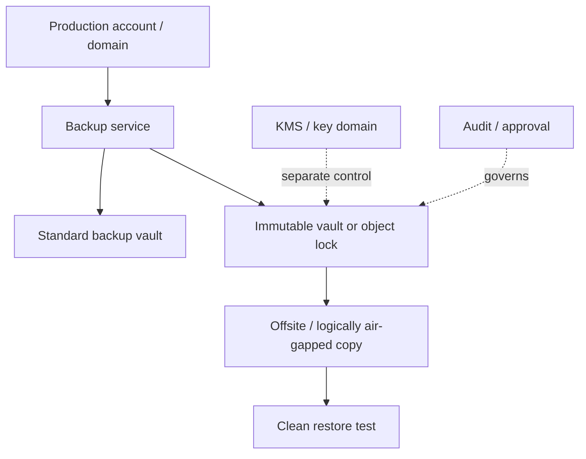

# 30 · 不可变备份、离线副本与反勒索设计

## 定位

今天讨论备份，不能只谈容量和恢复点，还必须谈 `能不能被删`、`能不能被篡改`、`凭据和密钥是否与生产域绑死`。这就是不可变备份、离线副本和反勒索设计的核心。

本章把反勒索备份拆成四层：副本存在、副本不可改、攻击者不易拿到管理权限、副本能在干净环境恢复。

## 学习目标

- 能区分 soft delete、versioning、WORM/immutability、offline/air-gap 和 offsite。
- 能解释为什么对象锁、vault lock、离线副本都只是控制手段，不是完整反勒索策略。
- 能设计生产域、备份域、密钥域和恢复验证域的隔离关系。
- 能把不可变备份纳入恢复演练，而不是只验证备份作业成功。

## 核心直觉

先抓住六个判断问题：

1. 这份备份能否被原有管理员、脚本或被入侵的生产账户直接删除？
2. 它是 `soft delete`，还是 `WORM / immutable`？
3. 副本是否仍然在线可写，还是存在离线或逻辑隔离路径？
4. 加密密钥和管理凭据是不是与生产环境共命运？
5. 备份是否定期验证可恢复，而不是只验证“任务成功”？
6. 当前方案是在防硬盘坏，还是在防勒索与恶意删除？

| 控制 | 主要防什么 | 不能替代 |
| --- | --- | --- |
| Soft delete | 误删后的短期恢复 | WORM 保留 |
| Versioning | 覆盖后的历史版本 | 独立备份 |
| Immutability / WORM | 保留期内删除和覆盖 | 密钥保护、恢复验证 |
| Offline / Air-gap | 横向移动和在线删除 | 保留策略 |
| Offsite | 站点级灾难 | 逻辑删除防护 |

## 机制边界

### Immutability / WORM

- 不可变的重点是：在保留期内不能删、不能覆盖、不能缩短保留。
- AWS S3 Object Lock 用 WORM 模型保护对象版本；Azure immutable storage 用时间型保留或 legal hold 保护 blob 版本或容器范围对象。
- AWS Backup Vault Lock 把保护对象从对象版本提升到备份恢复点仓库，并提供 governance / compliance 语义。

### Offline / Air-Gap

- CISA StopRansomware 指南建议维护 offline、encrypted backups，并定期测试可用性和完整性。
- 离线副本强调攻击面隔离，不等于保留策略本身。
- 逻辑空气隔离可以通过独立账号、服务托管密钥、短时同步窗口和多方审批实现，但仍需验证恢复路径。

### Offsite / Isolated

- NIST SP 800-34 建议 full 和 incremental backups 例行执行、offsite 存放、轮换并定期验证。
- 异地主要解决机房级或站点级风险，不自动解决恶意删除、密钥销毁或控制面接管。

### Soft Delete 不是 Immutability

- soft delete 更像短期回收站，主要防 accidental delete。
- immutability 更像保留期内的强约束，目标是阻止删除、覆盖或降低 retention。
- versioning 也不等于不可变；如果攻击者能删版本或缩短保留，历史版本仍可能失效。

## 架构/流程

反勒索设计四层：

1. 副本存在：至少要有独立副本，而不是只依赖主存储快照。
2. 副本不可改：至少一层恢复点具备 immutable / WORM 特性。
3. 副本不易被访问：离线、逻辑隔离、不同凭据域或专用备份域降低横向移动风险。
4. 副本可恢复：在隔离环境定期验证 availability、integrity 和业务可用性。

AWS Backup 的当前能力补充：

- `logically air-gapped vault` 是带额外安全特性的专用 vault，支持跨账号共享、AWS RAM 和 Multi-party approval。
- 官方文档已经支持把 logically air-gapped vault 指定为 primary backup target；对支持的资源，可减少先落标准 vault 再复制的流程。
- AWS 文档同时建议采用 MPA：当主账号受损或不可访问时，由独立恢复组织和多方审批访问恢复点。

## 常见故障

### 生产管理员可以删除所有恢复点

- 故障表现：勒索者拿到生产管理员权限后，先删除或缩短备份保留期。
- 判断方法：检查生产角色是否拥有备份 vault、对象锁、生命周期和 KMS 的管理权限。
- 修正方向：拆分生产域与备份域，使用 vault lock、对象锁、审批和独立审计。

### 对象仍在，但密钥没了

- 故障表现：不可变对象没有被删除，但 KMS key 被禁用、销毁或权限丢失，恢复失败。
- 判断方法：检查 key policy、key rotation、删除保护、跨账号恢复权限和恢复演练记录。
- 修正方向：把密钥域纳入备份治理，并为关键副本设计密钥恢复路径。

### 离线副本长期未验证

- 故障表现：恢复时发现介质损坏、目录缺失、版本不兼容或回温流程不可执行。
- 判断方法：定期从离线或隔离副本恢复到测试环境。
- 修正方向：把离线副本纳入 restore testing 和证据留档。

### 不可变策略锁错

- 故障表现：保留期太短挡不住攻击，或保留期太长造成不可逆成本负担。
- 判断方法：检查 min/max retention、grace time、锁定模式和容量评审。
- 修正方向：锁定前完成业务、合规、容量和恢复验证评审。

## 演练方法

### 演练 1：做一张备份防勒索控制检查表

- 控制项：独立副本、不可变恢复点、离线或隔离副本、密钥隔离、恢复验证。
- 目标：把“安全备份”拆成可以审查的控制项。

### 演练 2：画一张生产域与备份域权限图

- 节点：生产管理员、备份管理员、对象存储、KMS、审计、审批链。
- 目标：识别单点凭据和共命运权限。

### 演练 3：模拟一次误删和一次勒索场景

- 问题：哪一层副本还能用、哪个恢复点能保住、哪些操作会被阻止。
- 目标：理解 soft delete、immutability 和离线副本的实际差异。

演练证据模板：

| 场景 | 预期控制 | 实际结果 | 证据 |
| --- | --- | --- | --- |
| 删除恢复点 | Vault Lock / Object Lock 阻止 | 成功或失败 | 审计日志 |
| 缩短保留期 | 策略锁阻止 | 成功或失败 | 策略版本 |
| 生产账号失陷 | 备份域隔离 | 可否访问 | IAM 评估 |
| 恢复验证 | 可读、可启动、可验收 | 通过或失败 | 恢复记录 |

## 治理/合规判断

- 不可变备份策略应明确治理模式、合规模式、grace time、保留期上下限和例外处理。
- 备份删除、保留期缩短、KMS key 变更、生命周期变更都应进入审计和告警。
- 至少一份关键恢复链应独立于生产账号、生产身份源和生产密钥管理路径。
- 对受监管数据，WORM 只能证明“未提前删除或覆盖”，不能替代恢复完整性验证和访问审计。

## 前沿趋势

- 逻辑空气隔离正在从“二次复制目标”变成部分平台支持的 primary backup target。
- 多方审批、跨账号恢复、服务托管密钥和恢复账号正在成为 cyber recovery 的云上控制面标准形态。
- 备份平台越来越多集成 malware scan、indexing、restore testing 和 clean room workflow。
- 勒索防御正在从“能恢复加密文件”扩展到“能处理数据窃取、配置污染和身份域失信”。

## 本页要配套记住的概念卡

- Immutability / WORM
- Air Gap / Offline Backup
- Soft Delete vs Immutability
- Key Separation
- Backup Validation

## 延伸阅读

- CISA StopRansomware Guide: https://www.cisa.gov/stopransomware/ransomware-guide
- NIST SP 800-34 Rev. 1: https://nvlpubs.nist.gov/nistpubs/legacy/sp/nistspecialpublication800-34r1.pdf
- AWS S3 Object Lock: https://docs.aws.amazon.com/AmazonS3/latest/userguide/object-lock.html
- AWS Backup Vault Lock: https://docs.aws.amazon.com/aws-backup/latest/devguide/vault-lock.html
- AWS Backup logically air-gapped vault: https://docs.aws.amazon.com/aws-backup/latest/devguide/logicallyairgappedvault.html
- AWS Backup primary backups to logically air-gapped vaults: https://docs.aws.amazon.com/aws-backup/latest/devguide/lag-vault-primary-backup.html
- AWS Backup Multi-party approval: https://docs.aws.amazon.com/aws-backup/latest/devguide/multipartyapproval.html
- Azure Immutable Vault for Azure Backup: https://learn.microsoft.com/en-us/azure/backup/backup-azure-immutable-vault-concept
- Azure immutable storage for Blob Storage: https://learn.microsoft.com/en-us/azure/storage/blobs/immutable-storage-overview
