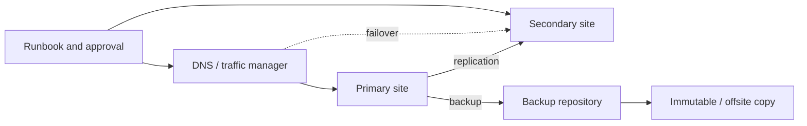
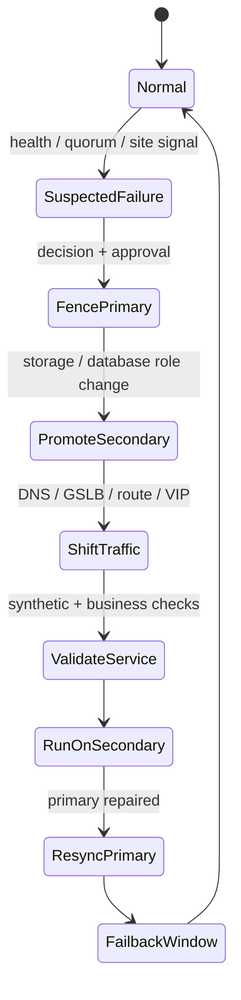

# 31 · 容灾拓扑、故障演练与恢复验证

## 定位

到了容灾阶段，讨论对象不再只是“有没有副本”，而是 `哪里接管`、`谁来切换`、`如何避免脑裂`、`演练后怎样回切`。没有拓扑设计和恢复演练的 DR，通常只是文档上的愿望。

本章从 cold / warm / hot site 推进到 failover / failback runbook，把容灾从架构图变成可执行、可验证、可复盘的恢复能力。

## 学习目标

- 能区分 HA、backup 和 DR 的目标边界。
- 能按 cold、warm、hot site 解释成本、RTO 和运行复杂度差异。
- 能设计 failover、failback、封写、升主、DNS/入口切换和验证顺序。
- 能识别 split-brain、复制滞后、回切覆盖和演练证据缺失等风险。

## 核心直觉

先抓住六个判断问题：

1. 当前方案解决的是 `本地高可用`、`备份恢复` 还是 `异地容灾`？
2. 接管目标是同城机房、异地机房、云端，还是手工重建？
3. 切换是自动、半自动，还是纯 runbook 人工操作？
4. 故障后谁有权提升 secondary 并阻止 primary 继续写？
5. 故障恢复后如何 failback，数据如何重新对齐？
6. 你是否真正演练过，而不是只做过备份任务成功统计？

| 层次 | 目标 | 典型技术 | 主要风险 |
| --- | --- | --- | --- |
| HA | 局部故障下继续在线 | 集群、冗余链路、VIP | 脑裂、误切 |
| Backup | 恢复历史数据 | 备份、快照、日志 | RTO 长、恢复点旧 |
| DR | 主站点不可用时恢复业务 | 异地复制、热/温/冷站、runbook | 切换、回切、依赖缺失 |

## 机制边界

### Cold Site

- cold site 更接近“场地和流程准备了，但大量资源要在事后补齐”。
- 成本较低，RTO 较长，对自动化和供应链依赖更强。
- 适合低优先级系统或可接受较长中断的业务。

### Warm Site

- warm site 预置关键系统、网络和部分数据路径，接管仍需人工步骤。
- 成本和 RTO 介于 cold 与 hot 之间。
- 适合大多数希望明显缩短恢复时间但不能长期双活运行的系统。

### Hot Site

- NIST SP 800-34 glossary 把 hot site 定义为 fully operational 的异地处理设施；warm site 是部分配备好的环境。
- hot site 目标是尽可能接近随时接管，成本、复制链路、一致性和演练要求最高。
- hot site 不是“万无一失”，更容易暴露自动切换误判和 split-brain 风险。

### Failover 和 Failback

- failover 是从主侧切到备侧，重点是止损、封写、升主、切入口和验证。
- failback 是主侧恢复后切回，重点是重新同步差异、避免覆盖正确数据和安排中断窗口。
- 只演练 failover、不演练 failback，DR 能力是不完整的。

## 架构/流程

有序 failover 最小流程：

1. 事件确认：确认主站点不可用或不可继续写入。
2. 封写：停止 primary 访问，避免双写和 split-brain。
3. 升主：提升 secondary，挂载存储、恢复数据库角色和服务角色。
4. 切入口：切 DNS、GSLB、VIP、路由、服务注册或客户端配置。
5. 验证：检查数据一致性、身份、密钥、证书、外部依赖、监控和业务流程。
6. 留证：记录实际恢复点、实际耗时、异常和审批。
7. 回切准备：主侧恢复后先重新同步，再计划 failback。

Ceph RBD mirroring 给出的典型提示很有代表性：failover 时应先停止 primary 访问，再 demote 当前 primary、promote 新 primary，最后恢复 alternate cluster 访问；官方也提醒 RBD 只提供有序 failover 工具，完整流程需要外部机制协调。

网络韧性不是附属项，它决定 DR 能不能被真正触发：

DR 网络检查清单：

- 是否有独立的管理入口可以在主站点身份、VPN 或堡垒机失效时执行恢复。
- DNS TTL、GSLB 健康检查、BGP/路由切换和客户端缓存是否纳入 RTO。
- primary 封写依赖什么机制：fencing、quorum、存储 demote、数据库只读，还是人工断链。
- secondary 的证书、KMS、镜像仓库、时间同步、监控出口和日志出口是否已经预置。
- 回切时如何避免客户端、队列、缓存和异步任务继续写旧主。

## 常见故障

### 异地有副本，但没有接管路径

- 故障表现：数据在远端，但没有入口切换、身份系统、密钥、证书或应用配置。
- 判断方法：从空白接管环境执行一次端到端演练。
- 修正方向：把 DNS、网络、IAM、KMS、证书、配置和监控纳入 runbook。

### 自动切换导致 split-brain

- 故障表现：主备网络隔离时双方都认为自己应该写入，恢复后数据分叉。
- 判断方法：检查 fencing、quorum、角色提升条件和强制 promote 记录。
- 修正方向：明确封写机制和人工审批边界，对强制提升设置复盘和 resync 流程。

### 只会切过去，不会切回来

- 故障表现：备侧运行后，主侧恢复但数据方向、差异同步和回切窗口不清楚。
- 判断方法：演练 failback，而不只是 failover。
- 修正方向：为回切定义重新同步、数据冻结、业务窗口、回退方案和验收标准。

### 演练报告只写“成功”

- 故障表现：没有实际 RTO、实际 RPO、问题清单、证据截图或 owner 签收。
- 判断方法：审计最近一次 DR drill 的记录是否能复现实操过程。
- 修正方向：用固定模板记录计划、实际、偏差、问题和整改期限。

## 演练方法

### 演练 1：设计一张 DR 拓扑图

- 标注：primary site、secondary site、replication path、backup path、management plane、identity plane、key plane。
- 目标：让“容灾”从抽象词变成可视化拓扑。

### 演练 2：写一个 failover / failback runbook

- failover：封写、升主、服务切换、校验、对外公告。
- failback：差异同步、回切窗口、入口回切、回退计划、恢复备份链。
- 目标：把角色切换路径写清楚。

### 演练 3：做一次恢复演练复盘

- 记录：计划 RTO、实际 RTO、计划 RPO、实际恢复点、问题与改进项。
- 目标：把 DR 从“年终汇报”变成持续迭代流程。

演练证据模板：

| 项目 | 记录 |
| --- | --- |
| 演练范围 | 系统、站点、依赖 |
| 切换类型 | tabletop / partial / full failover |
| 计划目标 | RPO、RTO、MTD |
| 实际结果 | 恢复点、耗时、数据验证 |
| 回切结果 | 是否完成、差异同步、问题 |
| 后续动作 | owner、截止日期、复测时间 |

## 治理/合规判断

- DR 目标必须来自业务影响分析，并按系统优先级分层，不应所有系统套同一 hot site 模板。
- failover 权限、强制升主权限和 DNS/路由切换权限应有审批、审计和备用授权。
- 演练证据应包括数据正确性、依赖连通性和业务 owner 验收。
- DR 文档要包含回切和重新建立保护链；接管成功后如果没有重新备份，风险仍在扩大。

## 前沿趋势

- DR 正在从单站点切换转向应用级编排：身份、网络、密钥、数据库、队列和监控一起恢复。
- 云上跨区域恢复越来越依赖自动化基础设施、跨账号恢复和对象不可变副本。
- 分布式存储的异步 mirroring 持续改进，但角色协调、封写和回切仍是外部流程责任。
- 演练从 tabletop 走向自动 restore testing 和持续验证，但高风险切换仍需要明确审批。

## 本页要配套记住的概念卡

- Hot / Warm / Cold Site
- Failover / Failback
- Split-Brain
- Restore Drill
- Recovery Validation

## 延伸阅读

- NIST SP 800-34 Rev. 1: https://nvlpubs.nist.gov/nistpubs/legacy/sp/nistspecialpublication800-34r1.pdf
- Ceph RBD Mirroring: https://docs.ceph.com/en/latest/rbd/rbd-mirroring/
- CephFS Snapshot Mirroring: https://docs.ceph.com/en/latest/cephfs/cephfs-mirroring/
- CISA StopRansomware Guide: https://www.cisa.gov/stopransomware/ransomware-guide
