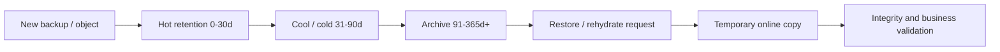

# 33 · 归档分层、对象生命周期与冷存储

## 定位

`归档`、`冷存储`、`分层` 看起来像成本话题，实际上是恢复时间和介质语义话题。你把一份数据放进更便宜的层，不只是换了单价，而是同时换了 `访问延迟`、`最小保留周期`、`恢复动作` 和 `自动化边界`。

本章把 hot / warm / cold / archive 看成一组恢复承诺，而不是一串价格档位。

## 学习目标

- 能解释热、温、冷、归档层在访问路径、恢复时间和最小保留期上的差异。
- 能识别生命周期规则误删、归档回温等待、早删费用和目录/密钥不可用等风险。
- 能为对象存储、备份后端、本地冷池和离线介质设计分层策略。
- 能把归档恢复纳入 RTO/RPO 和演练，而不是只做成本优化。

## 核心直觉

归档不是“便宜存储”，而是把访问延迟、恢复成本、保留策略和合规约束一起打包。

| 层 | 访问语义 | 典型风险 | 设计重点 |
| --- | --- | --- | --- |
| Hot | 在线、低延迟 | 成本高 | 近期恢复和生产读写 |
| Warm | 在线、较低频 | 生命周期规则误配 | 短期保留和次级副本 |
| Cold | 低频访问，仍通常在线 | 请求费、吞吐和延迟 | 低频但仍需较快读取 |
| Archive | 默认离线或需恢复 | 回温时间、取回费、最短保存期 | 长期保留和合规 |

## 机制边界

### 访问路径变了

- Azure Blob 文档说明，archive tier 中的 blob 不能直接读取或修改；读取前必须先 rehydrate 到 hot、cool 或 cold。
- Azure archive rehydrate 可能需要小时级等待，因此 archive 不是“慢一点的对象存储”，而是“恢复前要先解封的对象存储”。
- Amazon S3 Glacier Flexible Retrieval 和 Deep Archive 也需要发起 restore，并按 retrieval option 等待。

### 生命周期约束变了

- Amazon S3 文档说明，Glacier Instant Retrieval 和 Glacier Flexible Retrieval 的最小存储期限是 90 天，Glacier Deep Archive 是 180 天。
- 提前删除、过早转层或频繁取回，可能让“低单价”变成更高总成本。
- Google Cloud Storage lifecycle rule 在对象满足条件后异步执行，不能假设到点立刻删除或转层。

### 自动化边界变了

- 生命周期策略擅长自动下沉、删除或变更 storage class，但恢复通常仍需要显式 restore / rehydrate。
- Azure 生命周期规则不能自动把 archived blob 回温到在线层；如果回温后规则条件不当，数据可能很快又被打回归档。
- 归档恢复依赖在线目录、索引、密钥、权限、带宽和恢复队列。

## 架构/流程

三类主流归档思路：

- 对象存储分层：例如 `S3 Standard -> Glacier Instant Retrieval / Flexible Retrieval / Deep Archive`，自动化强但要理解最小保留期、恢复等待和请求成本。
- 备份软件对象后端归档：老恢复点转入对象归档层，必须确认元数据、索引和恢复目录仍在线。
- 本地冷存储或离线介质：低速磁盘池、备份一体机、离线盘柜或磁带，关键差异是拿回来的时间和恢复链完整性。

设计归档架构时最该问的十个问题：

1. 这份数据的真实恢复时限是多少，分钟、小时还是天？
2. 数据进入归档后，是直接可读，还是必须先发起 restore / rehydrate？
3. 归档层的最小保留周期是多少，提前删除会怎样计费？
4. 生命周期策略能自动下沉，但能否自动回温？
5. 当前恢复目录、索引和密钥是否仍在线且可用？
6. 大量小对象是否会遭遇元数据和请求成本放大？
7. 归档对象回温后，会不会被策略再次立即下沉？
8. 归档副本和在线副本是否共享同一控制平面？
9. 如果发生大规模恢复，网络带宽和对象恢复并发是否足够？
10. 当前方案是在做“低成本保存”，还是在做“可按 SLA 恢复的长期保留”？

## 常见故障

### 归档层被当成近线备份池

- 故障表现：事故时才发现回温需要数小时，无法满足 RTO。
- 判断方法：把 restore / rehydrate 等待时间纳入恢复演练。
- 修正方向：近期恢复点留在 hot/cold 在线层，归档层只承担长期保留。

### 生命周期规则误删或误转层

- 故障表现：对象过早进入归档，或满足删除条件后被生命周期清理。
- 判断方法：检查规则条件、last access、last tier change、版本控制和保留锁。
- 修正方向：生命周期规则变更走评审，关键对象结合 retention/hold。

### 只归档数据块，目录和密钥丢失

- 故障表现：对象还在，但备份目录、索引、KMS key 或恢复软件不可用。
- 判断方法：从归档层做完整恢复，而不是只抽样读取对象。
- 修正方向：把目录、索引、配置、密钥恢复路径一起纳入归档设计。

### 大规模回温没有容量和带宽计划

- 故障表现：20TB 历史数据恢复排队，在线落地点容量不足或网络堵塞。
- 判断方法：计算恢复并发、带宽、临时容量和校验时间。
- 修正方向：为大规模恢复预留临时在线层和分批校验流程。

## 演练方法

### 演练 1：做一张 `hot / warm / cold / archive` 分层决策表

- 字段：读取路径、目标恢复时长、最小保留周期、适用对象、早删风险。
- 目标：让成本和恢复语义一起落地。

### 演练 2：给一个 180 天保留需求设计对象生命周期

- 示例：`0-30` 天在线、`31-90` 天冷层、`91-180` 天归档。
- 补齐：读取延迟、回温动作、早删费用、保留锁和回温后防再次归档条件。
- 目标：理解“生命周期策略不是只写日期”。

### 演练 3：设计一次 Deep Archive 恢复排队演练

- 假设需要恢复 20TB 历史数据。
- 列出等待环节、审批、回温、临时容量、校验和业务验收。
- 目标：把归档恢复从抽象概念变成 runbook。

### 演练 4：比较本地冷盘池、对象归档和离线介质

- 对比容量成本、取回速度、控制面依赖、故障域和适用场景。
- 目标：把“归档”从云术语拉回到硬件与介质视角。

## 治理/合规判断

- 生命周期策略、保留策略和 legal hold 应分开治理：一个负责转层，一个负责不可删，一个负责事件驱动保留。
- 归档层的删除动作必须受 retention、hold 和审计约束，不能只由成本优化规则驱动。
- 合规归档要证明的不只是“存够时间”，还包括对象可读、密钥可用、审计可查和恢复可执行。
- 对长期归档，应定期抽样校验介质、对象完整性和恢复目录。

## 前沿趋势

- 对象存储分层越来越细：在线冷层、Instant Retrieval、Flexible Retrieval、Deep Archive 等让成本和恢复时间可以更精细匹配。
- 云厂商把生命周期、保留锁、对象级 retention 和批量操作结合，归档治理从桶级走向对象级。
- 备份软件正在把归档恢复编排、恢复目录保活和对象回温自动化做成策略能力。
- 数据量增长后，归档恢复瓶颈越来越多出现在元数据、请求并发、KMS 和网络出口，而不只是介质读取速度。

## 本页要配套记住的概念卡

- Archive Tier
- Rehydration
- Lifecycle Policy
- Early Deletion Penalty
- Glacier Deep Archive
- Cold Storage

## 延伸阅读

- Amazon S3 Glacier storage classes: https://docs.aws.amazon.com/AmazonS3/latest/userguide/glacier-storage-classes.html
- Amazon S3 Lifecycle transition considerations: https://docs.aws.amazon.com/AmazonS3/latest/userguide/lifecycle-transition-general-considerations.html
- Amazon S3 archive retrieval options: https://docs.aws.amazon.com/AmazonS3/latest/userguide/restoring-objects-retrieval-options.html
- Azure Blob access tiers overview: https://learn.microsoft.com/en-us/azure/storage/blobs/access-tiers-overview
- Azure Blob rehydration from archive tier: https://learn.microsoft.com/en-us/azure/storage/blobs/archive-rehydrate-overview
- Azure Blob lifecycle management policy structure: https://learn.microsoft.com/en-us/azure/storage/blobs/lifecycle-management-policy-structure
- Google Cloud Storage Object Lifecycle Management: https://cloud.google.com/storage/docs/lifecycle
