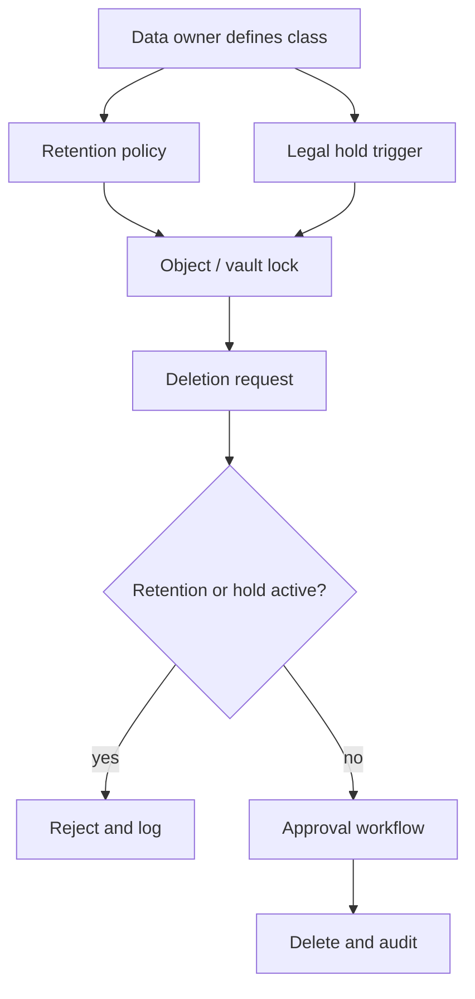

# 34 · 保留策略、Legal Hold 与删除治理

## 定位

很多团队把 `Retention` 写成一个天数，把 `Legal Hold` 理解成法务专用开关，把 `Delete` 当成普通清理动作。实际上，这三个动作决定的是谁能删、何时能删、删错了能不能挡住，以及控制面有没有被治理住。

本章把保留策略、法律保留和删除治理拆开：retention 是到期前不能删，legal hold 是未知到期时间的事件保留，deletion governance 是谁能删、何时删、如何证明。

## 学习目标

- 能区分 retention、legal hold、object lock、vault lock、soft delete 和 lifecycle delete。
- 能解释 governance mode 与 compliance mode 的差异，以及 locked / unlocked 策略的风险。
- 能设计删除审批、审计、例外处理和保留期上下限。
- 能判断合规保留是否真的防止提前删除，而不是只写了一个保留天数。

## 核心直觉

三个控制目标：

| 控制 | 谁批准 | 是否可缩短 | 证据 |
| --- | --- | --- | --- |
| Governance retention | 管理员/合规角色 | 受权限控制 | policy + audit |
| Compliance retention | 通常不可缩短 | 不应可绕过 | immutable metadata |
| Legal hold | 法务/合规 | 清除前持续 | hold tag + audit |
| Deletion workflow | 数据 owner + 审批 | 可拒绝 | ticket + log |

关键直觉：

- retention 是“在某段时间内不允许被提前删除”的规则。
- legal hold 是“在没有明确解除前，一直保持不可删除”的状态。
- deletion governance 讨论的是删除能力归谁管、谁能改策略、删除动作是否审计、错误删除是否能被控制面阻断。

## 机制边界

### S3 Object Lock

- Amazon S3 Object Lock 按 object version 生效，retention 和 legal hold 保护的是指定版本，不会阻止新版本继续被创建。
- retention period 为对象版本设置 `Retain Until Date`；到期前该版本不能被删除或覆盖。
- legal hold 没有固定到期时间；只要 hold 没被显式移除，该版本持续受保护。
- legal hold 与 retention 可以并存，移除其中一个不自动解除另一个。

### AWS Backup Vault Lock

- Vault Lock 把保护对象从对象版本提升到备份恢复点仓库。
- governance mode 更接近受控管理，具有足够权限的人可调整。
- compliance mode 在 grace time 结束后进入强保护状态，vault lock 不应再被任何用户或 AWS 删除或更改。
- min-retention-days 和 max-retention-days 是护栏：既防止过短保留，也防止错误配置成长期成本负担。

### Azure Immutable Storage

- Azure Blob immutable storage 支持 time-based retention policy 和 legal hold，使对象处于 WORM 状态。
- time-based retention 期间对象可以被创建和读取，但不能被修改或删除。
- Azure 区分 locked 与 unlocked policy；unlocked 适合测试，locked 才适合正式合规保护。
- Azure legal hold 要求用户定义标签，使 hold 与事件、案件或调查原因关联。

### Google Cloud Storage Retention

- Google Cloud Storage Object Retention Lock 支持对象级 retain-until time 和 locked / unlocked retention mode。
- bucket lock 是桶级统一保留；object retention lock 是对象级保留。
- lifecycle delete 不会删除仍处于 retention 或 object hold 保护下的对象。

## 架构/流程

删除治理最小流程：

1. 数据分类：业务数据、备份恢复点、日志、归档、法务调查材料分开。
2. 策略定义：保留期、最短/最长保留、锁定模式、legal hold 触发条件。
3. 权限分离：数据 owner、备份管理员、合规管理员、KMS 管理员和审计角色分开。
4. 变更审批：缩短保留期、解除 hold、删除恢复点、销毁密钥都要审批。
5. 审计留证：记录策略版本、操作人、时间、原因、工单和执行结果。
6. 定期复核：容量成本、合规要求、过期清理和 legal hold 解除。

控制模式对照：

| 控制 | 粒度 | 到期方式 | 典型误用 |
| --- | --- | --- | --- |
| Object version retention | 对象版本 | retain-until time | 以为能阻止新版本写入 |
| Legal hold | 对象版本或 blob | 人工解除 | 没有事件标签和解除流程 |
| Vault Lock | 备份仓库/恢复点 | min/max retention | 锁定前未评审容量与恢复窗口 |
| Bucket retention policy | 桶级对象集合 | 统一保留期 | 对细粒度数据分类不够灵活 |
| Lifecycle delete | 对象集合 | 条件满足后删除 | 与 retention/hold 关系没验证 |

删除治理的底线是：生命周期规则负责“何时清理”，retention/hold 负责“何时不能删”，审计负责“谁试图改过规则”。

## 常见故障

### 只看数据面，不看控制面

- 故障表现：数据块不可改，但策略可以被管理员缩短或删除。
- 判断方法：检查策略是否 locked、是否有 grace time、谁能绕过 governance mode。
- 修正方向：正式合规场景使用锁定策略，并审计策略变更。

### legal hold 和 retention 混用

- 故障表现：法务调查对象被设置固定天数，到期后被生命周期删除；或普通运维保留被无限 hold。
- 判断方法：检查 hold 是否有事件标签、解除条件和复核 owner。
- 修正方向：legal hold 事件驱动，retention 策略驱动，两套流程分开。

### 锁定前没有容量和生命周期审查

- 故障表现：错误配置的永久保留进入强保护状态，长期无法调整，成本失控。
- 判断方法：审查 min/max retention、对象增长率、归档策略和 grace time。
- 修正方向：锁定前做容量、成本、恢复和合规评审。

### WORM 被当成恢复验证

- 故障表现：对象删不掉，但恢复目录、密钥、软件版本或数据一致性不可用。
- 判断方法：从受保护副本执行恢复演练。
- 修正方向：把不可删证明和可恢复证明分开留档。

## 演练方法

### 演练 1：画一张 `Retention vs Legal Hold vs Vault Lock` 控制矩阵

- 对比粒度、是否有到期时间、谁能解除、适用场景。
- 目标：把三种控制机制从“一个词”拆成三个治理工具。

### 演练 2：设计一次误删防护链

- 假设管理员误删恢复点。
- 分析 Object Lock、Vault Lock、soft delete、审计日志各自挡住哪一步。
- 目标：把删除治理变成闭环控制链。

### 演练 3：做一次保留策略容量评审

- 设定不同系统保留 `30 / 90 / 365 / forever`。
- 评估容量、成本、审批和合规解释。
- 目标：避免“把锁开上再说”。

### 演练 4：为一次调查事件设计 legal hold 流程

- 定义触发人、标签、解除条件、审计记录和复核机制。
- 目标：让 legal hold 进入可执行 runbook。

## 治理/合规判断

- retention、legal hold 和 lifecycle delete 必须在同一数据分类模型下设计，否则容易出现互相覆盖或互相误解。
- 合规保留应优先使用 locked/compliance 语义，并清楚记录锁定前的 grace period 和责任人。
- 删除治理要覆盖数据面删除、策略修改、保留期缩短、hold 解除、KMS key 禁用或销毁。
- 审计日志应独立保存，避免被同一管理员或同一故障域同时删除。

## 前沿趋势

- 对象级 retention lock 正在补足桶级锁的粒度不足，适合细粒度合规和批量对象治理。
- 备份 vault lock 与对象 lock 正在合流：一个管恢复点仓库，一个管对象版本。
- 多方审批、跨账号恢复和策略护栏让删除治理从“权限控制”走向“流程控制”。
- 生命周期管理会越来越依赖数据分类、访问模式和保留约束联合决策，而不是单纯按对象年龄删除。

## 本页要配套记住的概念卡

- Retention Policy
- Legal Hold
- Object Lock
- Vault Lock
- Governance Mode
- Compliance Mode
- Policy Audit Log

## 延伸阅读

- Amazon S3 Object Lock: https://docs.aws.amazon.com/AmazonS3/latest/userguide/object-lock.html
- Amazon S3 Object Lock legal hold: https://docs.aws.amazon.com/AmazonS3/latest/userguide/batch-ops-legal-hold.html
- AWS Backup Vault Lock: https://docs.aws.amazon.com/aws-backup/latest/devguide/vault-lock.html
- Azure Blob immutable storage overview: https://learn.microsoft.com/en-us/azure/storage/blobs/immutable-storage-overview
- Azure configure immutability policies for blob versions: https://learn.microsoft.com/en-us/azure/storage/blobs/immutable-policy-configure-version-scope
- Google Cloud Storage Object Retention Lock: https://cloud.google.com/storage/docs/object-lock
- Google Cloud Storage Bucket Lock: https://cloud.google.com/storage/docs/using-bucket-lock
- Google Cloud Storage Object Lifecycle Management: https://cloud.google.com/storage/docs/lifecycle
