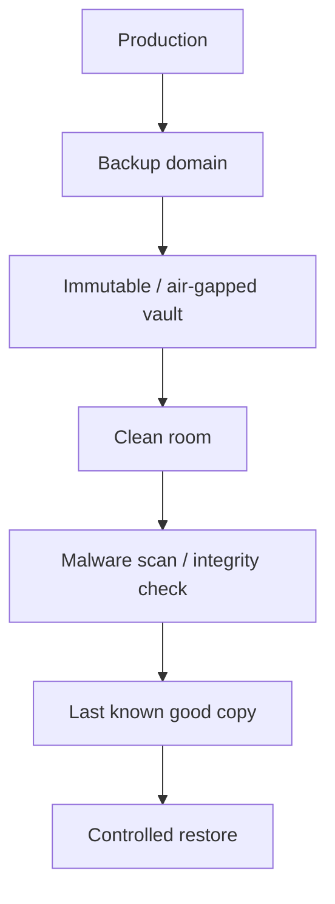

# 35 · Cyber Recovery Vault、隔离恢复区与恢复清洁区

## 定位

普通备份体系假设“生产环境坏了，但备份环境还是可信的”。`Cyber Recovery Vault` 处理的是更糟糕的情况：你已经不再相信生产控制面、备份控制面甚至管理员账号本身，所以必须把关键恢复链放进一个隔离得更彻底、操作得更谨慎的恢复域。

本章重点不是“再存一份”，而是“在生产域失信时，仍能找到可信副本并在干净环境恢复”。

## 学习目标

- 能区分普通备份域、隔离恢复域和恢复清洁区。
- 能解释 vault、logically air-gapped vault、MPA、last known good copy 和 clean room 的关系。
- 能设计生产、备份、vault、clean room 之间的账号、网络、密钥、日志和管理员隔离。
- 能用评分表判断候选副本是否适合作为 last known good copy。

## 核心直觉

三层恢复环境：

- 普通备份域：主要目标是保留恢复点和完成日常恢复，默认仍和现网账号、网络、控制面有较深耦合。
- 隔离恢复域：把关键恢复副本放到更难被横向渗透和批量删除的域里，不一定永远离线，但必须有更强隔离和审批边界。
- 恢复清洁区：把候选恢复副本先恢复到 isolated / trusted 验证环境，再决定是否回灌业务。

## 机制边界

### Cyber Recovery Vault

- Dell PowerProtect Cyber Recovery 文档把 vault 描述为 secure, air-gapped vault environment，用于保存关键数据与技术配置，以便恢复或分析。
- vault 的第一目标不是日常备份吞吐，而是在最坏时刻提供一个可信恢复源。
- vault 可以是物理隔离或虚拟隔离；关键是同步窗口、权限边界、保留锁和应急锁定流程。

### Logically Air-Gapped Vault

- AWS Backup logically air-gapped vault 是带额外安全特性的 specialized vault。
- 官方文档说明这类 vault 使用 compliance mode 的 Vault Lock，并将备份放在 AWS Backup service-owned account 中。
- 当前 AWS Backup 支持把 logically air-gapped vault 作为 primary backup target；如果采用该能力，AWS 建议结合 Multi-party approval。
- AWS MPA 支持通过独立恢复组织、AWS RAM 和恢复账号访问 vault，降低主账号受损时无法恢复的风险。

### Clean Room Recovery

- clean room 不是普通测试环境，而是恢复动作可信度控制。
- 它应具备独立账号、独立网络、独立密钥访问边界、独立日志、最小管理员集合和只读候选副本。
- 目标是先做恶意文件扫描、完整性检查、应用启动验证、身份关系检查和依赖版本核对，再决定是否回灌。

### Last Known Good Copy

- cyber recovery 不能默认拿最近副本，因为最近副本可能已经包含恶意软件、错误配置或被污染的身份关系。
- last known good copy 是一个证据判断，不是凭经验挑时间点。
- 评分维度至少包括时间、完整性、恶意扫描、业务校验和依赖版本。

## 架构/流程

最小 cyber recovery 流程：

1. 识别关键数据、配置、镜像、密钥材料引用、runbook 和依赖关系。
2. 将关键恢复链复制到 immutable / air-gapped vault。
3. 事件发生后冻结同步窗口，防止坏状态继续进入 vault。
4. 在 clean room 中恢复候选副本，而不是直接覆盖生产。
5. 做恶意扫描、哈希/校验、应用一致性和业务查询验证。
6. 用 last-known-good 评分表选择恢复点。
7. 经审批后回灌到生产或重建环境，并保留完整证据。

last-known-good 评分表：

| 维度 | 问题 | 评分提示 |
| --- | --- | --- |
| 时间 | 副本是否早于攻击、误删或配置污染窗口？ | 越接近事件前且证据充分越高 |
| 完整性 | 哈希、目录、数据库校验是否通过？ | 校验缺失要降分 |
| 恶意扫描 | 是否发现已知恶意文件、脚本、持久化项？ | 发现未解释异常要隔离 |
| 业务校验 | 核心查询、交易、登录、报表是否通过？ | 业务 owner 签收更可信 |
| 依赖版本 | OS、数据库、应用、证书、schema 是否匹配？ | 版本漂移会增加恢复风险 |

## 常见故障

### 把另一个 Region 当成 cyber vault

- 故障表现：跨 Region 有副本，但仍由同一账号、同一管理员、同一 KMS 和同一备份控制面管理。
- 判断方法：模拟生产管理员账号被接管后能否删除、解锁、缩短保留或恢复污染副本。
- 修正方向：引入独立账号/组织、vault lock、MPA、独立密钥和隔离日志。

### vault 同步窗口传播污染

- 故障表现：攻击发生后，受污染数据继续同步进 vault。
- 判断方法：检查异常检测、同步暂停权限和手动 secure / release 流程。
- 修正方向：事件怀疑阶段优先冻结同步，后续只放行经验证的恢复点。

### 没有 clean room，直接恢复生产

- 故障表现：恢复后恶意文件、后门账号、错误配置或污染 schema 被带回生产。
- 判断方法：检查恢复流程是否有隔离验证区和回灌批准条件。
- 修正方向：建立 clean room，先验证再回灌。

### 关键配置没有进入 vault

- 故障表现：业务数据存在，但 IAM 配置、DNS、证书、KMS 策略、部署脚本或 runbook 缺失。
- 判断方法：做一次从隔离区重建的演练。
- 修正方向：vault 内容覆盖数据、配置、依赖清单、恢复脚本和离线文档。

## 演练方法

### 演练 1：画一张 `Production -> Backup -> Vault -> Clean Room -> Restore` 结构图

- 标明控制面、数据面、密钥面、日志面和审批边界。
- 目标：把“隔离恢复域”变成可讨论的架构图。

### 演练 2：做一次 vault 失信场景推演

- 假设生产管理员账号被接管。
- 分析他还能不能改保留策略、删恢复点、打开同步窗口、触发恢复。
- 目标：找出真正的控制面单点。

### 演练 3：设计一次 `last known good copy` 识别流程

- 输入信号：快照时间、恶意行为发现时间、EDR/扫描结论、哈希校验、业务校验结果。
- 输出：候选副本排序、弃用原因、选中副本和审批记录。
- 目标：让“干净副本”不再只是经验判断。

### 演练 4：写一个 clean room 最小恢复 runbook

- 内容：网络隔离、身份最小化、恢复步骤、扫描、完整性校验、业务验证、回灌批准条件。
- 目标：把恢复清洁区从概念变成行动手册。

## 治理/合规判断

- cyber recovery vault 只放关键恢复链，不应无差别承载所有普通历史副本。
- vault 管理员、生产管理员、KMS 管理员、审批人和审计人应尽量分离。
- clean room 日志应独立保存，用于证明恢复点选择、扫描结果、验证结果和回灌审批。
- 主账号、主身份源或生产控制面失效时，必须有预先演练过的恢复授权路径。
- 恢复清洁区需要独立账号、网络、密钥、日志和管理员；否则只是普通测试环境。

## 前沿趋势

- 云平台正在把 service-owned account、logically air-gapped vault、RAM 共享和 MPA 融入 cyber recovery。
- 备份厂商把 clean copy discovery、恶意扫描、恢复点打分和 isolated recovery environment 做成产品能力。
- 数据窃取型勒索让恢复不再只是“解密后上线”，还需要数据分类、暴露面分析和法务保留。
- AI 辅助扫描和行为时间线分析会提升候选恢复点排序，但最终仍需要业务校验和人工审批。

## 本页要配套记住的概念卡

- Cyber Recovery Vault
- Air Gap
- Logically Air-Gapped Vault
- Multi-Party Approval
- Last Known Good Copy
- Clean Room Recovery

## 延伸阅读

- Dell PowerProtect Cyber Recovery Product Guide: https://www.dell.com/support/manuals/en-us/cyber-recovery/irs_p_19.13_userguide/what-is-the-dell-powerprotect-cyber-recovery-solution?guid=guid-08726c3f-7724-4f36-9a6c-d4843c93526e&lang=en-us
- Dell manually securing and releasing the Cyber Recovery vault: https://www.dell.com/support/manuals/en-us/cyber-recovery/irs_p_19.20_userguide/manually-securing-and-releasing-the-cyber-recovery-vault?guid=guid-75a91dc0-0f10-4a0d-8a69-ee8bb10a4418&lang=en-us
- AWS Backup logically air-gapped vault: https://docs.aws.amazon.com/aws-backup/latest/devguide/logicallyairgappedvault.html
- AWS Backup primary backups to logically air-gapped vaults: https://docs.aws.amazon.com/aws-backup/latest/devguide/lag-vault-primary-backup.html
- AWS Backup Multi-party approval: https://docs.aws.amazon.com/aws-backup/latest/devguide/multipartyapproval.html
- CISA ESXiArgs recovery guidance: https://www.cisa.gov/news-events/cybersecurity-advisories/aa23-039a
- CISA StopRansomware Guide: https://www.cisa.gov/stopransomware/ransomware-guide
