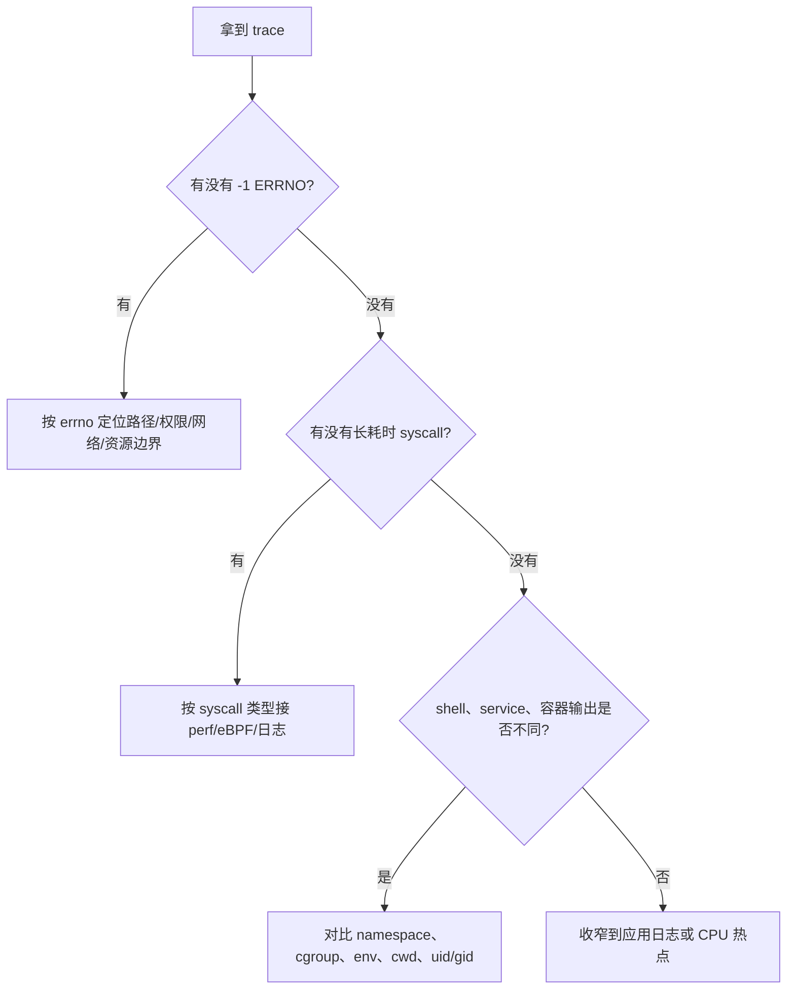

# 08 · strace 实验详解

## 学习目标

- 把“用户态程序如何请求内核服务”变成可观察的 trace。
- 能按文件、进程、内存、网络、IPC、信号对 syscall 做粗分类。
- 能从参数、返回值、errno 和耗时里定位启动失败、权限错误、文件缺失、网络超时等问题。
- 知道 `strace` 的边界：它适合看 syscall 行为，不适合单独定位纯 CPU 热点。

## 核心直觉

`strace` 是观察用户态/内核态边界的放大镜。程序不是“直接打开文件、访问网络、创建进程”，而是通过 `openat`、`read`、`write`、`socket`、`connect`、`clone`、`execve` 等系统调用向内核发请求。

读 trace 时不要从第一行硬啃。优先看三件事：

- 哪个 syscall 失败了：返回 `-1` 后面的 `ENOENT`、`EACCES`、`ETIMEDOUT` 等。
- 哪个 syscall 慢：用 `-T` 看单次调用耗时，用 `-tt` 看时间线。
- 哪个进程或线程在做事：多进程/多线程程序要用 `-f`，否则会漏掉子路径。

## 机制拆解

| 观察对象 | 常见 syscall | 要看什么 |
| --- | --- | --- |
| 程序启动 | `execve`, `arch_prctl`, `set_tid_address` | 入口程序、argv、环境影响 |
| 动态库与内存 | `openat`, `mmap`, `mprotect`, `brk` | 动态链接器、库加载、地址空间扩展 |
| 文件访问 | `openat`, `newfstatat`, `read`, `write`, `close` | 路径、fd、权限、返回字节数 |
| 进程/线程 | `clone`, `fork`, `wait4`, `exit_group` | 子进程生命周期和退出码 |
| 网络 | `socket`, `connect`, `sendto`, `recvfrom` | 地址、端口、超时、连接失败 |
| 同步等待 | `futex`, `poll`, `epoll_wait` | 是否卡在锁、事件或 IO 等待 |

`strace` 输出每行通常包含 syscall 名、参数、返回值。错误通常以 `-1 ERRNO` 出现；成功返回值可能是 fd、字节数、地址或 0。参数和返回值比 syscall 名更重要，因为它们告诉你程序在访问哪个路径、连接哪个地址、等待哪个 fd。

常用选项：

- `-f`：跟踪 fork/clone 出来的子进程和线程。
- `-ttT`：显示绝对时间和每个 syscall 耗时。
- `-o FILE`：输出到文件，便于检索。
- `-e trace=%file`：只看文件相关 syscall。
- `-e trace=%network`：只看网络相关 syscall。
- `-e trace=%process`：只看进程生命周期相关 syscall。

### 读 trace 的四步



常见过滤器可以先把噪声降下来：

| 目标 | 命令片段 | 读法 |
| --- | --- | --- |
| 只看失败调用 | `strace -Z ...` 或 `-e status=failed` | 快速找 `ENOENT`、`EACCES`、`EPERM` |
| 解码 fd 指向 | `strace -yy ...` | 看 fd 背后的路径、socket、设备 |
| 追 PID namespace 差异 | `strace --decode-pids=pidns ...` | 宿主机和容器 PID 视图不一致时有用 |
| 只看某个路径 | `strace -P /some/path ...` | 验证程序是否真的访问该路径 |

## 最小实验

### 实验 1：比较三个程序

```bash
strace -f -ttT -o /tmp/trace-ls.log ls
strace -f -ttT -o /tmp/trace-py.log python3 -c 'print(1)'
strace -f -ttT -o /tmp/trace-curl.log curl -I https://example.com

grep -E 'execve|openat|mmap|socket|connect|clone|exit_group' /tmp/trace-*.log
```

输出一张表：

| 程序 | 启动 | 文件 | 内存 | 网络 | 并发 |
| --- | --- | --- | --- | --- | --- |
| `ls` | `execve` | 多 | 有 `mmap` | 少 | 少 |
| `python3` | `execve` | 动态库/模块多 | 多 | 少 | 视运行时而定 |
| `curl` | `execve` | 证书/DNS 配置 | 有 | 多 | 可能有 DNS/SSL 路径 |

### 实验 2：先找失败，再找慢调用

```bash
strace -f -ttT -o /tmp/trace.log python3 - <<'PY'
from pathlib import Path
print(Path('/no/such/file').read_text())
PY

grep -E 'ENOENT|EACCES|ETIMEDOUT|ECONNREFUSED' /tmp/trace.log
grep -E '<[0-9.]+>$' /tmp/trace.log | sort -t '<' -k2,2nr | head
```

### 实验 3：只看一类边界

```bash
strace -e trace=%file ls /etc >/dev/null
strace -e trace=%memory python3 -c 'print("memory")'
strace -e trace=%network curl -I https://example.com >/dev/null
```

### 实验 4：最小权限/路径排查剧本

```bash
mkdir -p /tmp/os-strace-lab
chmod 000 /tmp/os-strace-lab
strace -f -Z -yy -e trace=%file python3 - <<'PY'
from pathlib import Path
Path('/tmp/os-strace-lab/x').write_text('x')
PY
chmod 700 /tmp/os-strace-lab
rmdir /tmp/os-strace-lab
```

先确认失败 syscall 和 errno，再看 fd/path 解码。真实服务里把 `/tmp/os-strace-lab/x` 换成应用日志里的路径；如果 shell 成功而 service 失败，再接第 11 章的 `systemctl show` 对比 `User=`, `WorkingDirectory=`, `PrivateTmp=` 和 `ReadWritePaths=`。

## 排障线索

- `ENOENT`：路径不存在。继续看它到底查了哪个路径，尤其是 service 下的 `WorkingDirectory`、容器挂载、相对路径。
- `EACCES` / `EPERM`：权限或能力不足。继续看用户、capability、SELinux/AppArmor、systemd sandbox、容器 user namespace。
- 长时间 `futex`：可能是锁、条件变量、运行时调度或线程池等待；继续接 `perf`、应用线程 dump 或 eBPF。
- 长时间 `connect` / `poll` / `epoll_wait`：可能是网络、DNS、远端服务或事件循环等待。
- shell 正常、systemd service 不正常：用 `strace + journalctl + systemctl show` 对比环境变量、工作目录、权限、namespace 和资源限制。

## 前沿/现代 Linux 连接

- `strace` 仍是最小成本的第一观察工具，但现代系统常要和 `perf`、ftrace、eBPF、`journalctl`、cgroup 文件一起用。
- 容器和 systemd 会改变进程看到的路径、权限、网络和 cgroup 视图；trace 中的路径和 errno 往往能暴露这些边界。
- 多线程程序中 `futex` 是常见同步 syscall。看到大量 `futex` 不等于有问题，关键是是否长期阻塞、是否和调度/锁争用症状一致。

## 延伸阅读

- https://man7.org/linux/man-pages/man1/strace.1.html
- https://man7.org/linux/man-pages/man2/syscalls.2.html
- https://man7.org/linux/man-pages/man2/execve.2.html
- https://man7.org/linux/man-pages/man2/clone.2.html
