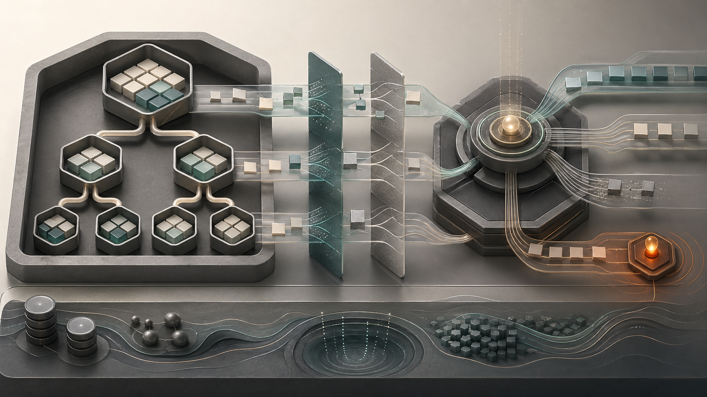
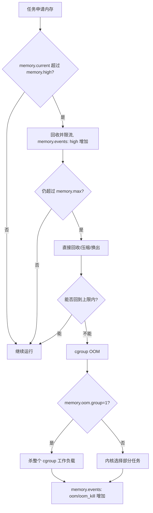

# 09 · cgroup v2 深入教程

## 学习目标

- 理解 cgroup v2 是现代 Linux 的统一资源控制树。
- 能读 `/sys/fs/cgroup` 下的关键接口文件。
- 能把 systemd unit、容器、Kubernetes Pod 和 cgroup 路径关联起来。
- 能用 cgroup 证据分析 CPU 配额、内存压力、OOM、IO 限制和 pids 限制。

## 核心直觉

cgroup v2 不是“给进程打标签”，而是把任务组织进一棵层级树，并在树上分配、限制、统计 CPU、memory、IO、pids 等资源。



> 图：把 cgroup 层级、内存页、压力阈值和 OOM 决策抽象成资源流。图片来源与生成说明见 [image_attribution.md](../../assets/image_attribution.md)。

三个关键点：

- 控制对象是一组任务，不是进程名。
- v2 使用统一层级，多类控制器共享同一棵树。
- delegation 决定谁可以管理子树，是 systemd、rootless 容器和多租户资源管理的安全边界。

## 机制拆解

### 树与控制器

| 文件 | 含义 | 读法 |
| --- | --- | --- |
| `cgroup.controllers` | 当前节点可用控制器 | 父节点暴露了什么 |
| `cgroup.subtree_control` | 子节点可启用的控制器 | 资源控制从父向子打开 |
| `cgroup.procs` | 属于该 cgroup 的进程 | 先看归属，不按进程名猜 |
| `cpu.max` | CPU 配额和周期 | `max 100000` 表示不限制 |
| `cpu.weight` | CPU 相对权重 | 资源争用时才明显 |
| `memory.high` | 内存压力阈值 | 倾向限流和回收 |
| `memory.max` | 内存硬上限 | 超限可能触发 OOM |
| `memory.events` | 内存事件计数 | 看 high、max、oom、oom_kill |
| `io.stat` / `io.max` | IO 统计和限制 | 通常绑定具体块设备 |
| `pids.current` / `pids.max` | 任务数统计与上限 | 线程多也会消耗 pids |

### 两个容易漏掉的约束

`no internal process constraint`：启用 domain controller 的中间节点通常不应同时放进程并继续把资源分给子节点。学习时可以把服务进程理解为应该落在叶子节点。

`single writer`：同一段 cgroup 树应由一个管理者负责。systemd 系统上通常由 PID 1 管理主树，容器运行时需要通过 delegation 管理自己的子树。

### PSI

PSI 不是利用率，而是压力信号。`cpu.pressure`、`memory.pressure`、`io.pressure` 回答的是“任务因为资源压力被拖住了多久”。这比单看 CPU%、RSS 或磁盘吞吐更接近用户体感。

### cgroup OOM 路径



`memory.high` 是压力阈值，适合做“提前减速”；`memory.max` 是硬上限，更多是最后防线。排障时不要只看进程 RSS：tmpfs、page cache、内核内存、线程栈和子进程都可能被计入 cgroup 侧的内存视图。

## 最小实验

### 实验 1：看当前系统是否使用 cgroup v2

```bash
mount | grep cgroup2
findmnt /sys/fs/cgroup
cat /proc/self/cgroup
ls /sys/fs/cgroup
```

### 实验 2：看 systemd 的 cgroup 树

```bash
systemd-cgls --no-pager
systemd-cgtop
systemctl show ssh.service -p ControlGroup -p CPUQuotaPerSecUSec -p MemoryMax
```

把 `ControlGroup` 对应到 `/sys/fs/cgroup/<path>`，再读：

```bash
cg=$(systemctl show ssh.service -p ControlGroup --value)
sudo cat "/sys/fs/cgroup$cg/cpu.stat"
sudo cat "/sys/fs/cgroup$cg/memory.events"
```

### 实验 3：创建一个受限 scope

```bash
systemd-run --user --scope -p CPUQuota=50% -p MemoryMax=512M bash
cat /proc/self/cgroup
```

在新 shell 中运行 CPU 或内存实验，观察 `cpu.stat`、`memory.events`、`*.pressure` 的变化。

### 实验 4：观察 `MemoryHigh` 与 `MemoryMax`

```bash
systemd-run --user --scope -p MemoryHigh=80M -p MemoryMax=120M bash
cg=$(sed -n 's/^0:://p' /proc/self/cgroup)
python3 - <<'PY' &
import time
chunks = []
for _ in range(200):
    chunks.append(bytearray(1024 * 1024))
    time.sleep(0.03)
PY
watch -n 0.5 "cat /sys/fs/cgroup$cg/memory.current; cat /sys/fs/cgroup$cg/memory.events"
```

看到 `high` 递增，说明 cgroup 已经进入内存压力控制；看到 `oom` 或 `oom_kill` 递增，说明硬上限已经参与。实验结束后退出这个临时 scope。若用户级 systemd 不允许资源控制，可在测试机上改用系统级 `systemd-run`。

## 排障线索

- 服务变慢但 CPU 没打满：查 `cpu.max`、`cpu.stat` 中的 throttling，再查 `cpu.pressure`。
- 进程被杀但应用日志不清楚：查 `memory.events` 的 `oom` / `oom_kill`，再看 `journalctl -k`。
- 线程池启动失败：查 `pids.max` 和 `pids.current`。
- 容器里资源值和宿主机不一致：对照容器进程的 `/proc/<pid>/cgroup` 和宿主机 `/sys/fs/cgroup` 路径。
- systemd 属性改了但没生效：查父 slice 是否有更严格限制，以及 controller 是否在父子层级中正确启用。

## 前沿/现代 Linux 连接

- Kubernetes 已支持并推荐关注 cgroup v2 行为，节点资源管理与运行时都要和统一层级对齐。
- systemd 的资源控制属性会映射到底层 cgroup v2 文件，如 `CPUQuota=` 到 `cpu.max`，`MemoryMax=` 到 `memory.max`。
- `memory.high`、PSI、systemd-oomd 等机制让资源管理从“超限杀掉”扩展到“提前感知压力并收敛”。
- rootless 容器依赖 user namespace 与 cgroup delegation；排障时要同时看权限映射和 cgroup 子树管理权。
- Kubernetes 侧的资源 request/limit 最终仍要落到节点上的 cgroup；排查 Pod OOM 时要同时看 kubelet 事件、容器退出码和宿主机 cgroup 文件。

## 延伸阅读

- https://docs.kernel.org/admin-guide/cgroup-v2.html
- https://systemd.io/CGROUP_DELEGATION/
- https://systemd.io/CONTROL_GROUP_INTERFACE/
- https://man7.org/linux/man-pages/man5/systemd.resource-control.5.html
- https://kubernetes.io/docs/concepts/architecture/cgroups/
