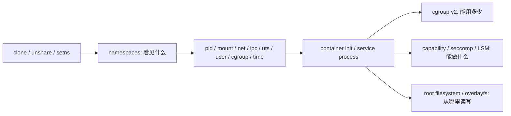

# 10 · namespaces 实战指南

## 学习目标

- 理解 namespace 隔离的是“进程看到的资源视图”。
- 能用 `/proc/self/ns`、`lsns`、`unshare` 观察和创建隔离环境。
- 能解释 pid、mount、net、ipc、uts、user、cgroup、time namespace 的分工。
- 能把 namespace 和容器、rootless、安全边界、挂载传播问题连接起来。

## 核心直觉

容器不是一个新内核。多个进程仍然共享同一个 Linux 内核，但它们可以处在不同 namespace 中，于是看到不同的 PID 空间、挂载表、网络设备、hostname、IPC 对象、UID/GID 映射或 cgroup 路径。

namespace 解决“看见什么世界”，cgroup 解决“能用多少资源”，capability/seccomp/LSM 解决“能做什么”。

## 机制拆解

| namespace | 隔离对象 | 最小直觉 |
| --- | --- | --- |
| mount | 挂载表 | 同一路径在不同 namespace 可指向不同内容 |
| pid | 进程号视图 | 容器内 PID 1 不等于宿主机 PID 1 |
| net | 网络设备、路由、端口、协议栈视图 | 容器可有自己的网卡和路由 |
| ipc | System V IPC、POSIX message queue | IPC 资源可隔离 |
| uts | hostname/domainname | 改 hostname 不影响宿主机 |
| user | UID/GID、capability 映射 | rootless 的关键 |
| cgroup | cgroup 路径视图 | 容器看到的资源树可被裁剪 |
| time | 时钟偏移视图 | 特定场景可隔离时间偏移 |

### mount propagation

mount namespace 不只是“看见不同目录”。如果挂载点传播属性是 shared，某些挂载事件可能在 namespace 之间传播。容器卷、systemd 私有挂载、嵌套容器经常会碰到这个问题。

### user namespace

user namespace 让容器内的 `root` 映射到宿主机的非 root 用户。它改善安全边界，但会让文件权限、设备访问、低端口绑定、mount、capability 判断更复杂。

### 隔离不是单点机制



看到“容器里是 root”时，先问三个问题：它在哪个 user namespace 里？它有哪些 capability？它的 cgroup 和 mount namespace 是否被 runtime 或 systemd 收紧？这三个答案经常比 `id` 输出更接近根因。

## 最小实验

### 实验 1：看当前 namespace 句柄

```bash
lsns
readlink /proc/self/ns/{mnt,pid,net,user,ipc,uts,cgroup}
```

同一个 namespace 类型如果 inode 一样，说明在同一个隔离视图里。

### 实验 2：创建最小隔离 shell

```bash
sudo unshare --mount --uts --ipc --pid --fork --mount-proc bash
hostname ns-lab
ps -ef
mount | head
readlink /proc/self/ns/{mnt,pid,ipc,uts}
```

退出后在宿主机上检查 hostname 和进程视图是否恢复。

### 实验 3：观察 user namespace 映射

```bash
unshare --user --map-root-user bash -c 'id; cat /proc/self/uid_map; cat /proc/self/gid_map'
```

如果失败，检查发行版是否允许非特权 user namespace，以及 `/etc/subuid`、`/etc/subgid` 配置。

### 实验 4：从宿主进入一个新 namespace

```bash
sudo unshare --pid --fork --mount-proc bash -c 'exec -a os-ns-lab sleep 300' &
target=$(pgrep -n -f 'os-ns-lab sleep 300')
sudo lsns -p "$target"
sudo nsenter -t "$target" -p -m ps -ef
sudo kill "$target"
```

`lsns` 用宿主机视角告诉你目标进程在哪些 namespace；`nsenter` 则让调试 shell 进入相同视图。容器排障时，这个模式可以替换成容器 init 进程的宿主机 PID。

## 排障线索

- 容器里“找不到进程”：先确认 PID namespace，再从宿主机找到容器 init 进程对应的真实 PID。
- 容器里路径和宿主机不一致：看 mount namespace、bind mount、overlayfs、mount propagation。
- 容器网络不通：容器内看 `ip a` 不够，还要回宿主机看 veth、bridge、CNI、iptables/nftables。
- rootless 下权限异常：读 `uid_map` / `gid_map`，再看文件属主、capability、设备节点权限。
- systemd sandbox 影响行为：检查 `PrivateTmp=`, `ProtectSystem=`, `RestrictNamespaces=` 等执行环境限制。

## 前沿/现代 Linux 连接

- rootless container 的关键不是“没有 root”，而是 user namespace 把容器内 root 映射到宿主机普通用户。
- cgroup namespace 能隐藏宿主机真实 cgroup 路径，但资源限制仍由宿主机侧 cgroup 生效。
- time namespace 已进入主线，可为容器化测试、checkpoint/restore 等场景提供时间偏移视图。
- mount propagation 仍是容器和 Kubernetes volume 排障的高频隐性问题。

## 延伸阅读

- https://man7.org/linux/man-pages/man7/namespaces.7.html
- https://docs.kernel.org/admin-guide/namespaces/index.html
- https://man7.org/linux/man-pages/man1/unshare.1.html
- https://docs.kernel.org/userspace-api/unshare.html
- https://man7.org/linux/man-pages/man7/user_namespaces.7.html
- https://docs.kernel.org/filesystems/sharedsubtree.html
