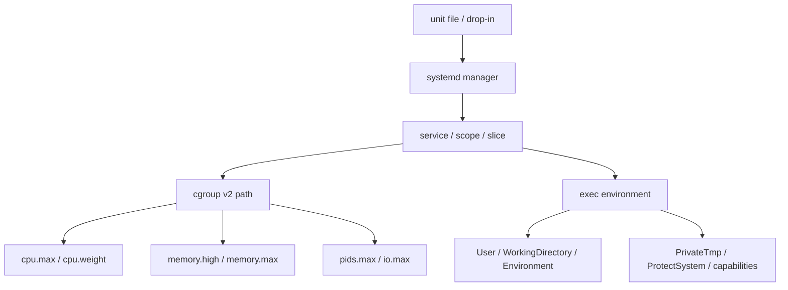

# 11 · systemd 资源控制指南

## 学习目标

- 把 systemd 从“服务启动器”理解为 service、unit、cgroup、日志、执行环境和 sandbox 的组织者。
- 能读 `systemctl status`、`systemctl show`、`journalctl -u`、`systemd-cgls` 的输出。
- 能把 `CPUQuota=`, `CPUWeight=`, `MemoryHigh=`, `MemoryMax=`, `TasksMax=`, `Delegate=` 映射到底层 cgroup v2 语义。
- 能用 systemd 证据解释服务在 shell 正常、unit 下失败的差异。

## 核心直觉

systemd 是用户态服务管理面，cgroup v2 是内核资源控制面。现代 Linux 服务的生命周期、日志、依赖、资源限制和一部分隔离策略，通常都要通过 unit 配置落到内核对象上。

一个 service 不是“一个命令”，而是：

- 一组进程和生命周期规则；
- 一个 cgroup 路径；
- 一组执行环境；
- 一组日志、依赖和重启策略；
- 可选的 namespace、capability、文件系统保护和资源控制策略。

## 机制拆解

### unit、slice、scope

| 类型 | 用途 | 资源控制视角 |
| --- | --- | --- |
| service | systemd 启动和管理的服务 | 常见服务主对象 |
| scope | 外部进程注册给 systemd 管理 | `systemd-run --scope`、容器/会话常见 |
| slice | 组织 service/scope 的层级 | 资源分配的上层分组 |

### 常用资源属性

| 目标 | systemd 属性 | cgroup v2 语义 |
| --- | --- | --- |
| 限 CPU 上限 | `CPUQuota=` | `cpu.max` |
| CPU 相对权重 | `CPUWeight=` | `cpu.weight` |
| 内存压力阈值 | `MemoryHigh=` | `memory.high` |
| 内存硬上限 | `MemoryMax=` | `memory.max` |
| 任务数限制 | `TasksMax=` | pids controller |
| IO 权重/带宽 | `IOWeight=`, `IOReadBandwidthMax=` | io controller |
| 委托子树 | `Delegate=` | 允许下层管理 cgroup 子树 |

### 常用 sandbox 属性

| 属性 | 影响 |
| --- | --- |
| `PrivateTmp=` | 给服务隔离 `/tmp` / `/var/tmp` 视图 |
| `ProtectSystem=` | 让系统路径只读或更严格 |
| `ReadWritePaths=` | 为受保护系统路径开写口 |
| `NoNewPrivileges=` | 禁止获得新的特权 |
| `CapabilityBoundingSet=` | 收敛 capability 集合 |
| `RestrictNamespaces=` | 限制 namespace 创建能力 |

### unit 到内核对象的落地路径



`systemctl show` 看到的是 systemd 的生效配置，`/sys/fs/cgroup` 看到的是内核接口文件。两边都看，才能判断“配置没写对”“父 slice 更严格”还是“内核控制器没有落地”。

## 最小实验

### 实验 1：读一个服务的真实状态

```bash
systemctl status ssh.service --no-pager
systemctl cat ssh.service
systemctl show ssh.service -p Slice -p ControlGroup -p User -p WorkingDirectory -p ExecStart -p MemoryMax -p CPUQuotaPerSecUSec
journalctl -u ssh.service -n 50 --no-pager
```

### 实验 2：创建 CPU 受限临时服务

```bash
systemd-run --unit=os-lab-cpu --property=CPUQuota=25% yes
systemctl status os-lab-cpu --no-pager
systemctl show os-lab-cpu -p ControlGroup -p CPUQuotaPerSecUSec
systemctl stop os-lab-cpu
```

### 实验 3：用 scope 做交互实验

```bash
systemd-run --user --scope -p MemoryMax=512M -p CPUQuota=50% bash
cat /proc/self/cgroup
```

在新 shell 里运行压力程序，再回到 `/sys/fs/cgroup` 看 `cpu.stat`、`memory.events`。

### 实验 4：验证父子限制和 Effective 值

```bash
systemd-run --user --unit=os-lab-mem \
  -p MemoryAccounting=yes -p MemoryHigh=80M -p MemoryMax=120M sleep 300

systemctl --user show os-lab-mem \
  -p ControlGroup -p MemoryHigh -p MemoryMax -p EffectiveMemoryMax

cg=$(systemctl --user show os-lab-mem -p ControlGroup --value)
cat "/sys/fs/cgroup$cg/memory.current"
cat "/sys/fs/cgroup$cg/memory.events"
systemctl --user stop os-lab-mem
```

如果 `EffectiveMemoryMax` 比你写的 `MemoryMax` 更小，说明父 slice 或物理内存上限更严格。用户级 systemd 不支持时，在测试机用系统级 unit 重做同一组观察。

## 排障线索

- 只会 `restart` 不够。先看 `systemctl status` 的退出码、主 PID、最近日志和失败状态。
- shell 能跑、service 不能跑：重点对比 `User=`, `Group=`, `WorkingDirectory=`, `Environment=`, `PrivateTmp=`, `ProtectSystem=`, `ReadWritePaths=`。
- 服务偶发卡顿：查 `CPUQuota=`, `MemoryHigh=`, `MemoryMax=`, 父 slice 限制和 cgroup pressure。
- 容器运行时或 rootless service 资源控制异常：查 `Delegate=`，确认下层是否有权管理自己的 cgroup 子树。
- OOM 不一定在应用日志里：读 `journalctl -k` 和 unit 对应 cgroup 的 `memory.events`。

## 前沿/现代 Linux 连接

- systemd 的资源控制已围绕 cgroup v2 统一层级展开。不要把 cgroup v1 的多挂载点模型当成默认。
- `MemoryHigh=` 更适合作为日常内存压力控制，`MemoryMax=` 更像最后防线。
- systemd-oomd、PSI、memory pressure handling 让服务管理开始使用压力信号，而不只是事后看 OOM。
- 容器、VM、用户级服务需要 delegation 才能在安全边界内继续管理自己的子树。

## 延伸阅读

- https://man7.org/linux/man-pages/man5/systemd.resource-control.5.html
- https://man7.org/linux/man-pages/man5/systemd.exec.5.html
- https://man7.org/linux/man-pages/man5/systemd.service.5.html
- https://www.freedesktop.org/software/systemd/man/devel/systemd.resource-control.html
- https://systemd.io/CGROUP_DELEGATION/
- https://systemd.io/CONTROL_GROUP_INTERFACE/
- https://systemd.io/MEMORY_PRESSURE/
