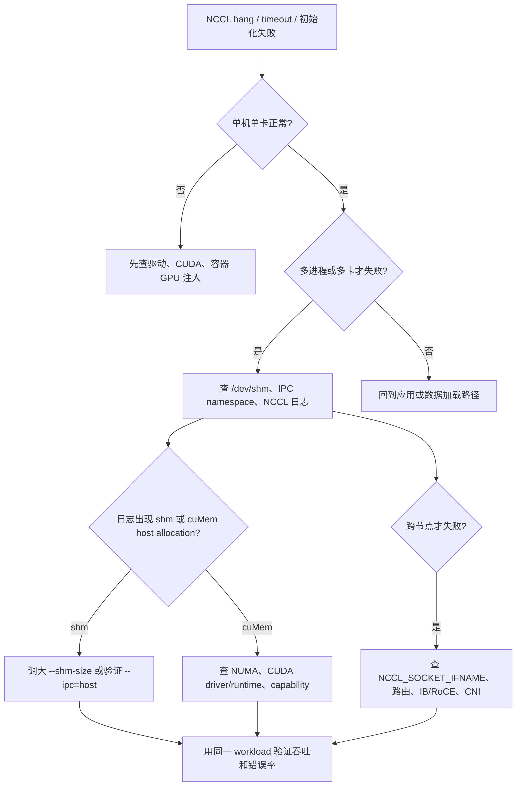

# 12 · /dev/shm 与 NCCL 主线

## 学习目标

- 理解 `/dev/shm` 是 tmpfs 上的 POSIX 共享内存入口。
- 能解释容器默认共享内存大小、IPC namespace、`--shm-size`、`--ipc` 对多进程程序的影响。
- 能把 NCCL 初始化失败、hang、timeout、吞吐差和共享内存、网络接口、GPU/NIC 拓扑联系起来。
- 能写出 AI/GPU 容器通信问题的最小证据链。

## 核心直觉

`/dev/shm` 平时很安静，但在多进程数据加载、PyTorch distributed、NCCL 多卡通信和容器环境中会变成关键边界。很多“框架报错”实际是共享内存太小、IPC 隔离、设备/拓扑不可见或网络接口选择错误。

不要把长期方案简化成 `--ipc=host`。它能快速验证 IPC 边界，但会扩大隔离面。更好的习惯是先证明问题属于共享内存，再选择合适的 `--shm-size`、IPC 策略和运行时配置。

## 机制拆解

```mermaid
flowchart LR
  A[PyTorch / distributed job] --> B[NCCL communicator]
  B --> C[/dev/shm shared memory]
  B --> D[/sys PCI topology]
  B --> E[GPU / NIC / NVLink / PCIe]
  C --> F[Docker --shm-size / --ipc]
  D --> G[容器是否暴露拓扑]
  E --> H[NCCL_SOCKET_IFNAME / IB / RoCE]
```

四层问题树：

| 层 | 关注点 | 证据 |
| --- | --- | --- |
| 共享内存 | `/dev/shm` 大小、tmpfs、POSIX shm | `df -h /dev/shm`, `mount` |
| 容器参数 | `--shm-size`, `--ipc`, rootless, runtime | `docker inspect`, 容器启动参数 |
| 通信配置 | `NCCL_DEBUG`, `NCCL_SOCKET_IFNAME`, backend | NCCL 日志、环境变量 |
| 拓扑放置 | NUMA、GPU/NIC、PCIe/NVLink | `nvidia-smi topo -m`, `/sys` |

NCCL 新版本还要关注 cuMem host allocations。NCCL 文档说明 2.23 起引入相关路径，2.24 在满足 CUDA driver/runtime 和 NUMA 条件时会默认启用，2.26.5 起在失败时会回退。排障时不能只盯 `/dev/shm`，还要记录 CUDA、驱动、NCCL、NUMA 和容器 capability。

### 通信异常决策树



`--ipc=host` 适合作为归因实验，不适合直接当长期答案。长期方案要写清楚是需要更大的 tmpfs、共享 IPC namespace、NUMA/capability 修正，还是网络和拓扑修正。

## 最小实验

### 实验 1：检查宿主机共享内存

```bash
df -h /dev/shm
mount | grep shm
python3 - <<'PY'
import multiprocessing.shared_memory as shm
b = shm.SharedMemory(create=True, size=64 * 1024 * 1024)
print(b.name)
b.close()
b.unlink()
PY
```

### 实验 2：比较容器共享内存

```bash
docker run --rm ubuntu:24.04 df -h /dev/shm
docker run --rm --shm-size=1g --ipc=private ubuntu:24.04 df -h /dev/shm
docker run --rm --ipc=host ubuntu:24.04 df -h /dev/shm
```

### 实验 3：收集 NCCL 证据

```bash
env | grep -E '^NCCL_|^CUDA_|^TORCH_'
nvidia-smi
nvidia-smi topo -m
df -h /dev/shm
```

运行分布式程序时临时打开：

```bash
NCCL_DEBUG=INFO NCCL_DEBUG_SUBSYS=INIT,ENV,GRAPH your_command_here
```

### 实验 4：复现容器 `/dev/shm` 不足

```bash
docker run --rm --shm-size=32m python:3.12-slim python - <<'PY'
from multiprocessing import shared_memory
block = shared_memory.SharedMemory(create=True, size=64 * 1024 * 1024)
print(block.name)
for i in range(0, len(block.buf), 4096):
    block.buf[i] = 1
block.close()
block.unlink()
PY
```

如果小 `--shm-size` 下失败、调大后成功，说明问题在共享内存边界。Kubernetes 里常用 `emptyDir.medium: Memory` 挂载内存型 tmpfs，但写入内容会计入写入容器的内存限制，不能只调 volume 而忽略 Pod memory limit。

## 排障线索

- 日志出现 `/dev/shm/nccl-*` 或共享内存创建失败：先查 `/dev/shm` 大小、IPC namespace、容器 `--shm-size`。
- NCCL 初始化 hang：查 `NCCL_DEBUG=INFO`、网卡选择、DNS/路由、IB/RoCE 设备、容器网络模式。
- 单卡正常，多卡失败：查 GPU 可见性、拓扑、NCCL communicator 初始化路径。
- 性能差但不报错：查 `nvidia-smi topo -m`、NUMA 放置、GPU/NIC 亲和性、RDMA 设备透传。
- rootless 容器中异常：额外查 UID/GID 映射、设备节点权限、cgroup 限制和 NVIDIA Container Toolkit 支持状态。

## 前沿/现代 Linux 连接

- `/dev/shm` 是 tmpfs，和虚拟内存、mmap、page cache、IPC namespace 都有关。
- 容器化 AI 训练的问题常跨越 Linux IPC、cgroup、namespace、设备文件、驱动栈、通信库和网络拓扑。
- NCCL 的 cuMem host allocation 路径让新版本排障不再只围绕 `/dev/shm`，NUMA 和 CUDA/driver 条件会进入主链路。
- Kubernetes 中还要把 emptyDir memory、Pod resource、device plugin、runtime class、CNI/Multus 等纳入证据链。

## 延伸阅读

- https://man7.org/linux/man-pages/man7/shm_overview.7.html
- https://docs.docker.com/engine/storage/tmpfs/
- https://docs.docker.com/engine/containers/run/
- https://docs.nvidia.com/deeplearning/nccl/user-guide/docs/troubleshooting.html
- https://docs.nvidia.com/datacenter/cloud-native/container-toolkit/latest/
- https://kubernetes.io/docs/concepts/storage/volumes/#emptydir
