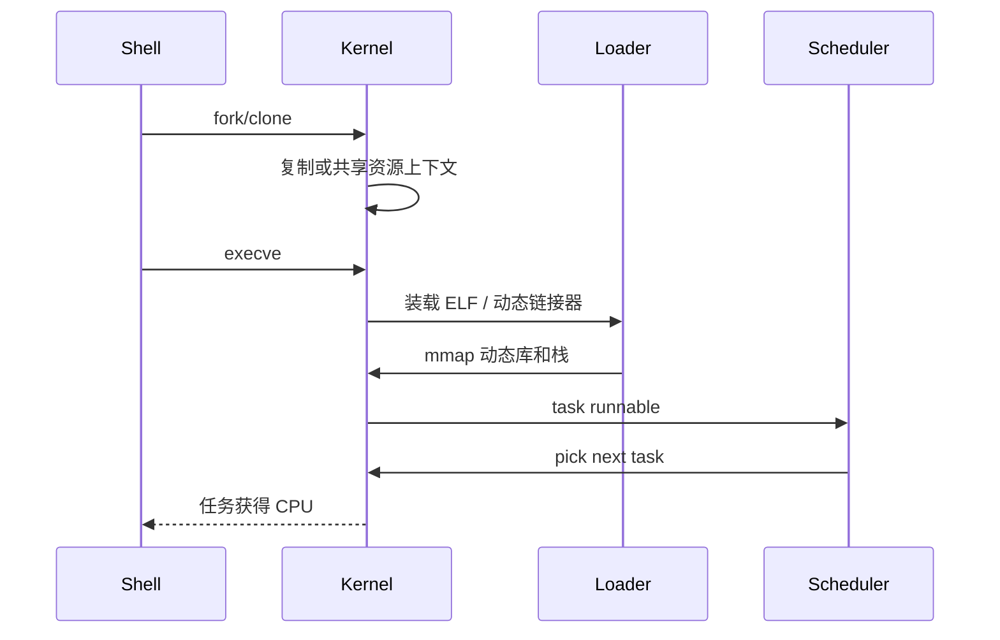

# 13 · 进程 / 线程 / 调度详解

## 学习目标

- 区分程序文件、进程、线程、task、调度实体。
- 能解释 `fork`、`clone`、`execve` 和 `exit_group` 在任务生命周期中的位置。
- 能用 `ps -T`、`top -H`、`vmstat`、`pidstat`、`perf sched` 观察线程和调度行为。
- 理解 Linux 6.6 后普通任务调度从 CFS 心智模型推进到 EEVDF 的现代锚点。

## 核心直觉

进程定义资源边界，线程定义执行流，调度器决定哪个可运行实体获得 CPU。

进程不是磁盘上的程序文件，而是运行时资源容器：地址空间、文件描述符、信号处理、凭证、一个或多个线程。线程也不是“更小的进程”，它的重要特征是共享进程级资源，但拥有自己的栈、寄存器状态和调度实体。

## 机制拆解

### 从命令到 CPU



### 概念对照

| 概念 | 关注点 | 常见误区 |
| --- | --- | --- |
| 程序 | 磁盘上的可执行内容 | 把程序等同于进程 |
| 进程 | 资源边界 | 以为一定只有一个执行流 |
| 线程 | 执行流/调度实体 | 以为线程越多越快 |
| runnable | 已准备好，只等 CPU | 高 load 不一定等于 CPU 利用率高 |
| blocked | 等 IO、锁、事件 | 看起来“卡住”不一定在烧 CPU |
| context switch | CPU 从一个任务切到另一个任务 | 多不一定好，少也不一定坏 |

### EEVDF 的学习直觉

Linux 6.6 起主线调度逻辑转向 EEVDF。它仍追求公平，但不只靠“最小 vruntime”来理解。可以抓四个词：

| 概念 | 通俗理解 | 排障意义 |
| --- | --- | --- |
| runnable | 已准备好，只等 CPU | 高 load 可能是 runnable 积压 |
| lag | 任务是否欠 CPU 或多拿 CPU | 公平性不是简单轮流 |
| virtual deadline | 虚拟截止时间 | 延迟敏感任务可更快被选中 |
| slice | 任务期望运行片段 | 影响响应性和吞吐平衡 |

## 最小实验

### 实验 1：看任务创建链

```bash
strace -f -e trace=%process python3 -c 'print(1)'
strace -f -e execve,clone,exit_group python3 -c 'print(1)'
```

### 实验 2：看线程视图

```bash
ps -eLo pid,tid,psr,stat,comm | head
top -H
```

启动一个多线程程序后，对比进程视图和线程视图。

### 实验 3：观察争用

```bash
vmstat 1
pidstat -w 1
```

有 perf 权限时：

```bash
perf sched record -- sleep 5
perf sched latency
```

## 排障线索

- 高 load 不等于 CPU 算力不够。load 包含 runnable 和不可中断等待，需要结合 CPU 利用率、IO wait、D 状态任务看。
- 线程更多可能更慢：锁争用、cache 抖动、上下文切换、NUMA 远端访问会抵消并行收益。
- 被 cgroup `CPUQuota=` 限制的服务可能表现为周期性卡顿，应用层看不到“CPU 满”。
- Python/PyTorch 的 dataloader workers 是进程还是线程，会影响内存、IPC、调度、文件描述符和 cgroup 行为。
- 卡在 `futex` 时不要只看 syscall，要结合线程 dump、锁路径和调度延迟。

## 前沿/现代 Linux 连接

- EEVDF 是现代 Linux 调度的重要锚点；旧的 CFS 文档仍有历史价值，但学习时要知道主线已经变化。
- `sched_setattr()` 暴露了更细的调度属性，现代低延迟应用会更关注 slice 和延迟语义。
- 容器和 systemd 的 CPU 配额/权重会改变调度结果，调度问题经常要和 cgroup 一起查。
- AI 训练中 CPU 数据加载、线程池、NUMA、进程绑定会直接影响 GPU 利用率。

## 延伸阅读

- https://docs.kernel.org/scheduler/sched-eevdf.html
- https://docs.kernel.org/scheduler/sched-design-CFS.html
- https://man7.org/linux/man-pages/man2/clone.2.html
- https://man7.org/linux/man-pages/man2/execve.2.html
- https://man7.org/linux/man-pages/man2/sched_setattr.2.html

