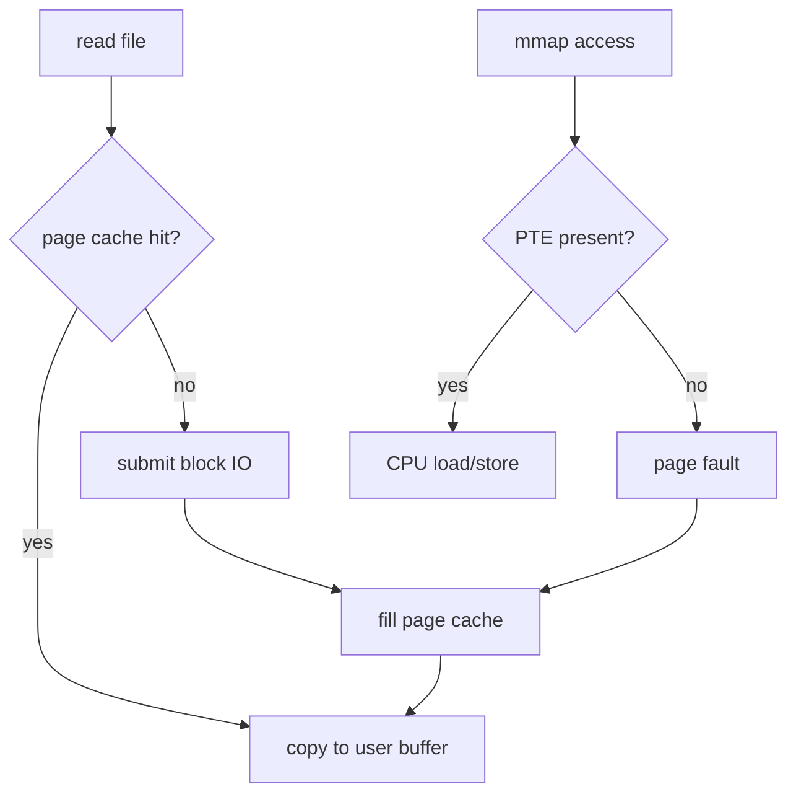

# 14 · 虚拟内存 / mmap / page cache

## 学习目标

- 建立虚拟地址、物理页、页表、缺页异常、匿名页、文件页的基本模型。
- 理解 `mmap` 如何把文件或匿名区域映射进进程地址空间。
- 理解 page cache 如何让文件 IO 和内存管理合流。
- 能解释首次读取和再次读取速度差异、RSS 不等于申请量、内存占用高不一定 OOM。

## 核心直觉

虚拟内存不是“把磁盘当内存”的小技巧，而是现代进程模型的地基。每个进程看到连续、隔离、可控的虚拟地址空间，内核用页表把虚拟页映射到物理页、文件页或暂时不存在的页。

`mmap` 和 page cache 是文件、内存、IO 的桥。`mmap` 不一定立即读文件；访问映射区时可能触发 page fault，内核再把数据通过文件系统和 page cache 带入内存。

## 机制拆解

### 三条路径

| 路径 | 发生什么 | 典型现象 |
| --- | --- | --- |
| 匿名内存 | `malloc` 后经 `brk` / `mmap` 扩展地址空间，按需分配物理页 | RSS 不是申请多少就涨多少 |
| 文件映射 | `mmap` 文件区间，首次访问触发 page fault | 访问像内存，背后仍可能走 IO |
| 普通读写 | `read` / `write` 经 page cache | 第二次读可能明显更快 |

### page cache 路径



### 关键概念

| 概念 | 解释 |
| --- | --- |
| 虚拟地址 | 进程指令看到的地址 |
| 物理页 | 实际内存中的页框 |
| 页表 | 虚拟地址到物理地址/权限的映射结构 |
| 缺页异常 | 访问未准备好的页时进入内核处理 |
| 匿名页 | 不直接绑定文件的内存页 |
| 文件页 | 和文件内容关联的页 |
| dirty page | 已修改但尚未写回存储的页 |
| reclaim | 内核回收可回收页面以满足新分配 |

## 最小实验

### 实验 1：观察 `mmap`

```bash
strace -e mmap,mprotect,munmap,brk python3 -c 'print("vm")'
```

重点看动态库和运行时如何通过 `mmap` 进入地址空间。

### 实验 2：首次读和再次读

```bash
/usr/bin/time -v python3 - <<'PY'
from pathlib import Path
p = Path('/tmp/os-page-cache-lab.bin')
p.write_bytes(b'a' * 256 * 1024 * 1024)
print(len(p.read_bytes()))
print(len(p.read_bytes()))
PY
```

记录两次读取耗时、major/minor page faults、最大 RSS。不要在生产机器上随意清空 page cache。

### 实验 3：观察进程映射

```bash
python3 -c 'import time; a=bytearray(128*1024*1024); time.sleep(60)' &
pid=$!
cat /proc/$pid/maps | head
grep -E 'VmSize|VmRSS|RssAnon|RssFile|VmSwap' /proc/$pid/status
wait $pid
```

## 排障线索

- 内存占用高：先分匿名页、文件页、slab、tmpfs，不要把 page cache 直接当泄漏。
- 第二次读很快：可能是 page cache 命中，不代表底层存储足够快。
- `mmap` 不总是更快：随机访问、page fault、TLB、NUMA、回写都可能成为瓶颈。
- 容器中 `/dev/shm` 占用会计入 tmpfs/内存限制，可能触发 cgroup OOM。
- 大模型权重 mmap、KV cache、NUMA 放置、pinned memory 会把虚拟内存机制直接推到性能面前。

## 前沿/现代 Linux 连接

- DAMON、Multi-Gen LRU、userfaultfd、Transparent Huge Pages 是现代内存管理的重要进阶锚点。
- pinned memory 是主机到 GPU 传输优化，不等于普通 page cache，但理解分页、映射和 NUMA 是前置知识。
- 容器内存限制会改变 reclaim 和 OOM 行为；要同时看 `/proc/meminfo`、cgroup `memory.*` 和进程 `/proc/<pid>/status`。
- 数据加载性能往往是 page cache、文件系统、预取、存储、NUMA 的组合问题，不只是模型计算问题。

## 延伸阅读

- https://man7.org/linux/man-pages/man2/mmap.2.html
- https://docs.kernel.org/admin-guide/mm/
- https://docs.kernel.org/admin-guide/mm/concepts.html
- https://docs.kernel.org/mm/page_tables.html
- https://docs.kernel.org/filesystems/caching/index.html
