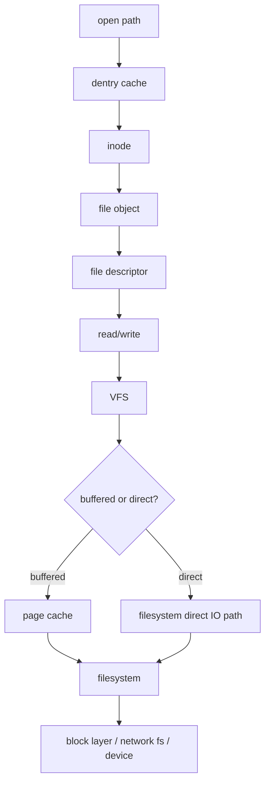

# 15 · 文件系统 / VFS / IO 路径

## 学习目标

- 理解 VFS 如何统一 ext4、XFS、NFS、overlayfs、procfs 等不同文件系统。
- 区分路径名、dentry、inode、file、fd。
- 能画出 `open -> read/write -> page cache/direct IO -> filesystem -> block/device` 路径。
- 能解释为什么文件系统问题常表现为应用性能、容器挂载或数据加载问题。

## 核心直觉

VFS 是 Linux 提供给用户态文件 API 的统一抽象层。应用看到的是路径和 fd，内核里会经过路径解析、dentry cache、inode、`struct file`、page cache 或 direct IO，再下沉到具体文件系统、块层、设备或网络文件系统。

路径名不是文件本体。打开文件后，进程拿到的是 fd，fd 指向内核里的 file 对象；路径被移动或重命名后，已有 fd 仍可能继续有效。

## 机制拆解



### 关键对象

| 概念 | 含义 | 常见误区 |
| --- | --- | --- |
| path | 用户态传入的路径字符串 | 路径不是文件本体 |
| dentry | 路径组件缓存 | 不是磁盘目录项本身 |
| inode | 文件元数据和身份 | 文件名不在 inode 里 |
| file | 打开文件后的运行时对象 | 同一 inode 可有多个 file |
| fd | 进程内整数句柄 | fd 不是全局对象 |
| page cache | 文件页缓存 | 不是具体文件系统私有缓存 |

### buffered IO 与 direct IO

| 路径 | 特点 | 适合场景 |
| --- | --- | --- |
| buffered IO | 默认路径，经过 page cache | 通用文件访问、重复读取、小工具 |
| direct IO | 尽量绕过 page cache，约束更多 | 数据库、高性能存储、自管缓存 |

direct IO 不等于一定更快。它把对齐、队列深度、缓存策略、回压处理责任更多交给上层。

### IO 慢的分岔口

| 证据 | 更像哪一层 | 下一步 |
| --- | --- | --- |
| `openat`/`statx` 很多且慢 | 路径解析、元数据、远程 FS | 看 dentry/inode、目录规模、NFS/对象存储网关 |
| `read` 慢但第二次快 | page cache miss | 看存储延迟、readahead、缓存命中 |
| `write` 快但 `fsync` 慢 | dirty page 回写 | 看 writeback、设备队列、journal |
| `io.stat` 增长但吞吐低 | cgroup IO 限制或设备争用 | 查 `io.max`, `io.weight`, `iostat -xz` |
| 只在容器慢 | overlayfs、bind mount、volume、mount propagation | 对比宿主和容器 `findmnt`, `stat -f` |

## 最小实验

### 实验 1：路径与句柄

```bash
name=/tmp/os-vfs-lab
echo hello > "$name"
ls -li "$name"
exec 9< "$name"
ls -l /proc/$$/fd/9
mv "$name" "$name.moved"
cat <&9
ls -l /proc/$$/fd/9
exec 9<&-
```

### 实验 2：观察 open/read 路径

```bash
strace -e openat,newfstatat,read,close cat /etc/hosts >/dev/null
```

### 实验 3：看挂载和文件系统

```bash
findmnt
cat /proc/mounts | head
stat -f /tmp
```

在容器中重复观察，比较 overlayfs、bind mount、tmpfs、procfs 的差异。

### 实验 4：识别现代异步 IO 入口

```bash
strace -f -e io_uring_setup,io_uring_enter,io_uring_register your_command_here
```

看到 `io_uring_setup` 说明程序可能用 shared submission/completion ring 和内核交换 IO 请求。它不绕过 VFS，也不自动绕过 page cache；排障仍要看文件系统、缓存、块层和 cgroup IO，只是 syscall 形态会从大量 `read`/`write` 变成 ring 提交与完成。

## 排障线索

- `write` 返回成功不代表数据已经持久落盘；还要理解 dirty page、writeback、`fsync`。
- 容器内路径异常：看 mount namespace、overlayfs upper/lower/merged、bind mount 和传播属性。
- 小文件数据集慢：可能是路径解析、元数据、远程文件系统、page cache 命中率和 IO 并发共同作用。
- 数据库 direct IO 慢：检查对齐、队列深度、设备能力、cgroup IO 限制和文件系统支持。
- “文件被删但空间没释放”：检查是否仍有进程持有 fd。

## 前沿/现代 Linux 连接

- `io_uring` 是现代异步 IO 入口，用户态和内核通过 submission/completion ring 减少提交与完成路径开销。
- 容器 overlayfs 是 AI/服务部署常见路径，镜像层、写时复制和 volume 会改变 IO 行为。
- page cache、VFS、block layer、cgroup IO、远程存储共同决定真实吞吐，不能只按文件系统名字判断。
- 观测 `io_uring_setup`、`io_uring_enter`、`io_uring_register` 有助于识别现代运行时或数据库 IO 路径。

## 延伸阅读

- https://docs.kernel.org/filesystems/vfs.html
- https://docs.kernel.org/filesystems/index.html
- https://man7.org/linux/man-pages/man2/open.2.html
- https://man7.org/linux/man-pages/man7/io_uring.7.html
- https://docs.kernel.org/admin-guide/cgroup-v2.html
- https://docs.kernel.org/filesystems/iomap/operations.html
- https://docs.kernel.org/filesystems/overlayfs.html
- https://docs.kernel.org/filesystems/ext4/
- https://docs.kernel.org/filesystems/xfs.html
