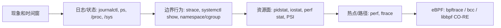

# 16 · Linux 可观测性方法论

## 学习目标

- 把 Linux 可观测性从“工具清单”整理成分层诊断框架。
- 能为启动失败、卡住、慢、OOM、IO 异常、容器差异、GPU 通信问题选择第一观察工具。
- 能组合 `strace`、`journalctl`、`systemctl`、`/proc`、`/sys`、`perf`、eBPF、NVIDIA 工具形成证据链。
- 知道低成本观察和高分辨率观察的顺序。

## 核心直觉

可观测性的关键不是工具越多越好，而是知道当前问题更像发生在 syscall、日志、调度、CPU、内存、IO、网络、隔离边界还是 GPU runtime 层。

先确认现象和边界，再选工具。很多问题不需要一上来 profiler；权限、路径、环境、cgroup 限制、systemd sandbox 先排掉，效率更高。

## 机制拆解

| 观察面 | 问什么 | 工具 |
| --- | --- | --- |
| 行为 | 程序向内核请求了什么 | `strace`, `ltrace` |
| 状态 | 当前对象处于什么状态 | `ps`, `top`, `/proc`, `/sys`, `ss`, `lsblk`, `systemctl show` |
| 事件 | 发生过什么 | `journalctl`, `dmesg`, audit log |
| 性能 | 时间花在哪里 | `perf`, ftrace, bcc/bpftrace, `pidstat`, `iostat` |
| GPU/AI | 设备、拓扑、通信、时间线 | `nvidia-smi`, `NCCL_DEBUG`, Nsight Systems |

### 常用组合

| 场景 | 工具组合 |
| --- | --- |
| 程序启动失败 | `strace + journalctl + systemctl show` |
| service 和 shell 行为不同 | `systemctl show + journalctl -u + strace` |
| 资源限制/OOM | `systemctl status + /sys/fs/cgroup + journalctl -k` |
| CPU 高或延迟异常 | `top/pidstat + perf + cgroup cpu.stat` |
| IO 慢 | `iostat + strace + cgroup io.stat + filesystem/mount` |
| 容器差异 | namespace/cgroup/mount/env 对比 |
| NCCL hang | `NCCL_DEBUG + nvidia-smi topo + /dev/shm + network` |

### 从低扰动到高分辨率



| 工具层 | 适合回答 | 风险/前提 |
| --- | --- | --- |
| `strace` | 程序请求了哪些内核服务 | ptrace 有扰动，CPU 热点不适合单靠它 |
| `perf` | CPU 时间、采样热点、调度延迟 | 受 `perf_event_paranoid` 和符号质量影响 |
| ftrace | 内核函数/事件路径 | 需要熟悉 tracefs，注意输出量 |
| `bpftrace` | 临时按事件聚合 | 需要内核 BPF 能力和 root/CAP_BPF/CAP_PERFMON |
| libbpf/CO-RE | 可分发的长期观测程序 | 开发成本更高，需要 BTF/内核兼容性设计 |

## 最小实验

### 实验 1：低成本系统快照

```bash
date
uname -a
uptime
ps -eo pid,ppid,stat,comm --sort=stat | head
free -h
df -h
```

### 实验 2：按资源面观察

```bash
pidstat -durhw 1
iostat -xz 1
ss -tanp
journalctl -k -n 100 --no-pager
```

### 实验 3：进入高分辨率

```bash
strace -f -ttT -o /tmp/trace.log your_command_here
perf top
```

如果有 bpftrace：

```bash
sudo bpftrace -e 'tracepoint:syscalls:sys_enter_openat { @[comm] = count(); }'
```

### 实验 4：用 eBPF 观察 cgroup OOM 线索

```bash
sudo bpftrace -e 'tracepoint:oom:oom_kill { printf("oom_kill pid=%d comm=%s\n", args->pid, str(args->comm)); }'
```

同时在另一个窗口读目标 cgroup 的 `memory.events`。eBPF 给你“内核事件发生了”，cgroup 文件给你“哪个工作负载的计数变化了”，两者合起来比只看应用日志可靠。

## 排障线索

- 慢：先判断 CPU、IO、网络、锁等待、资源配额、远端依赖，避免直接改参数。
- 卡住：看 `strace` 是否停在 `futex`、`poll`、`read`、`connect`，再决定看锁、事件循环、IO 还是网络。
- 启动失败：先看 `errno`、systemd 状态、工作目录、权限、环境变量。
- OOM：同时查应用日志、`journalctl -k`、cgroup `memory.events`。
- 容器中才失败：比对 namespace、mount、cgroup、env、用户映射、设备节点。

## 前沿/现代 Linux 连接

- eBPF 的价值是把观测点放到内核路径上，同时避免长期维护定制内核模块。学习顺序建议是成熟工具 -> `bpftrace` 单行脚本 -> libbpf/CO-RE。
- ftrace、perf、BPF 不是互相替代，分别适合不同分辨率和持久化需求。
- systemd、cgroup v2、PSI 让服务级资源状态变成现代 Linux 观测的基础面。
- GPU 训练可观测性必须跨 Linux 和加速器：CPU 数据加载、共享内存、NCCL、拓扑、网络都要进同一证据链。

## 延伸阅读

- https://man7.org/linux/man-pages/man1/strace.1.html
- https://docs.kernel.org/trace/index.html
- https://docs.kernel.org/bpf/
- https://docs.kernel.org/admin-guide/perf/index.html
- https://man7.org/linux/man-pages/man1/perf.1.html
- https://man7.org/linux/man-pages/man7/capabilities.7.html
- https://bpftrace.org/docs/release_024/language
- https://www.freedesktop.org/software/systemd/man/latest/journalctl.html
