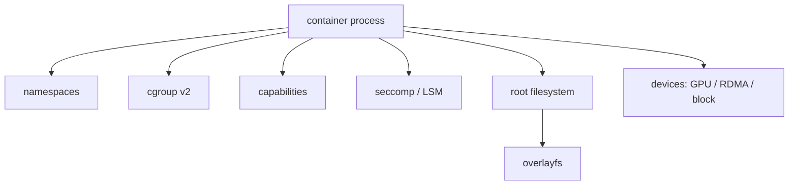

# 17 · 容器运行时 / rootless / isolation

## 学习目标

- 把容器理解为 namespaces、cgroup、capabilities、seccomp/LSM、root filesystem、runtime 的组合。
- 区分 image、container、runtime、shim、daemon 的职责。
- 理解 rootful 与 rootless 的安全收益和兼容性约束。
- 能按隔离、资源、挂载、网络、设备、GPU/RDMA、共享内存排查容器问题。

## 核心直觉

容器不是轻量虚拟机，也不是 Docker 私有魔法。它是 Linux 隔离视图、资源控制、文件系统视图、权限收敛和镜像分发约定组合出来的执行环境。

rootless 容器把宿主机 root 权限从默认路径拿掉，安全边界更好，但网络、挂载、设备访问、低端口绑定、cgroup delegation、GPU/RDMA 都可能出现额外差异。

## 机制拆解



### 容器对象

| 对象 | 含义 |
| --- | --- |
| image | 只读内容模板和元数据 |
| container | 运行实例和可写层 |
| runtime | 配置 namespace/cgroup/mount/capability 并启动进程 |
| OCI spec | 运行时配置标准 |
| root filesystem | 容器进程看到的根文件系统 |

### rootful vs rootless

| 维度 | rootful | rootless |
| --- | --- | --- |
| 宿主机权限 | daemon/runtime 常有高权限 | 通过 user namespace 映射 |
| 网络 | bridge/CNI 能力完整 | 常见 slirp/pasta 等用户态路径 |
| 设备 | GPU、RDMA、块设备更直接 | 需要额外映射和权限 |
| 低端口 | 更容易绑定 | 通常受非特权端口限制 |
| cgroup | 管理能力强 | 依赖 systemd delegation 和内核支持 |
| 风险 | 权限集中 | 默认爆炸半径更小但约束更多 |

### OCI 到 Linux 原语

| OCI 配置面 | Linux 原语 | 排障入口 |
| --- | --- | --- |
| `process.args`, `env`, `cwd` | `execve` 参数和环境 | `strace`, `docker inspect`, runtime config |
| `linux.namespaces` | pid/mount/net/ipc/uts/user/cgroup namespace | `lsns`, `/proc/<pid>/ns` |
| `linux.resources` | cgroup v2 控制器 | `/proc/<pid>/cgroup`, `/sys/fs/cgroup` |
| `linux.capabilities` | capability 集合 | `capsh`, `/proc/<pid>/status` |
| `linux.seccomp` / LSM | syscall 和强制访问控制 | audit log, `dmesg`, Kubernetes security context |
| mounts | rootfs、overlayfs、bind mount、tmpfs | `findmnt`, `stat -f`, `/proc/<pid>/mountinfo` |

容器排障时，先拿到容器 init 的宿主机 PID，再沿着 `/proc/<pid>` 读 namespace、mount、cgroup、status。比只看容器内 shell 更稳定，因为容器内看到的是被裁剪后的视图。

## 最小实验

### 实验 1：比较 namespace

```bash
readlink /proc/self/ns/{mnt,pid,net,user,ipc,uts,cgroup}
docker run --rm ubuntu:24.04 sh -c 'readlink /proc/self/ns/mnt /proc/self/ns/pid /proc/self/ns/net /proc/self/ns/user /proc/self/ns/ipc /proc/self/ns/uts /proc/self/ns/cgroup'
```

### 实验 2：比较 `/dev/shm`

```bash
docker run --rm ubuntu:24.04 df -h /dev/shm
docker run --rm --shm-size=1g ubuntu:24.04 df -h /dev/shm
```

### 实验 3：rootless 固定检查

```bash
cat /proc/self/uid_map
cat /proc/self/gid_map
grep "$USER" /etc/subuid /etc/subgid
docker info | grep -i rootless
```

### 实验 4：把容器 PID 接回宿主证据

```bash
cid=$(docker run -d --rm ubuntu:24.04 sleep 300)
pid=$(docker inspect -f '{{.State.Pid}}' "$cid")
sudo lsns -p "$pid"
sudo cat "/proc/$pid/cgroup"
sudo sed -n '1,40p' "/proc/$pid/mountinfo"
docker stop "$cid"
```

rootless 下如果 `State.Pid` 或宿主权限受限，仍可以用同样的字段思路：先确认 user namespace 映射，再看 runtime 是否有 cgroup delegation、设备节点和网络路径权限。

## 排障线索

- 容器内 root 不是宿主机 root：先读 `uid_map` / `gid_map`。
- 挂载失败：查 user namespace、capability、seccomp、mount propagation、rootless 限制。
- 网络异常：容器内看 `ip a`，宿主机看 veth/bridge/CNI/nftables，rootless 还要看用户态网络栈。
- GPU 不可见：查 NVIDIA Container Toolkit、设备节点、驱动版本、runtime 配置、容器内 `nvidia-smi`。
- 多卡/NCCL 异常：查 `/dev/shm`、IPC、`/sys` 拓扑、RDMA/IB 设备、NCCL 网卡选择。
- 资源限制异常：查容器进程 `/proc/<pid>/cgroup`，再回宿主机看对应 cgroup 文件。

## 前沿/现代 Linux 连接

- OCI Runtime Specification 是理解 runc/crun/containerd 等运行时行为的标准入口。
- rootless 越来越重要，但它不是“免费兼容”；设备、网络、cgroup、低端口和挂载是固定风险面。
- NVIDIA Container Toolkit、device plugin、CDI 等机制让 GPU 设备注入更标准化，但底层仍是设备文件、驱动、权限和 runtime 配置。
- cgroup v2、systemd delegation、user namespace 的组合决定 rootless 容器能否获得可用的资源管理能力。

## 延伸阅读

- https://github.com/opencontainers/runtime-spec
- https://rootlesscontaine.rs/
- https://rootlesscontaine.rs/getting-started/common/subuid/
- https://docs.docker.com/engine/security/rootless/
- https://kubernetes.io/docs/concepts/security/linux-kernel-security-constraints/
- https://docs.kernel.org/admin-guide/namespaces/index.html
- https://docs.kernel.org/admin-guide/cgroup-v2.html
- https://docs.nvidia.com/datacenter/cloud-native/container-toolkit/latest/
